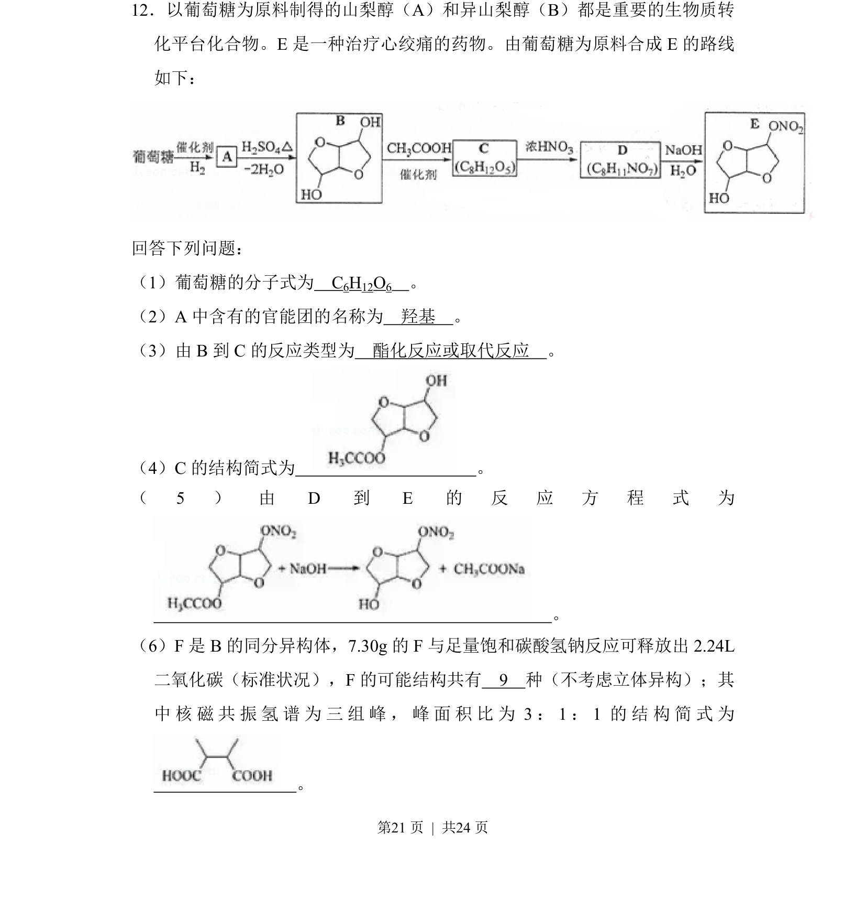
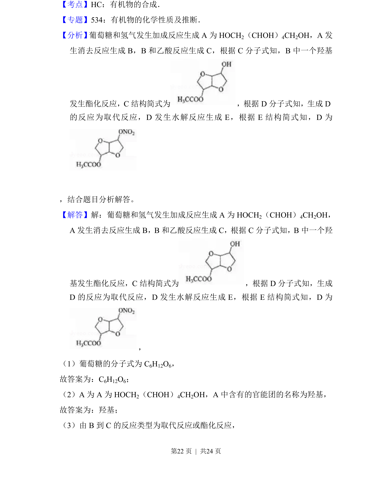
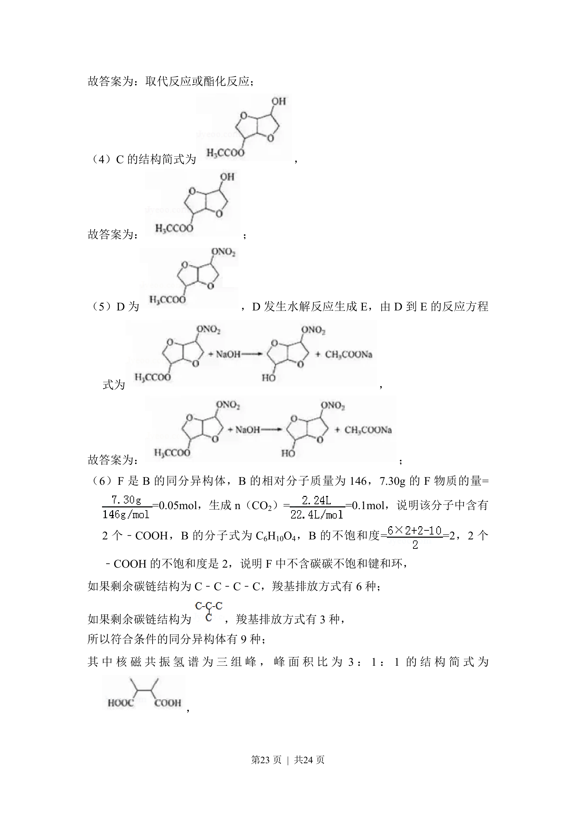
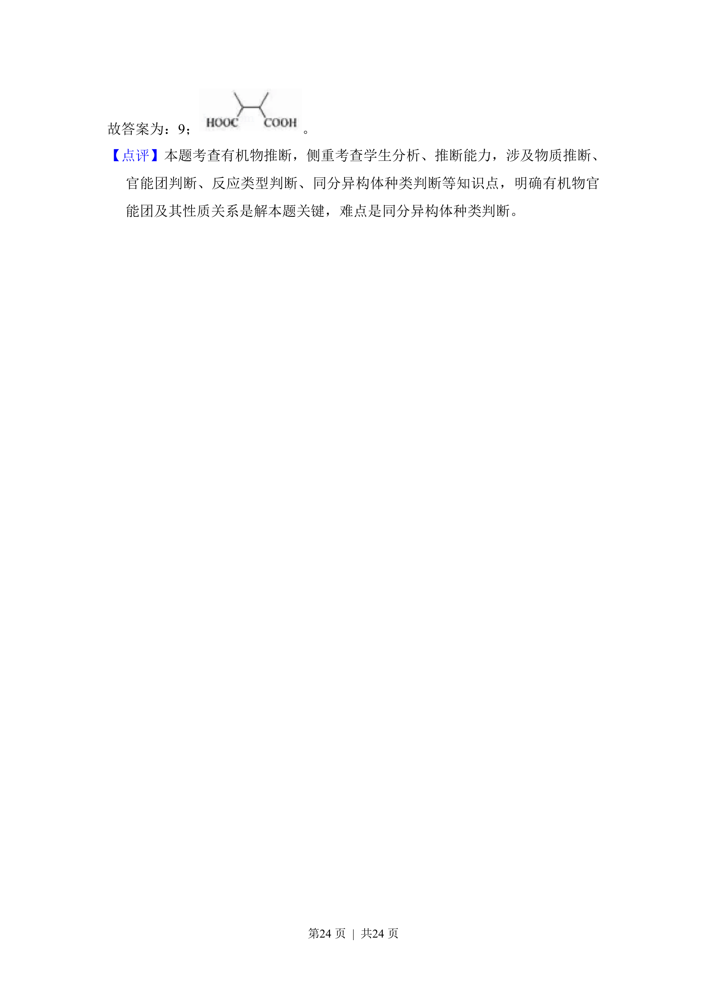

## 题面

## 摘要

本题考查以葡萄糖为原料的有机合成路线推断，涉及官能团、反应类型、结构简式和同分异构体数目判断。

## 关联考点

- [[664-官能团识别|官能团识别]]
- [[250-酯化反应|酯化反应]]
- [[657-同分异构体计数|同分异构体计数]]
- [[818-结构简式书写|结构简式书写]]

## 答案与解析

> 📄 原 PDF 第 21 页：`素材/真题/吉林/2008-2024·（吉林）化学高考真题/2018年高考化学试卷（新课标Ⅱ）（解析卷）.pdf`
