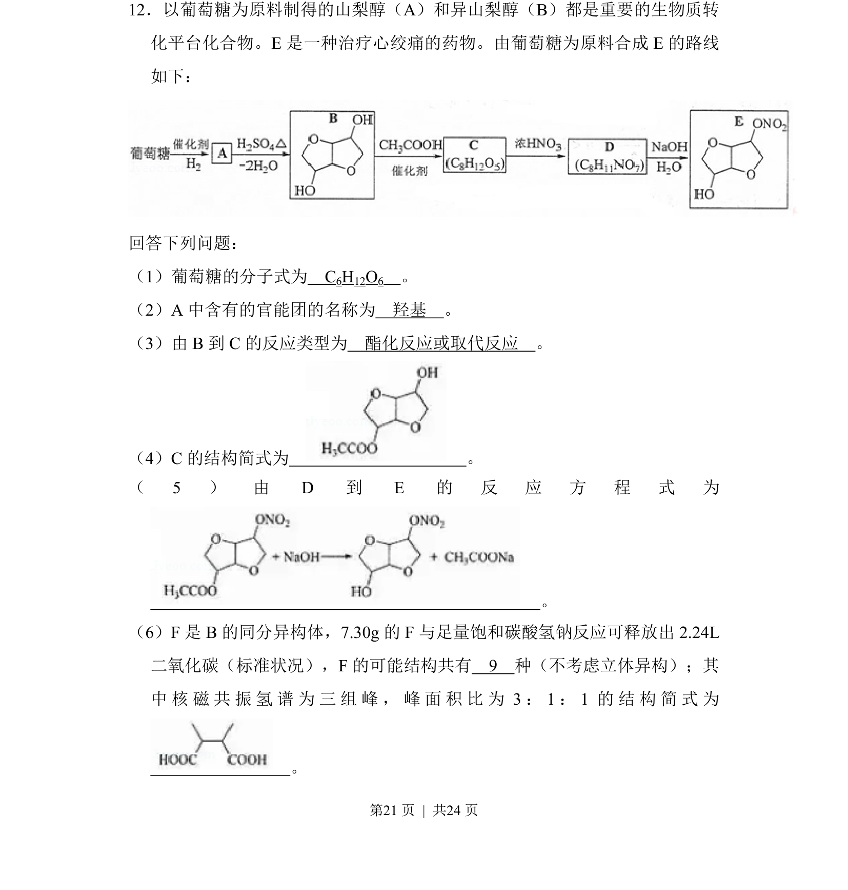
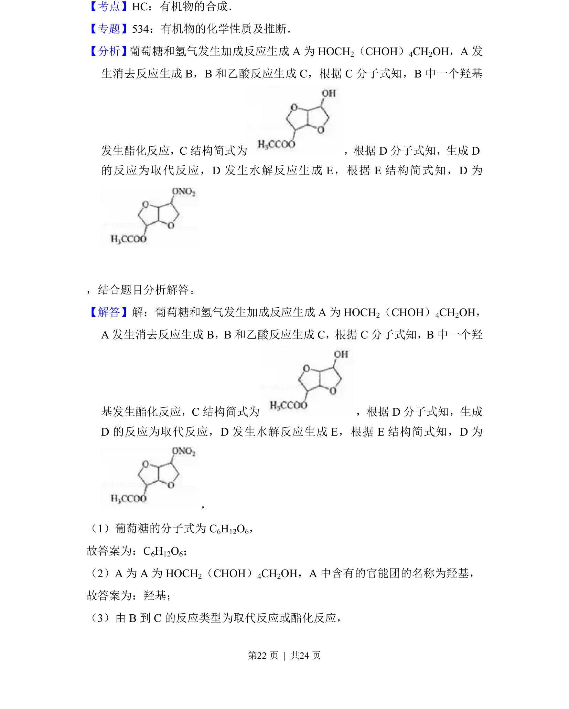
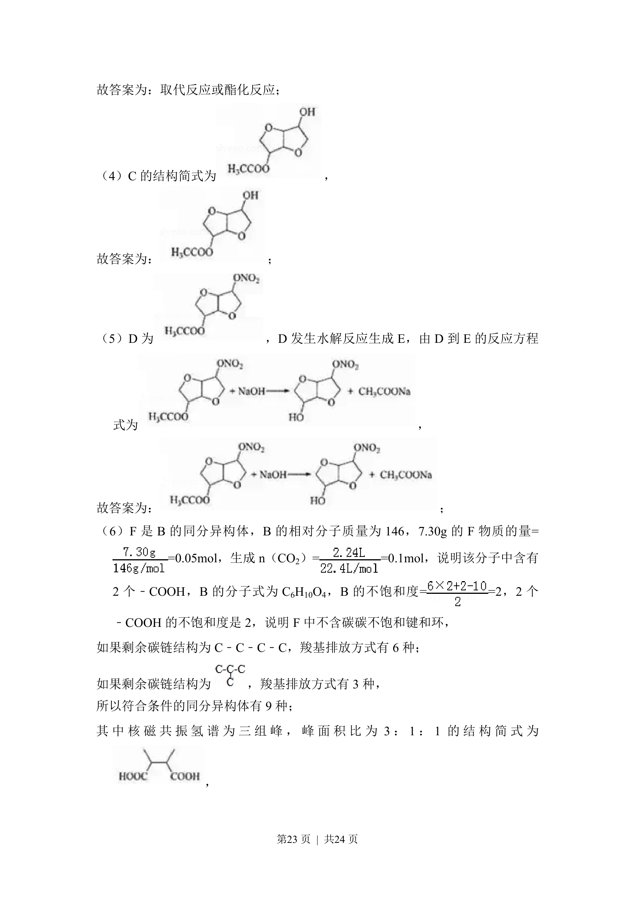
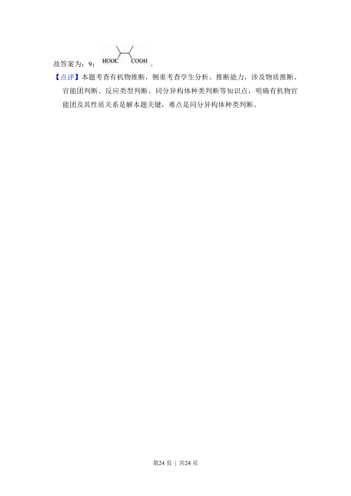

## 题面

## 摘要

本题考查以葡萄糖为原料的有机合成路线推断，涉及官能团、反应类型、结构简式和同分异构体数目判断。

## 关联考点

- [[664-官能团识别|官能团识别]]
- [[250-酯化反应|酯化反应]]
- [[657-同分异构体计数|同分异构体计数]]
- [[818-结构简式书写|结构简式书写]]

## 答案与解析

> 📄 原 PDF 第 21 页：`素材/真题/吉林/2008-2024·（吉林）化学高考真题/2018年高考化学试卷（新课标Ⅱ）（解析卷）.pdf`

<!-- 题干文本-start -->
## 题干文本
12．以葡萄糖为原料制得的山梨醇（A）和异山梨醇（B）都是重要的生物质转
化平台化合物。E是一种治疗心绞痛的药物。由葡萄糖为原料合成E的路线
如下：
回答下列问题：
（1）葡萄糖的分子式为　C6H12O6　。
（2）A中含有的官能团的名称为　羟基　。
（3）由B到C的反应类型为　酯化反应或取代反应　。
（4）C的结构简式为　 　。
（5） 由D到E的 反 应 方 程 式 为 　
　。
（6）F是B的同分异构体，7.30g的F与足量饱和碳酸氢钠反应可释放出2.24L
二氧化碳（标准状况），F的可能结构共有　9　种（不考虑立体异构）；其
中核磁共振氢谱为三组峰，峰面积比为3：1：1的结构简式为　
　。
<!-- 题干文本-end -->

<!-- 解析文本-start -->
## 解析文本

<!-- 解析文本-end -->
