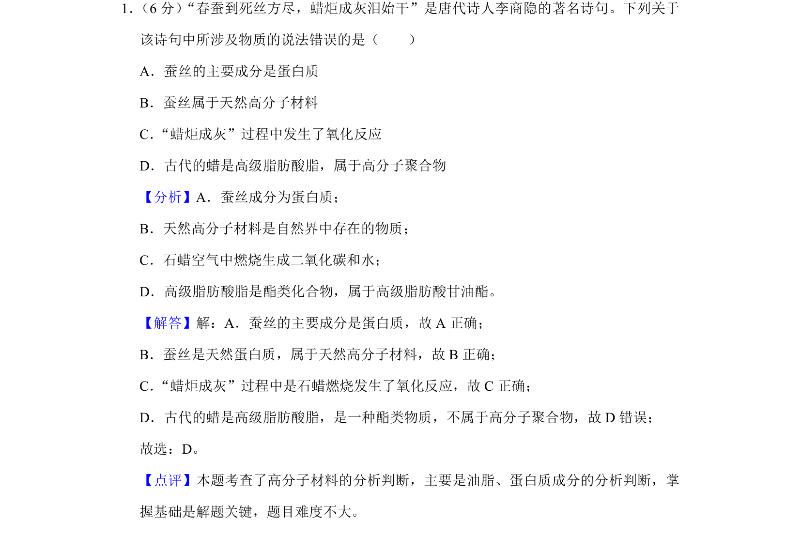
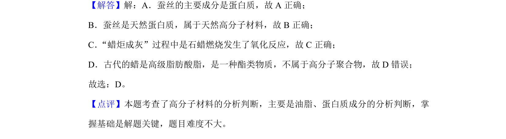

## 题面

## 摘要

蚕丝的主要成分是蛋白质，属于天然高分子材料；蜡炬燃烧涉及氧化反应，高级脂肪酸脂不属于高分子聚合物。

## 关联考点

- [[134-蛋白质|蛋白质]]
- [[866-高分子材料|高分子材料]]
- [[043-氧化反应|氧化反应]]
- [[825-聚合物|聚合物]]

## 答案与解析

> 📄 原 PDF 第 1 页：`素材/真题/吉林/2008-2024·（吉林）化学高考真题/2019年高考化学试卷（新课标Ⅱ）（解析卷）.pdf`
