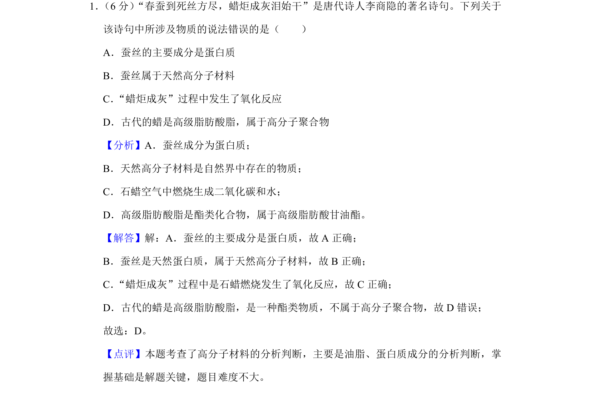
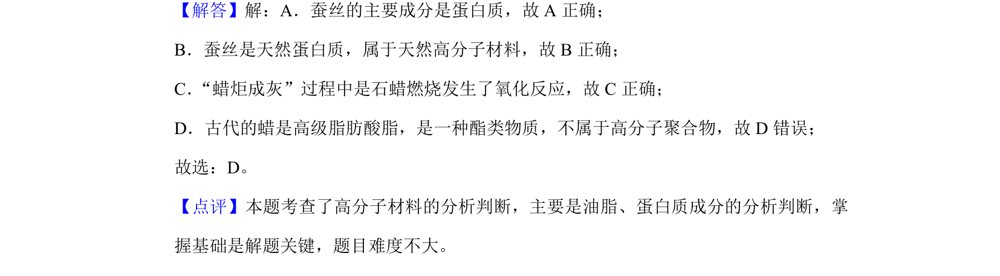

## 题面

## 摘要

蚕丝的主要成分是蛋白质，属于天然高分子材料；蜡炬燃烧涉及氧化反应，高级脂肪酸脂不属于高分子聚合物。

## 关联考点

- [[134-蛋白质|蛋白质]]
- [[866-高分子材料|高分子材料]]
- [[043-氧化反应|氧化反应]]
- [[825-聚合物|聚合物]]

## 答案与解析

> 📄 原 PDF 第 1 页：`素材/真题/吉林/2008-2024·（吉林）化学高考真题/2019年高考化学试卷（新课标Ⅱ）（解析卷）.pdf`

<!-- 题干文本-start -->
## 题干文本
1． （6分）“春蚕到死丝方尽，蜡炬成灰泪始干”是唐代诗人李商隐的著名诗句。下列关于
该诗句中所涉及物质的说法错误的是（　　）
A．蚕丝的主要成分是蛋白质
B．蚕丝属于天然高分子材料
C．“蜡炬成灰”过程中发生了氧化反应
D．古代的蜡是高级脂肪酸脂，属于高分子聚合物
<!-- 题干文本-end -->

<!-- 解析文本-start -->
## 解析文本
【分析】A．蚕丝成分为蛋白质；
B．天然高分子材料是自然界中存在的物质；
C．石蜡空气中燃烧生成二氧化碳和水；
D．高级脂肪酸脂是酯类化合物，属于高级脂肪酸甘油酯。
【解答】解：A．蚕丝的主要成分是蛋白质，故A正确；
B．蚕丝是天然蛋白质，属于天然高分子材料，故B正确；
C．“蜡炬成灰”过程中是石蜡燃烧发生了氧化反应，故C正确；
D．古代的蜡是高级脂肪酸脂，是一种酯类物质，不属于高分子聚合物，故D错误；
故选：D。
【点评】本题考查了高分子材料的分析判断，主要是油脂、蛋白质成分的分析判断，掌
握基础是解题关键，题目难度不大。
<!-- 解析文本-end -->
