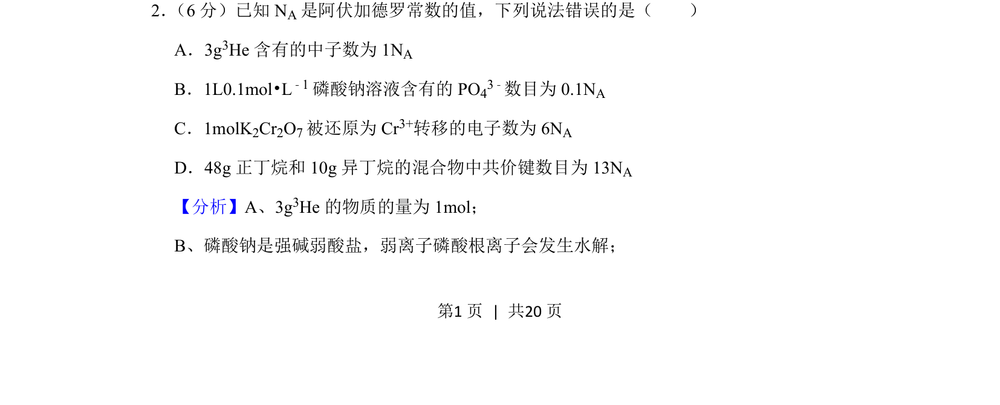
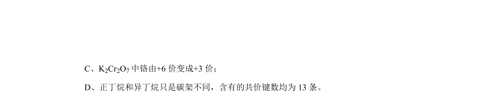
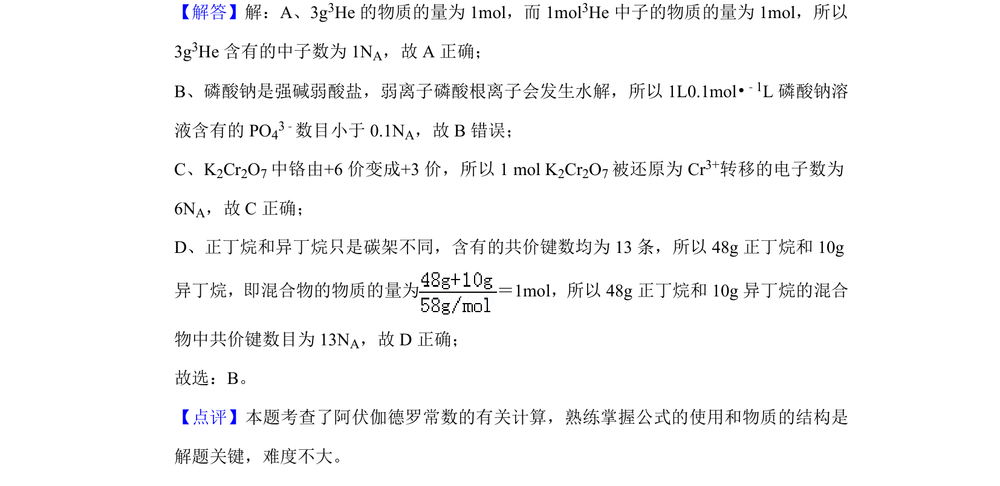

## 题面

## 摘要

该题考查阿伏加德罗常数、物质的量及微粒数目的判断，涉及盐类水解和氧化还原计算。

## 关联考点

- [[450-阿伏伽德罗常数|阿伏加德罗常数]]
- [[779-物质的量|物质的量]]
- [[336-盐类水解|盐类水解]]
- [[162-氧化还原反应|氧化还原]]

## 答案与解析

> 📄 原 PDF 第 1 页：`素材/真题/吉林/2008-2024·（吉林）化学高考真题/2019年高考化学试卷（新课标Ⅱ）（解析卷）.pdf`
