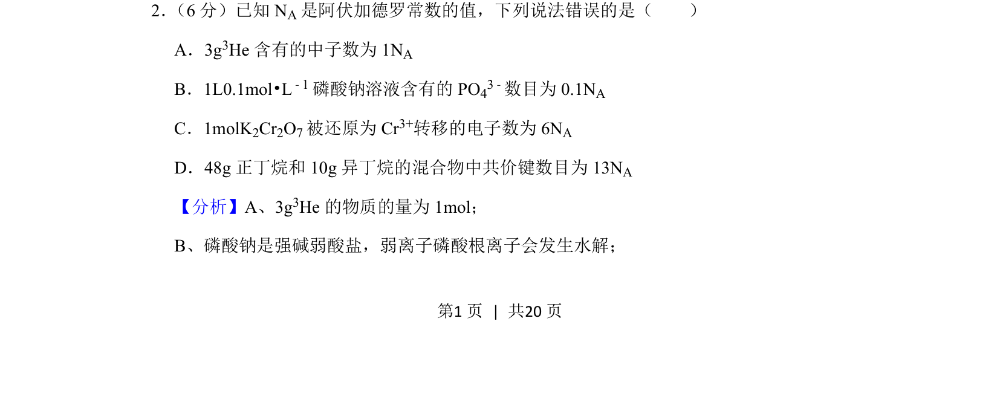
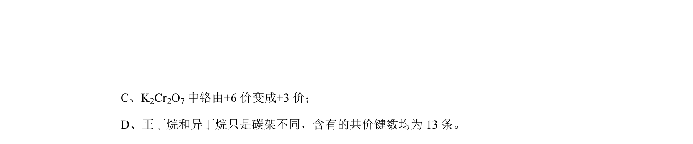
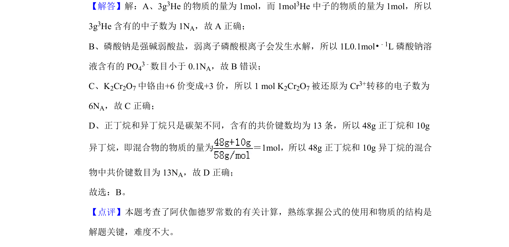

## 题面

## 摘要

该题考查阿伏加德罗常数、物质的量及微粒数目的判断，涉及盐类水解和氧化还原计算。

## 关联考点

- [[450-阿伏伽德罗常数|阿伏加德罗常数]]
- [[779-物质的量|物质的量]]
- [[336-盐类水解|盐类水解]]
- [[162-氧化还原反应|氧化还原]]

## 答案与解析

> 📄 原 PDF 第 1 页：`素材/真题/吉林/2008-2024·（吉林）化学高考真题/2019年高考化学试卷（新课标Ⅱ）（解析卷）.pdf`

<!-- 题干文本-start -->
## 题干文本
2． （6分）已知NA是阿伏加德罗常数的值，下列说法错误的是（　　）
A．3g3He含有的中子数为1N A
B．1L0.1mol•L﹣1磷酸钠溶液含有的PO 43﹣数目为0.1N A
C．1molK2Cr2O7被还原为Cr 3+转移的电子数为6N A
D．48g正丁烷和10g异丁烷的混合物中共价键数目为13N A
<!-- 题干文本-end -->

<!-- 解析文本-start -->
## 解析文本
【分析】A、3g3He的物质的量为1mol；
B、磷酸钠是强碱弱酸盐，弱离子磷酸根离子会发生水解；
<!-- 解析文本-end -->
