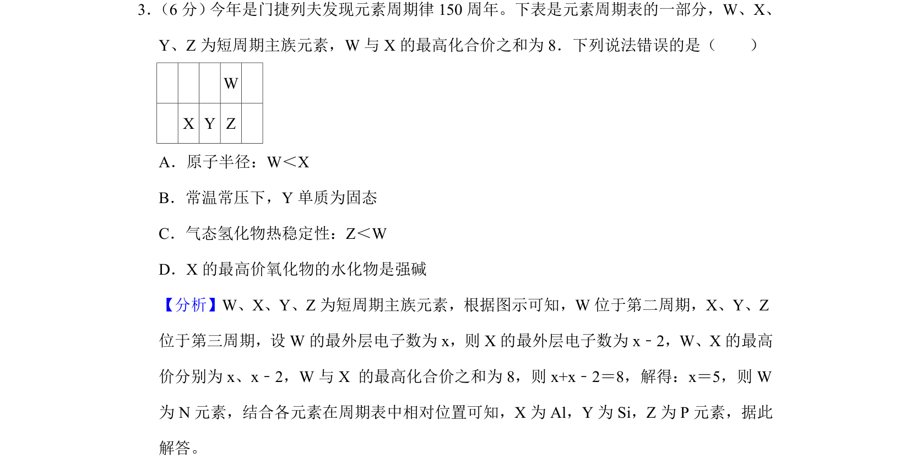
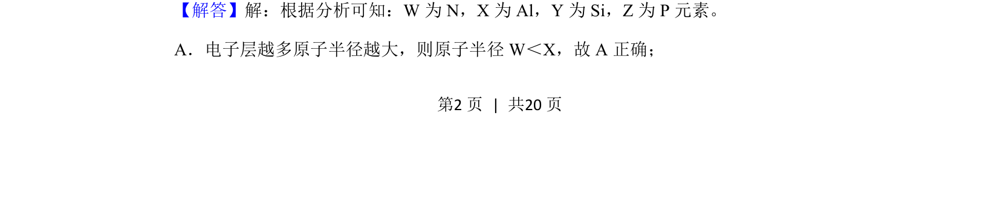

## 题面

## 摘要

本题通过元素周期表位置与化合价关系推断元素，并判断原子半径、单质状态、氢化物稳定性及最高价氧化物水化物的酸碱性。

## 关联考点

- [[252-元素周期律|元素周期律]]
- [[原子半径比较]]
- [[气态氢化物稳定性]]
- [[最高价氧化物水化物]]

## 答案与解析

> 📄 原 PDF 第 2 页：`素材/真题/吉林/2008-2024·（吉林）化学高考真题/2019年高考化学试卷（新课标Ⅱ）（解析卷）.pdf`
