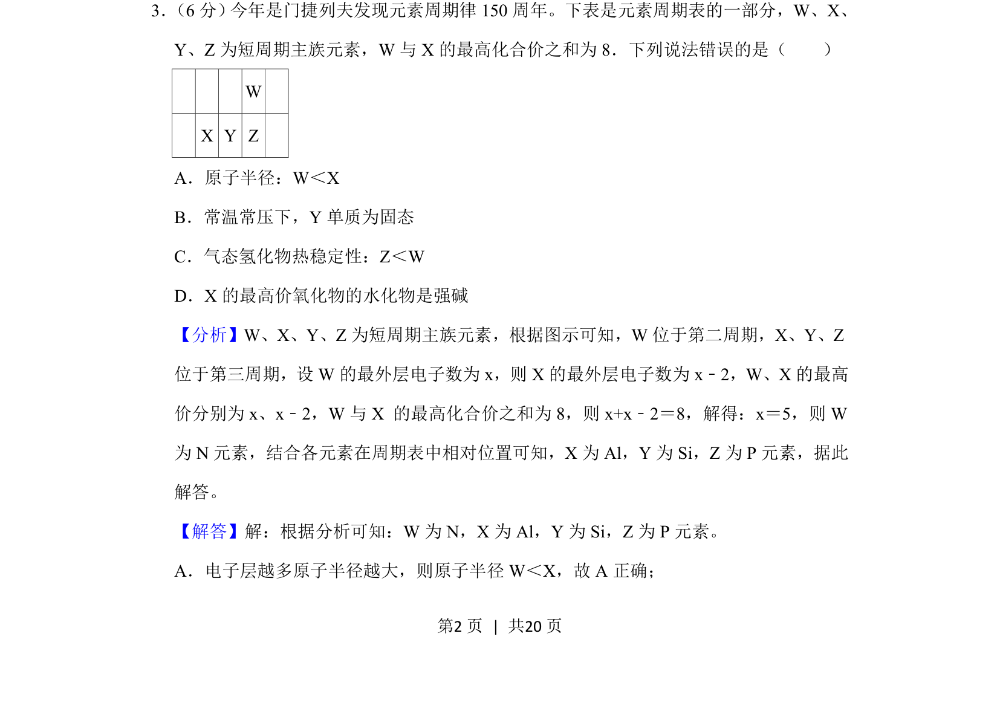
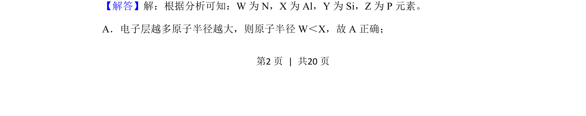
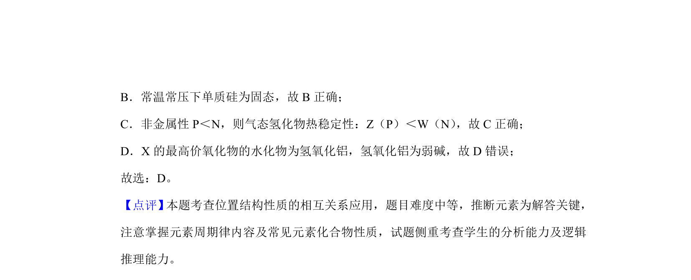

## 题面

## 摘要

本题通过元素周期表位置与化合价关系推断元素，并判断原子半径、单质状态、氢化物稳定性及最高价氧化物水化物的酸碱性。

## 关联考点

- [[252-元素周期律|元素周期律]]
- [[635-原子半径比较|原子半径比较]]
- [[547-气态氢化物稳定性|气态氢化物稳定性]]
- [[703-最高价氧化物水化物|最高价氧化物水化物]]

## 答案与解析

> 📄 原 PDF 第 2 页：`素材/真题/吉林/2008-2024·（吉林）化学高考真题/2019年高考化学试卷（新课标Ⅱ）（解析卷）.pdf`

<!-- 题干文本-start -->
## 题干文本
3． （6分） 今年是门捷列夫发现元素周期律150周年。下表是元素周期表的一部分，W、X、
Y、Z为短周期主族元素，W与X的最高化合价之和为8．下列说法错误的是（　　）
W
X Y Z
A．原子半径：W＜X
B．常温常压下，Y单质为固态
C．气态氢化物热稳定性：Z＜W
D．X的最高价氧化物的水化物是强碱
<!-- 题干文本-end -->

<!-- 解析文本-start -->
## 解析文本
【分析】W、X、Y、Z为短周期主族元素，根据图示可知，W位于第二周期，X、Y、Z
位于第三周期，设W的最外层电子数为x，则X的最外层电子数为x﹣2，W、X的最高
价分别为x、x﹣2，W与X 的最高化合价之和为8，则x+x﹣2＝8，解得：x＝5，则W
为N元素，结合各元素在周期表中相对位置可知，X为Al，Y为Si，Z为P元素，据此
解答。
【解答】解：根据分析可知：W为N，X为Al，Y为Si，Z为P元素。
A．电子层越多原子半径越大，则原子半径W＜X，故A正确；
<!-- 解析文本-end -->
