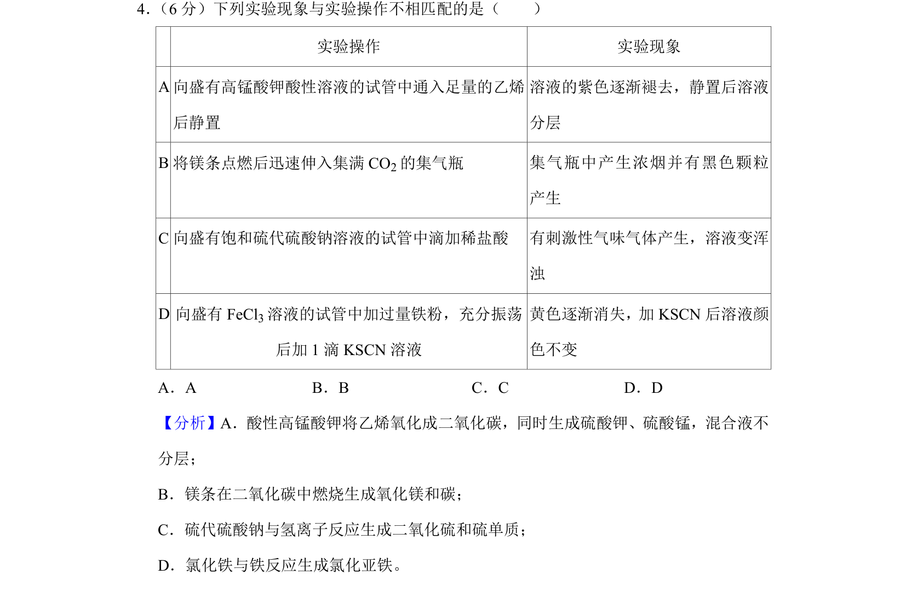
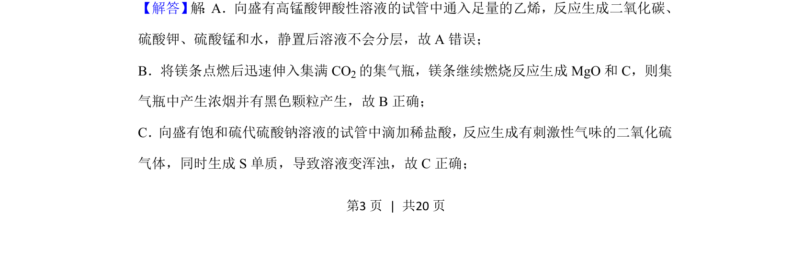
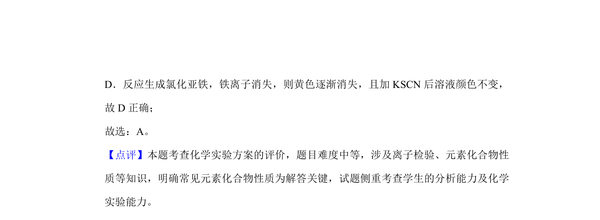

## 题面

## 摘要

考查化学实验操作与现象是否匹配，涉及氧化还原反应、气体生成及物质性质判断

## 关联考点

- [[580-实验操作|实验操作]]
- [[实验现象]]
- [[162-氧化还原反应|氧化还原反应]]

## 答案与解析

> 📄 原 PDF 第 3 页：`素材/真题/吉林/2008-2024·（吉林）化学高考真题/2019年高考化学试卷（新课标Ⅱ）（解析卷）.pdf`
