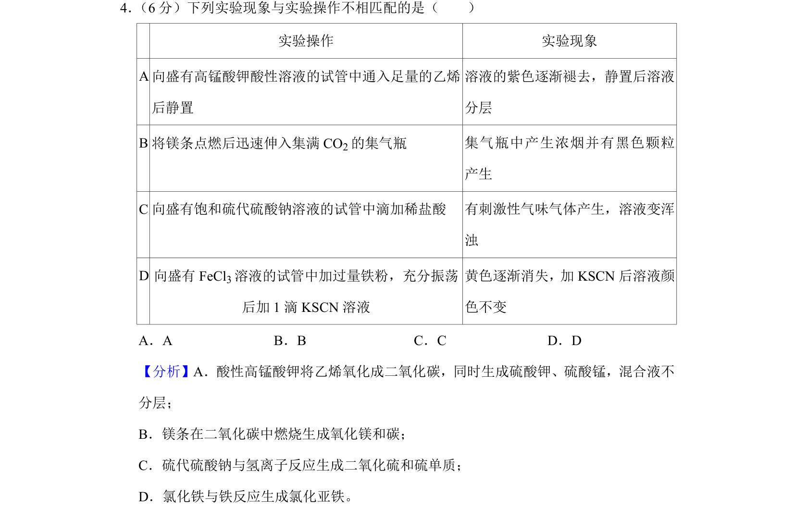
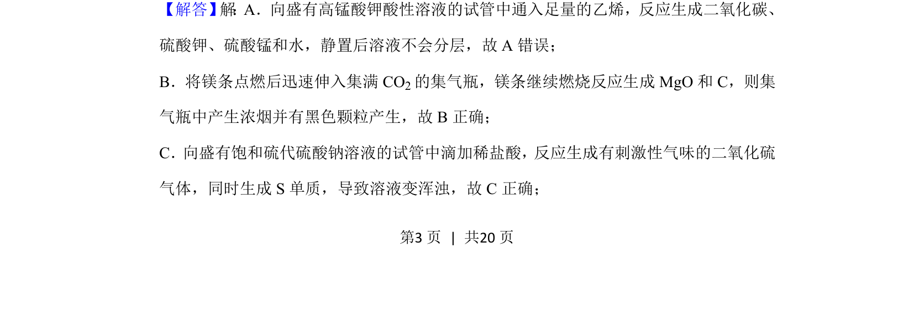
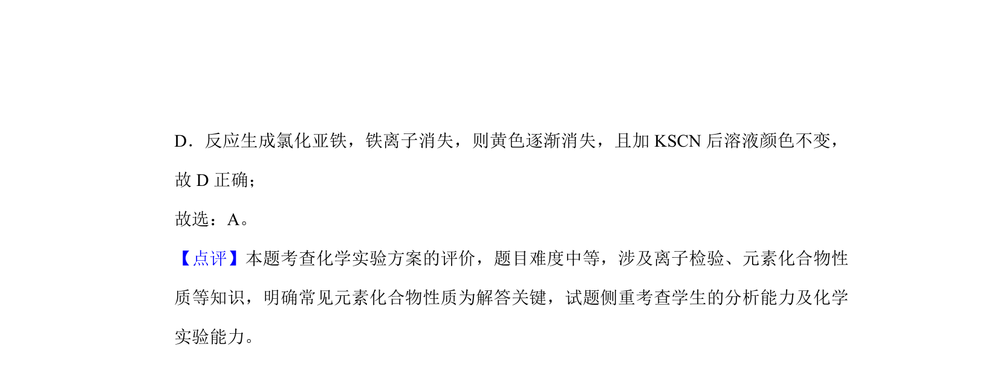

## 题面

## 摘要

考查化学实验操作与现象是否匹配，涉及氧化还原反应、气体生成及物质性质判断

## 关联考点

- [[580-实验操作|实验操作]]
- [[671-实验现象|实验现象]]
- [[162-氧化还原反应|氧化还原反应]]

## 答案与解析

> 📄 原 PDF 第 3 页：`素材/真题/吉林/2008-2024·（吉林）化学高考真题/2019年高考化学试卷（新课标Ⅱ）（解析卷）.pdf`

<!-- 题干文本-start -->
## 题干文本
4． （6分）下列实验现象与实验操作不相匹配的是（　　）
实验操作 实验现象
A向盛有高锰酸钾酸性溶液的试管中通入足量的乙烯
后静置
溶液的紫色逐渐褪去，静置后溶液
分层
B将镁条点燃后迅速伸入集满CO 2的集气瓶 集气瓶中产生浓烟并有黑色颗粒
产生
C向盛有饱和硫代硫酸钠溶液的试管中滴加稀盐酸 有刺激性气味气体产生，溶液变浑
浊
D 向盛有FeCl 3溶液的试管中加过量铁粉，充分振荡
后加1滴KSCN溶液
黄色逐渐消失，加KSCN后溶液颜
色不变
A．A B．B C．C D．D
<!-- 题干文本-end -->

<!-- 解析文本-start -->
## 解析文本
【分析】A．酸性高锰酸钾将乙烯氧化成二氧化碳，同时生成硫酸钾、硫酸锰，混合液不
分层；
B．镁条在二氧化碳中燃烧生成氧化镁和碳；
C．硫代硫酸钠与氢离子反应生成二氧化硫和硫单质；
D．氯化铁与铁反应生成氯化亚铁。
【解答】 解 ：A．向盛有高锰酸钾酸性溶液的试管中通入足量的乙烯，反应生成二氧化碳、
硫酸钾、硫酸锰和水，静置后溶液不会分层，故A错误；
B．将镁条点燃后迅速伸入集满CO 2的集气瓶，镁条继续燃烧反应生成MgO和C，则集
气瓶中产生浓烟并有黑色颗粒产生，故B正确；
C．向盛有饱和硫代硫酸钠溶液的试管中滴加稀盐酸，反应生成有刺激性气味的二氧化硫
气体，同时生成S单质，导致溶液变浑浊，故C正确；
<!-- 解析文本-end -->
