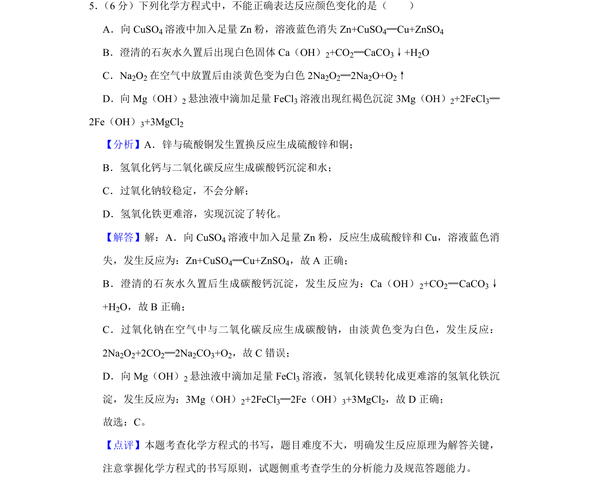
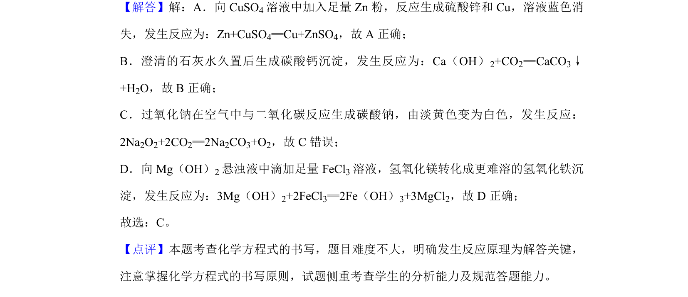

## 题面

## 摘要

该题通过化学方程式判断颜色变化反应的正误，考查常见无机化学反应原理。

## 关联考点

- [[621-化学方程式书写|化学方程式书写]]
- [[536-反应颜色变化|反应颜色变化]]
- [[330-沉淀转化|沉淀转化]]
- [[571-过氧化钠性质|过氧化钠性质]]

## 答案与解析

> 📄 原 PDF 第 4 页：`素材/真题/吉林/2008-2024·（吉林）化学高考真题/2019年高考化学试卷（新课标Ⅱ）（解析卷）.pdf`
