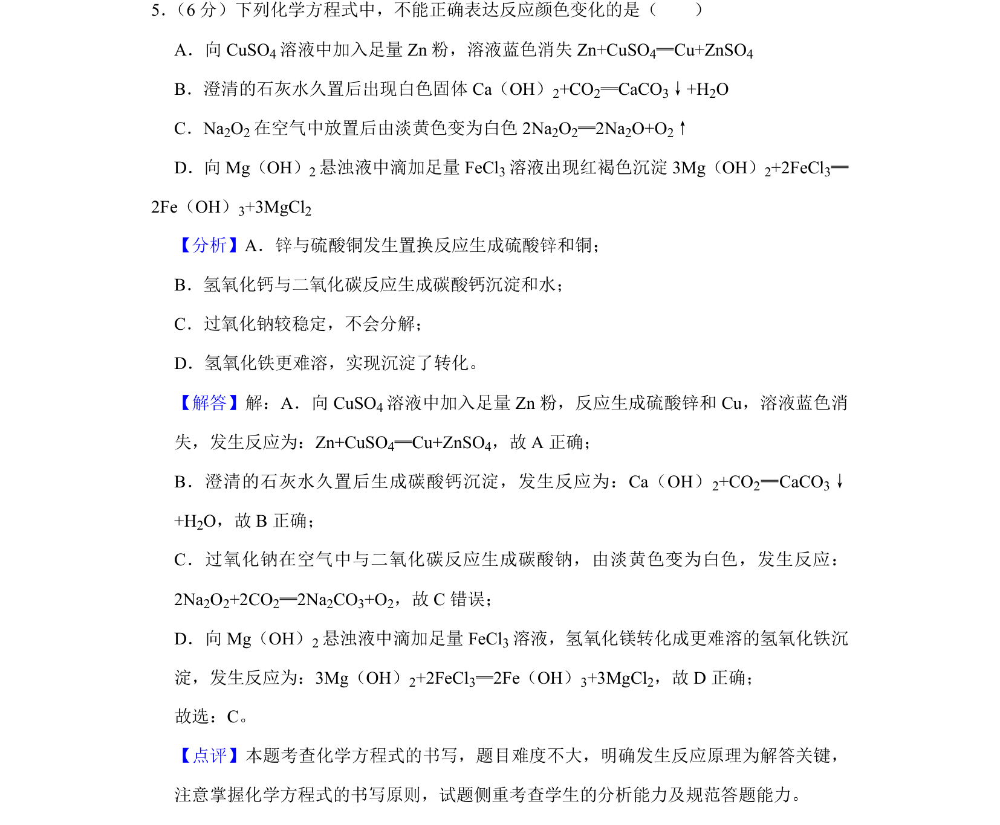
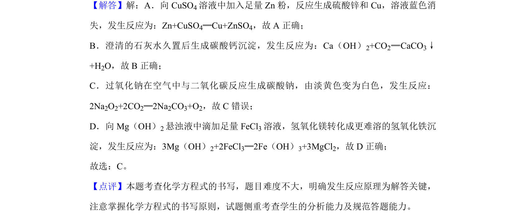

## 题面

## 摘要

该题通过化学方程式判断颜色变化反应的正误，考查常见无机化学反应原理。

## 关联考点

- [[976-化学方程式的书写|化学方程式书写]]
- [[536-反应颜色变化|反应颜色变化]]
- [[330-沉淀转化|沉淀转化]]
- [[571-过氧化钠性质|过氧化钠性质]]

## 答案与解析

> 📄 原 PDF 第 4 页：`素材/真题/吉林/2008-2024·（吉林）化学高考真题/2019年高考化学试卷（新课标Ⅱ）（解析卷）.pdf`

<!-- 题干文本-start -->
## 题干文本
5． （6分）下列化学方程式中，不能正确表达反应颜色变化的是（　　）
A．向CuSO 4溶液中加入足量Zn粉，溶液蓝色消失Zn+CuSO 4═Cu+ZnSO4
B．澄清的石灰水久置后出现白色固体Ca（OH） 2+CO2═CaCO3↓+H2O
C．Na2O2在空气中放置后由淡黄色变为白色2Na 2O2═2Na2O+O2↑
D．向Mg（OH） 2悬浊液中滴加足量FeCl 3溶液出现红褐色沉淀3Mg（OH） 2+2FeCl3═
2Fe（OH）3+3MgCl2
<!-- 题干文本-end -->

<!-- 解析文本-start -->
## 解析文本
【分析】A．锌与硫酸铜发生置换反应生成硫酸锌和铜；
B．氢氧化钙与二氧化碳反应生成碳酸钙沉淀和水；
C．过氧化钠较稳定，不会分解；
D．氢氧化铁更难溶，实现沉淀了转化。
【解答】解：A．向CuSO 4溶液中加入足量Zn粉，反应生成硫酸锌和Cu，溶液蓝色消
失，发生反应为：Zn+CuSO4═Cu+ZnSO4，故A正确；
B．澄清的石灰水久置后生成碳酸钙沉淀，发生反应为：Ca（OH） 2+CO2═CaCO3↓
+H2O，故B正确；
C．过氧化钠在空气中与二氧化碳反应生成碳酸钠，由淡黄色变为白色，发生反应：
2Na2O2+2CO2═2Na2CO3+O2，故C错误；
D．向Mg（OH） 2悬浊液中滴加足量FeCl 3溶液，氢氧化镁转化成更难溶的氢氧化铁沉
淀，发生反应为：3Mg（OH）2+2FeCl3═2Fe（OH）3+3MgCl2，故D正确；
故选：C。
【点评】本题考查化学方程式的书写，题目难度不大，明确发生反应原理为解答关键，
注意掌握化学方程式的书写原则，试题侧重考查学生的分析能力及规范答题能力。
<!-- 解析文本-end -->
