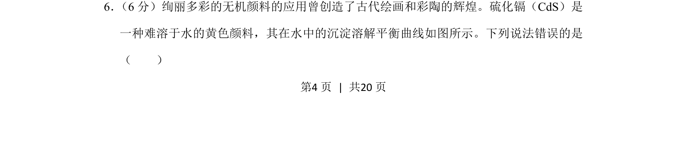
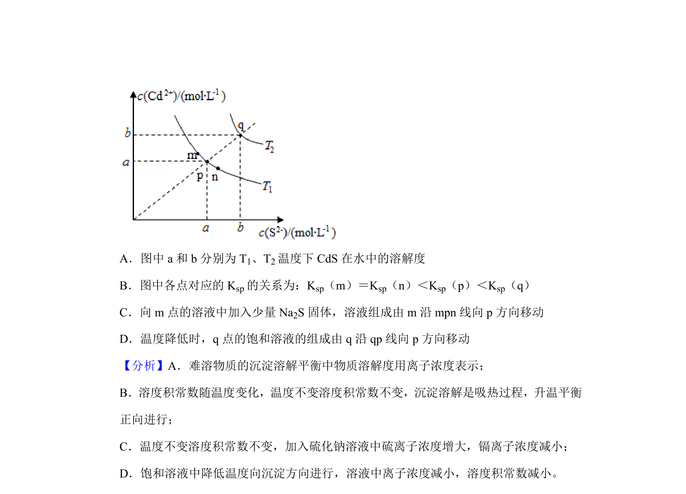
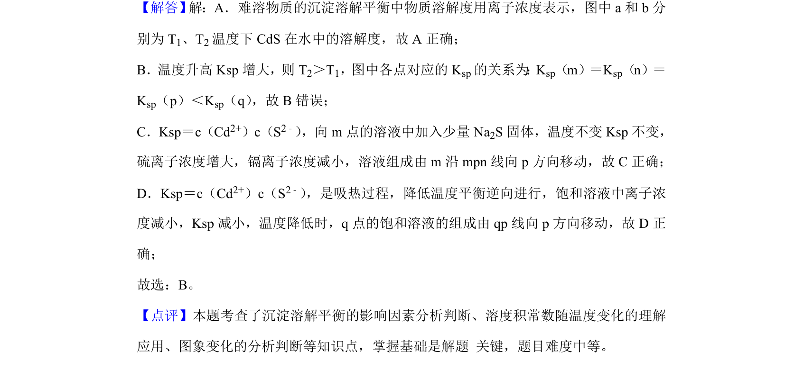

## 题面

## 摘要

该题以硫化镉的沉淀溶解平衡曲线图为背景，考查学生对溶度积常数和沉淀溶解平衡移动的理解与图像分析能力。

## 关联考点

- [[328-沉淀溶解平衡|沉淀溶解平衡]]
- [[762-溶度积|溶度积常数]]
- [[564-图像分析|图像分析]]
- [[349-平衡移动|平衡移动]]

## 答案与解析

> 📄 原 PDF 第 4 页：`素材/真题/吉林/2008-2024·（吉林）化学高考真题/2019年高考化学试卷（新课标Ⅱ）（解析卷）.pdf`
