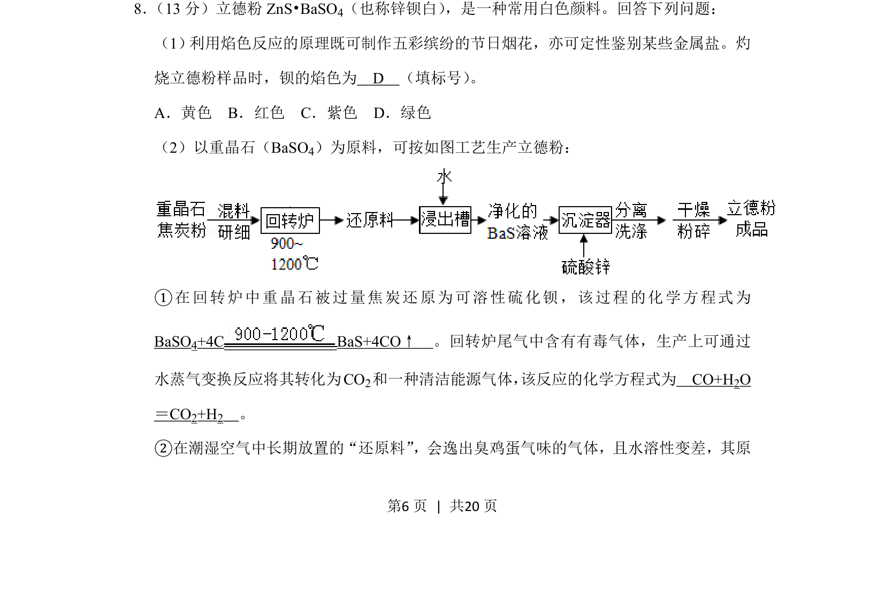
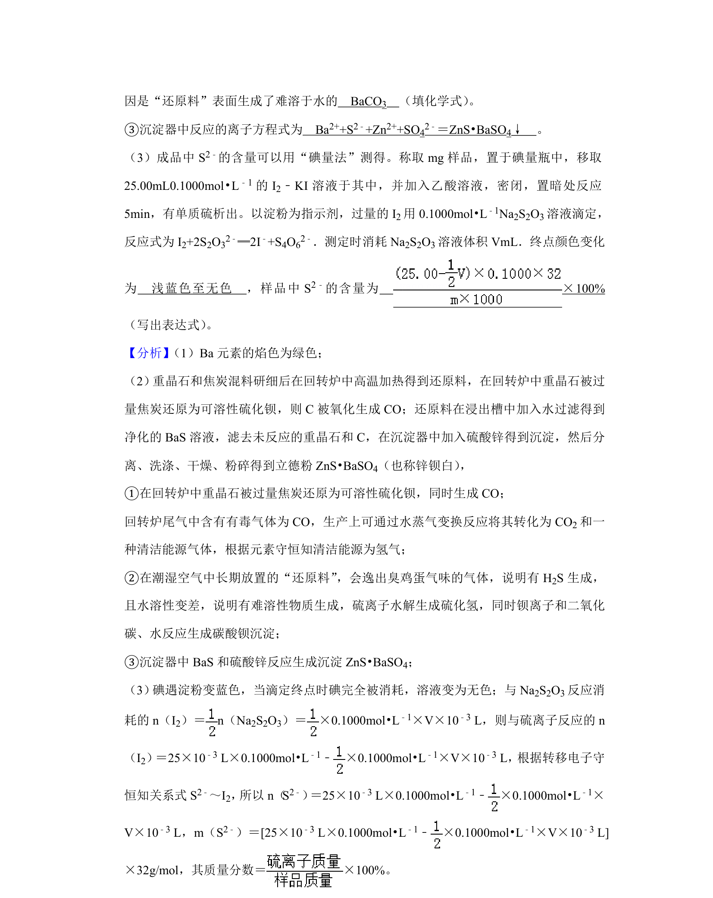
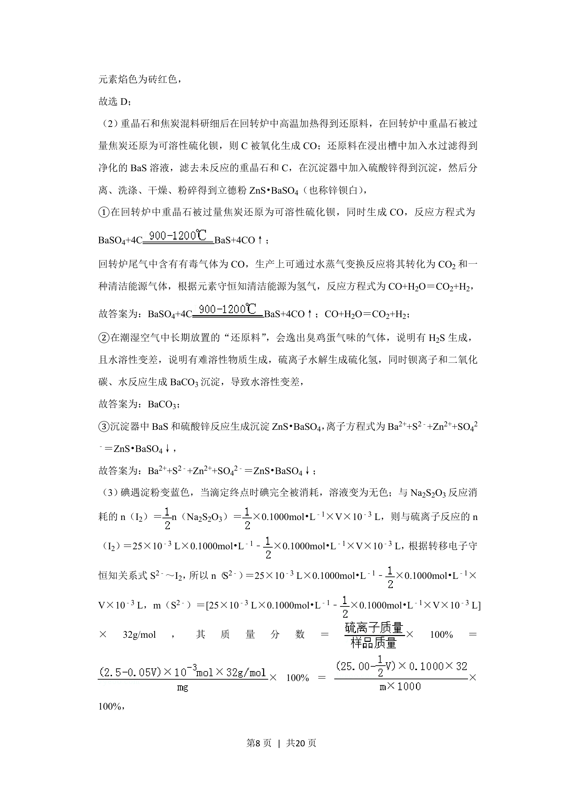
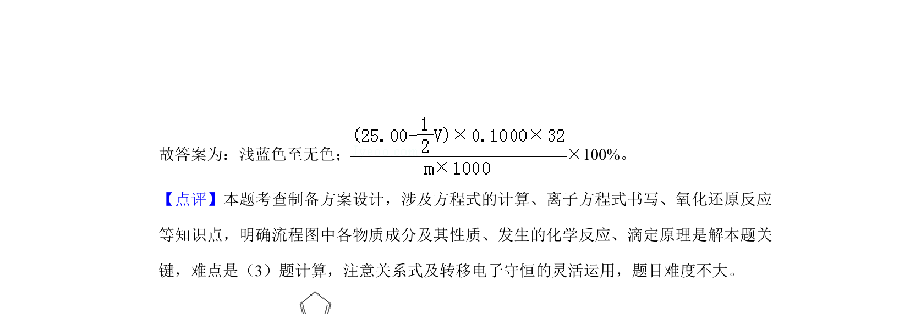

## 题面

## 摘要

立德粉相关工艺流程，涉及焰色反应、氧化还原方程式书写、尾气处理等知识。

## 关联考点

- [[205-焰色反应|焰色反应]]
- [[052-化学方程式|化学方程式]]
- [[162-氧化还原反应|氧化还原反应]]
- [[679-工艺流程|工艺流程]]

## 答案与解析

> 📄 原 PDF 第 6 页：`素材/真题/吉林/2008-2024·（吉林）化学高考真题/2019年高考化学试卷（新课标Ⅱ）（解析卷）.pdf`
