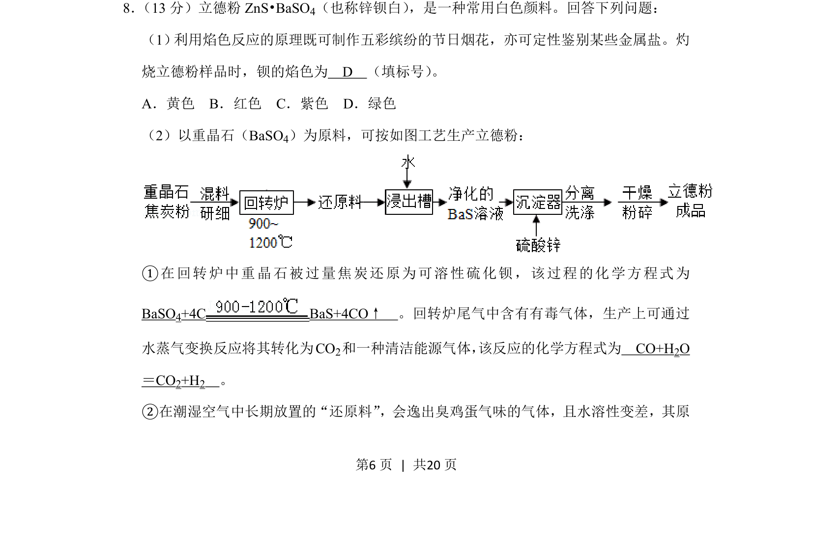
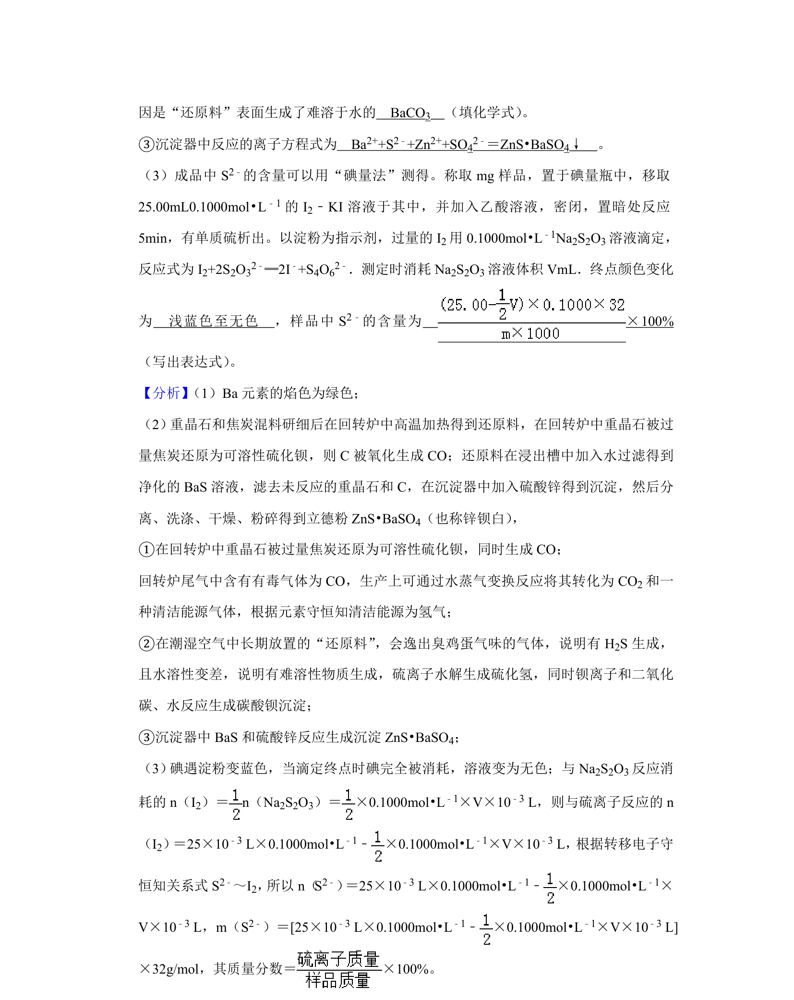
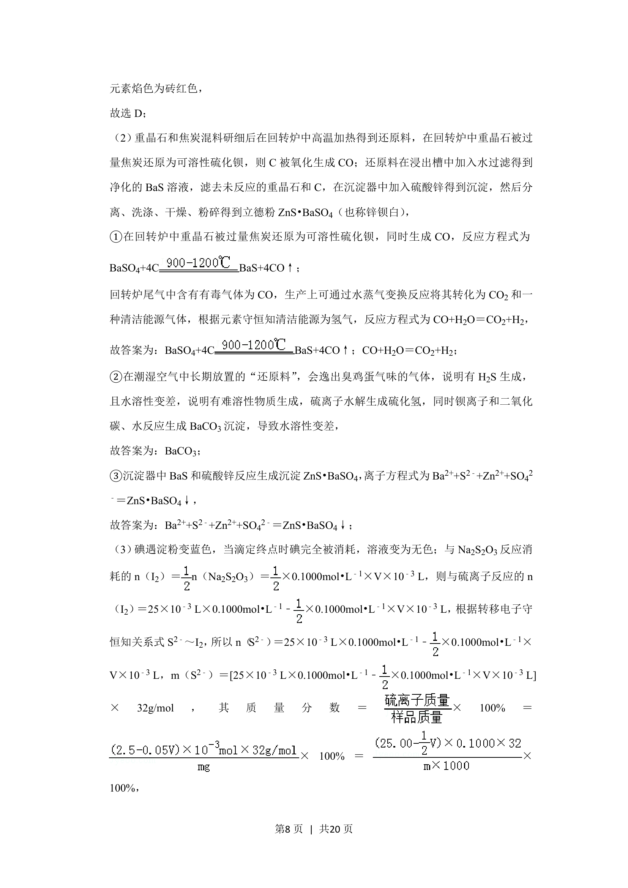
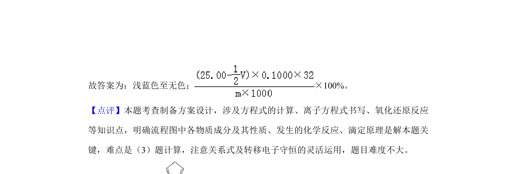

## 题面

## 摘要

立德粉相关工艺流程，涉及焰色反应、氧化还原方程式书写、尾气处理等知识。

## 关联考点

- [[205-焰色反应|焰色反应]]
- [[052-化学方程式|化学方程式]]
- [[162-氧化还原反应|氧化还原反应]]
- [[679-工艺流程|工艺流程]]

## 答案与解析

> 📄 原 PDF 第 6 页：`素材/真题/吉林/2008-2024·（吉林）化学高考真题/2019年高考化学试卷（新课标Ⅱ）（解析卷）.pdf`

<!-- 题干文本-start -->
## 题干文本
8． （13分）立德粉ZnS•BaSO4（也称锌钡白） ，是一种常用白色颜料。回答下列问题：
（1） 利用焰色反应的原理既可制作五彩缤纷的节日烟花，亦可定性鉴别某些金属盐。灼
烧立德粉样品时，钡的焰色为　D　（填标号） 。
A．黄色  B．红色  C．紫色  D．绿色
（2）以重晶石（BaSO4）为原料，可按如图工艺生产立德粉：
①在回转炉中重晶石被过量焦炭还原为可溶性硫化钡，该过程的化学方程式为　
BaSO4+4C BaS+4CO↑　。回转炉尾气中含有有毒气体，生产上可通过
水蒸气变换反应将其转化为CO 2和一种清洁能源气体， 该反应的化学方程式为　CO+H2O
＝CO2+H2　。
②在潮湿空气中长期放置的“还原料”，会逸出臭鸡蛋气味的气体，且水溶性变差，其原
<!-- 题干文本-end -->

<!-- 解析文本-start -->
## 解析文本

<!-- 解析文本-end -->
