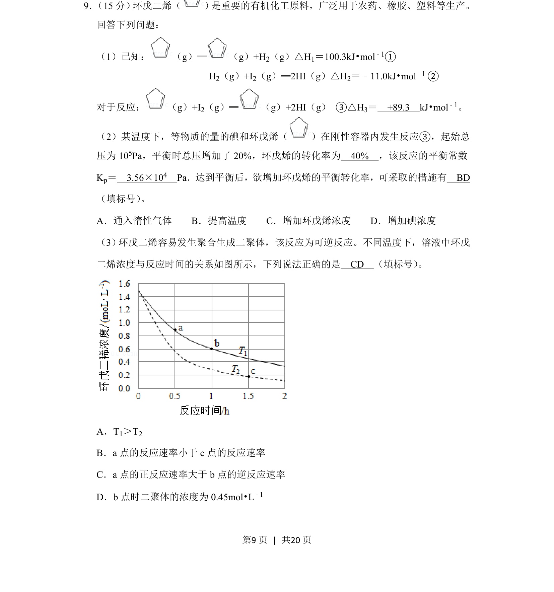

## 题面

## 摘要

本题为化学热力学与化学平衡综合题，涉及盖斯定律、转化率与平衡常数计算、反应速率与条件判断。

## 关联考点

- [[311-盖斯定律|盖斯定律]]
- [[342-化学平衡常数|化学平衡常数]]
- [[转化率计算]]
- [[反应速率图像分析]]

## 答案与解析

> 📄 原 PDF 第 9 页：`素材/真题/吉林/2008-2024·（吉林）化学高考真题/2019年高考化学试卷（新课标Ⅱ）（解析卷）.pdf`
