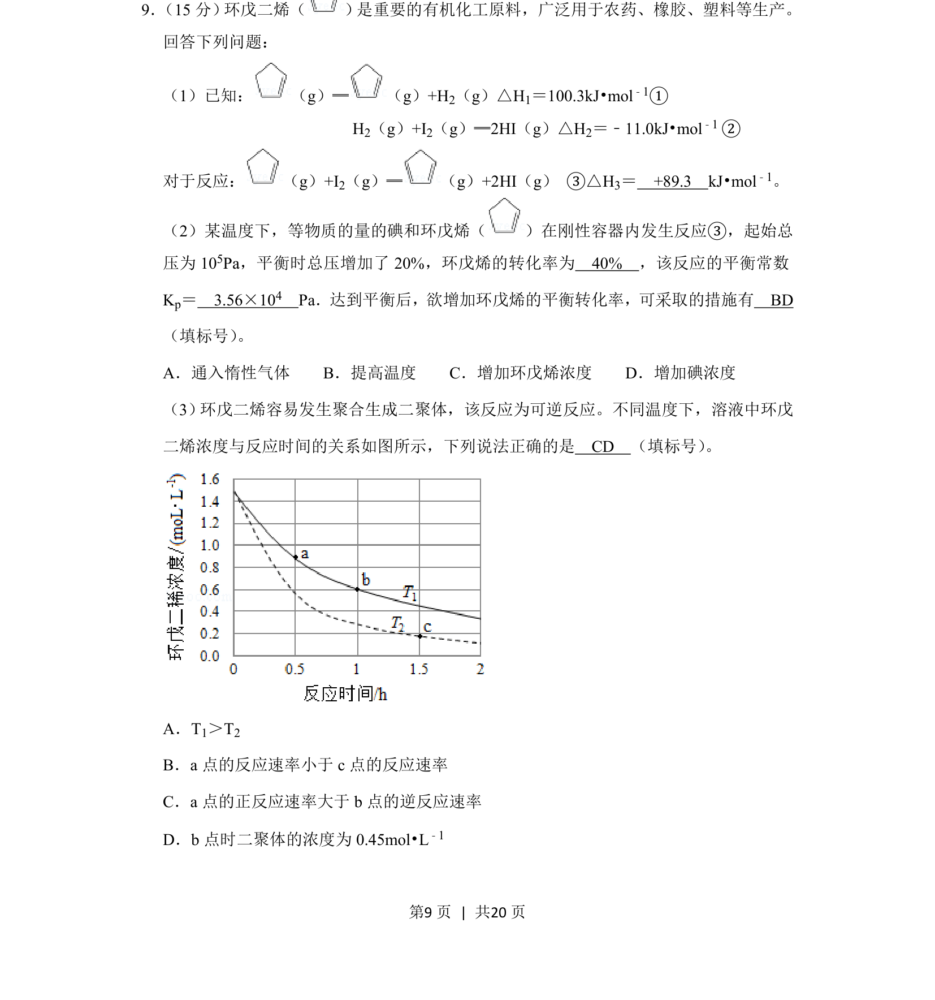
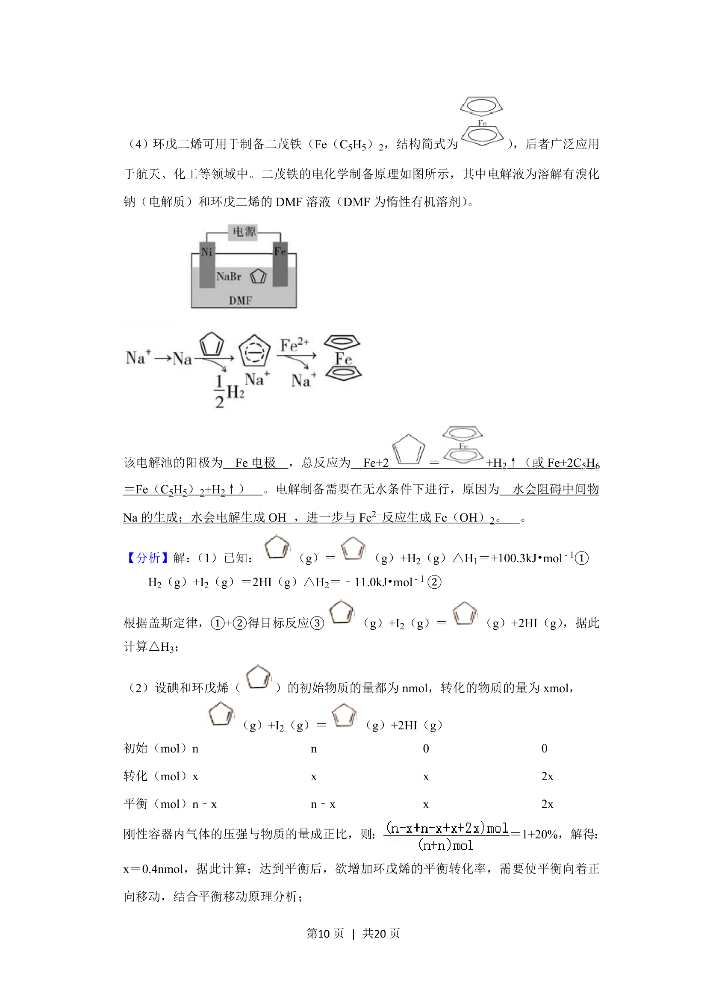
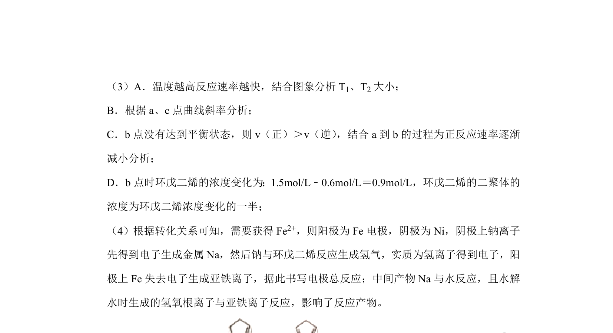
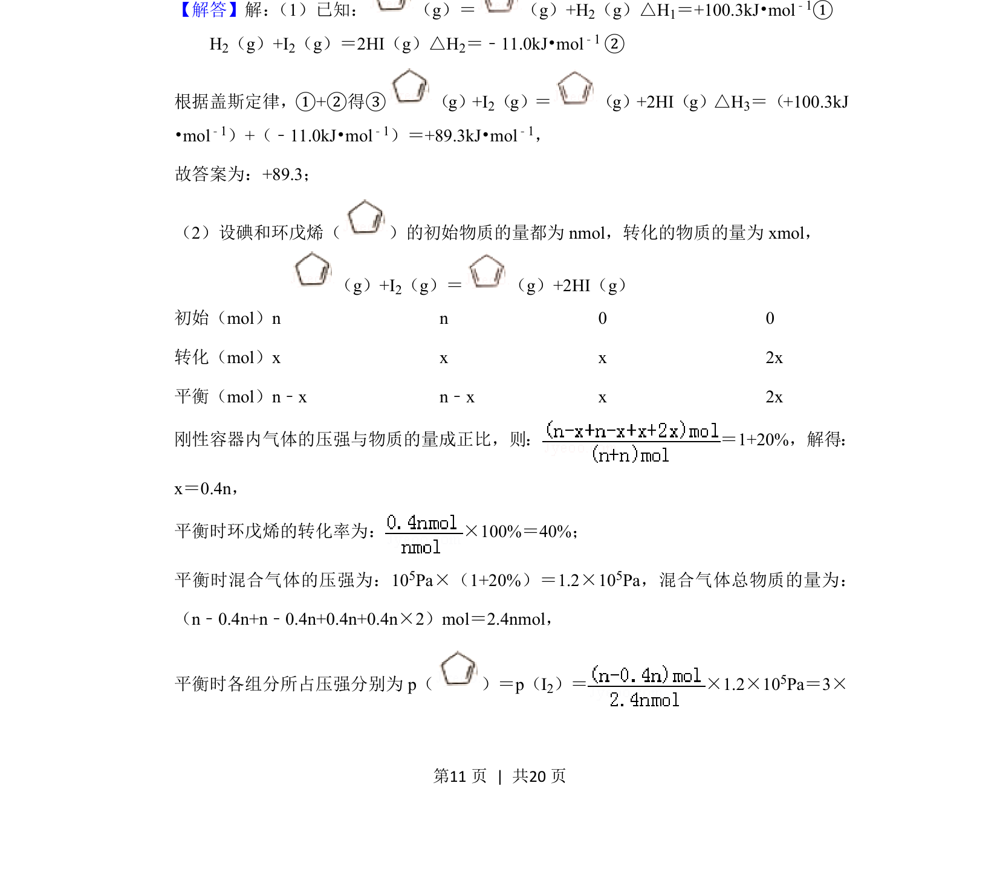
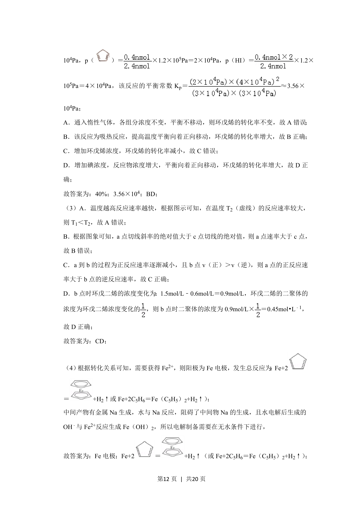
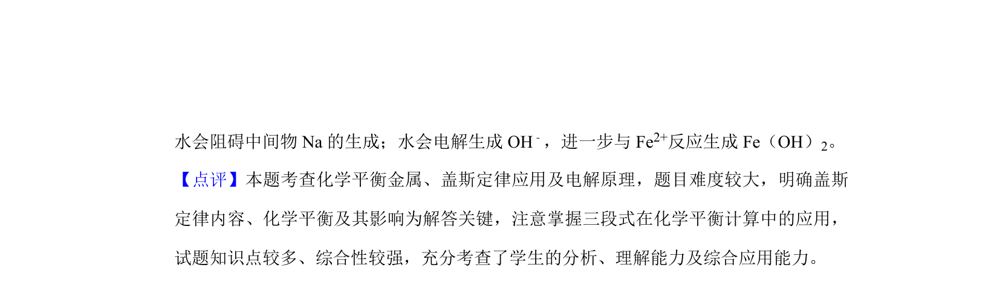

## 题面

## 摘要

本题为化学热力学与化学平衡综合题，涉及盖斯定律、转化率与平衡常数计算、反应速率与条件判断。

## 关联考点

- [[311-盖斯定律|盖斯定律]]
- [[342-化学平衡常数|化学平衡常数]]
- [[843-转化率计算|转化率计算]]
- [[650-反应速率图像分析|反应速率图像分析]]

## 答案与解析

> 📄 原 PDF 第 9 页：`素材/真题/吉林/2008-2024·（吉林）化学高考真题/2019年高考化学试卷（新课标Ⅱ）（解析卷）.pdf`

<!-- 题干文本-start -->
## 题干文本
9． （15分） 环戊二烯（ ） 是重要的有机化工原料，广泛用于农药、橡胶、塑料等生产。
回答下列问题：
（1）已知： （g）═ （g）+H 2（g）△H1＝100.3kJ•mol﹣1①
                       H 2（g）+I2（g）═2HI（g）△H2＝﹣11.0kJ•mol﹣1 ②
对于反应： （g）+I 2（g）═ （g）+2HI（g） ③△H 3＝　+89.3　kJ•mol﹣1。
（2）某温度下，等物质的量的碘和环戊烯（ ）在刚性容器内发生反应③，起始总
压为10 5Pa，平衡时总压增加了20%，环戊烯的转化率为　40%　，该反应的平衡常数
Kp＝　3.56×104　Pa．达到平衡后，欲增加环戊烯的平衡转化率，可采取的措施有　BD　
（填标号） 。
A．通入惰性气体    B．提高温度    C．增加环戊烯浓度    D．增加碘浓度
（3） 环戊二烯容易发生聚合生成二聚体，该反应为可逆反应。不同温度下，溶液中环戊
二烯浓度与反应时间的关系如图所示，下列说法正确的是　CD　（填标号） 。
A．T1＞T2
B．a点的反应速率小于c点的反应速率
C．a点的正反应速率大于b点的逆反应速率
D．b点时二聚体的浓度为0.45mol•L ﹣1
<!-- 题干文本-end -->

<!-- 解析文本-start -->
## 解析文本

<!-- 解析文本-end -->
