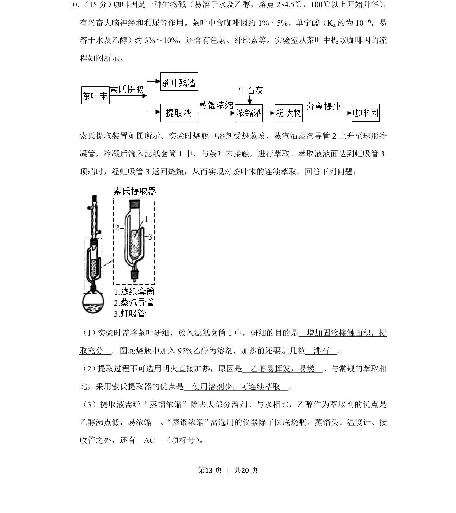
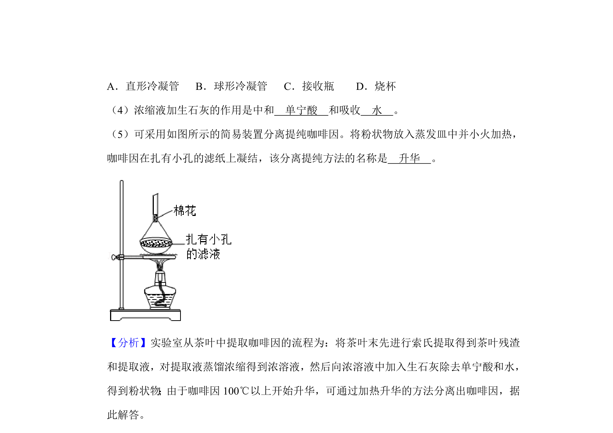
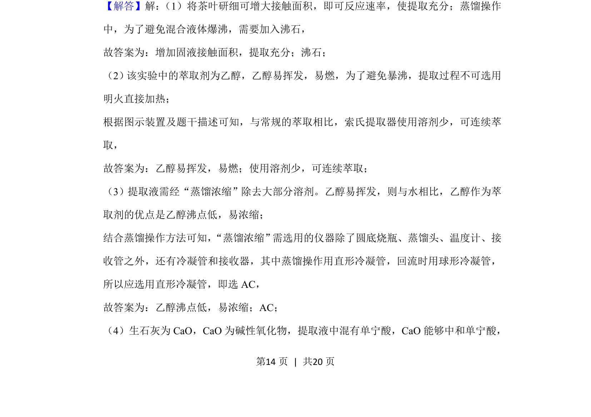
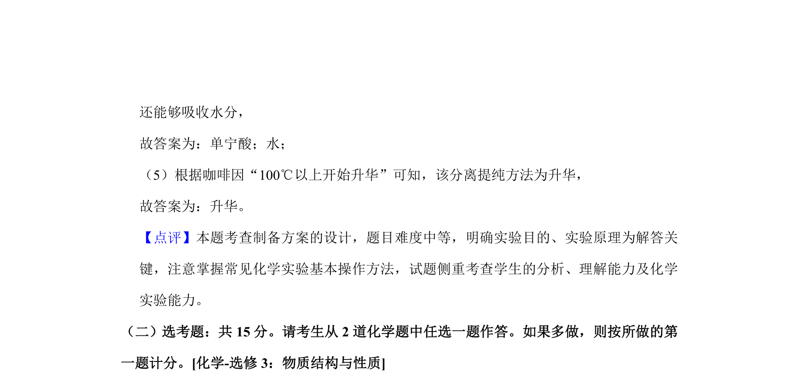

## 题面

## 摘要

茶叶中咖啡因的提取实验操作、仪器选择及萃取原理

## 关联考点

- [[580-实验操作|实验操作]]
- [[592-仪器选择|仪器选择]]
- [[833-萃取原理|萃取原理]]

## 答案与解析

> 📄 原 PDF 第 13 页：`素材/真题/吉林/2008-2024·（吉林）化学高考真题/2019年高考化学试卷（新课标Ⅱ）（解析卷）.pdf`
