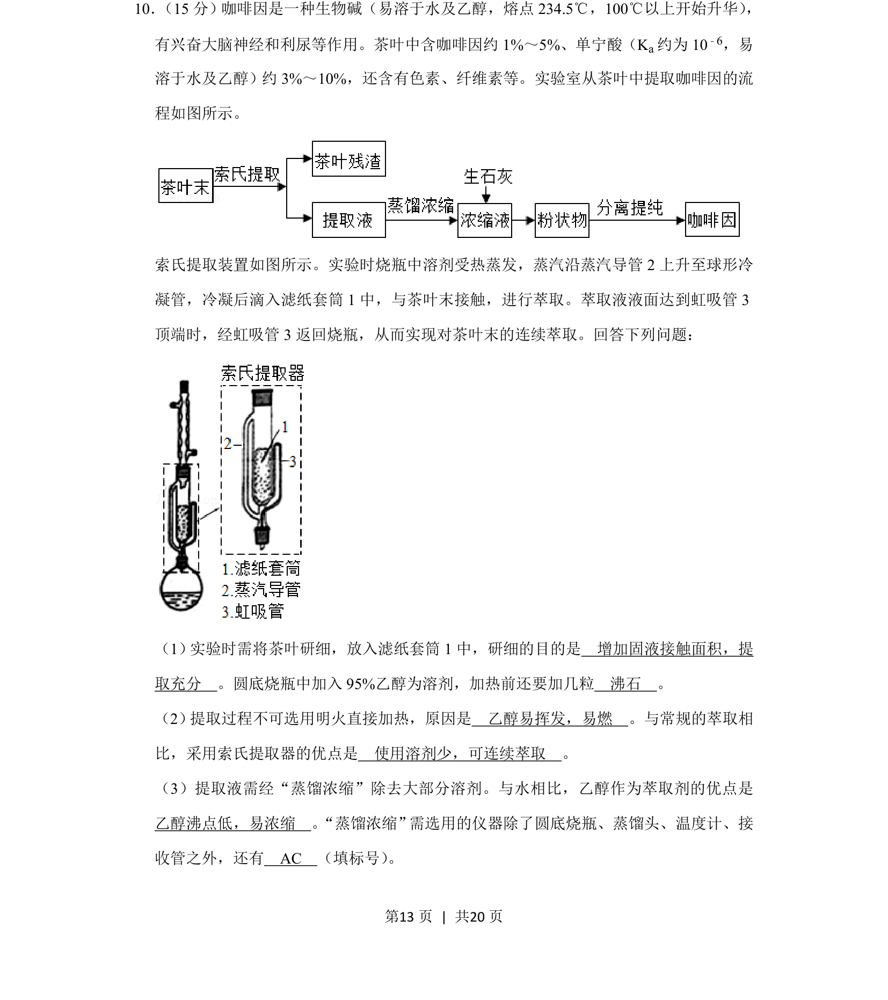
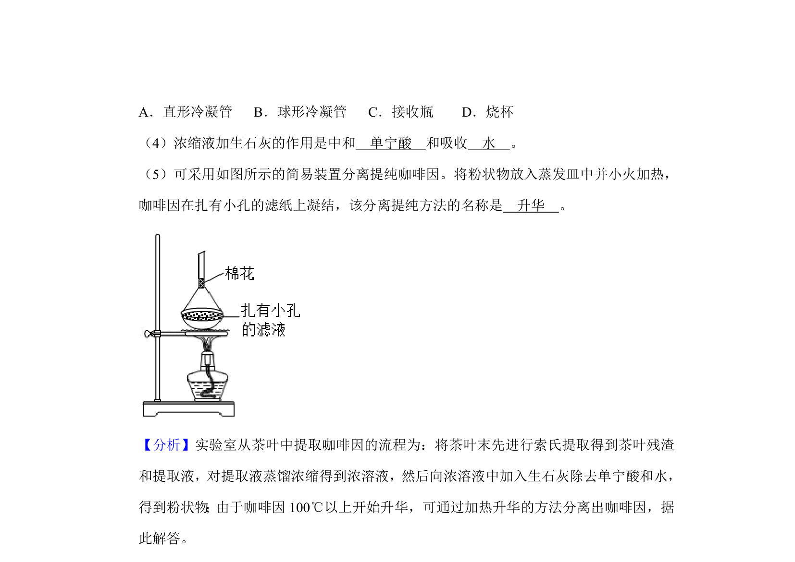
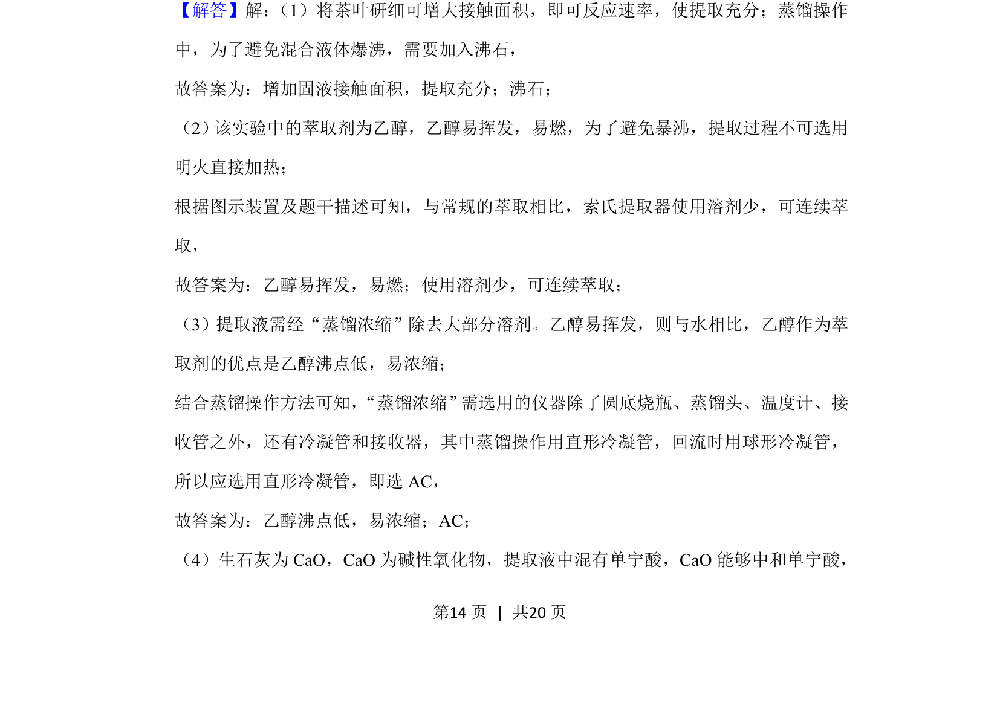
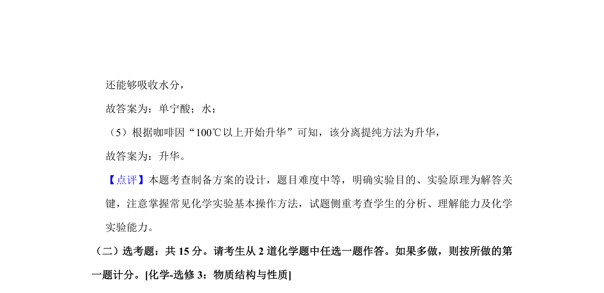

## 题面

## 摘要

茶叶中咖啡因的提取实验操作、仪器选择及萃取原理

## 关联考点

- [[580-实验操作|实验操作]]
- [[592-仪器选择|仪器选择]]
- [[833-萃取原理|萃取原理]]

## 答案与解析

> 📄 原 PDF 第 13 页：`素材/真题/吉林/2008-2024·（吉林）化学高考真题/2019年高考化学试卷（新课标Ⅱ）（解析卷）.pdf`

<!-- 题干文本-start -->
## 题干文本
10． （15分）咖啡因是一种生物碱（易溶于水及乙醇，熔点234.5℃，100℃以上开始升华） ，
有兴奋大脑神经和利尿等作用。茶叶中含咖啡因约1%～5%、单宁酸（K a约为10 ﹣6，易
溶于水及乙醇）约3%～10%，还含有色素、纤维素等。实验室从茶叶中提取咖啡因的流
程如图所示。
索氏提取装置如图所示。实验时烧瓶中溶剂受热蒸发，蒸汽沿蒸汽导管2上升至球形冷
凝管，冷凝后滴入滤纸套筒1中，与茶叶末接触，进行萃取。萃取液液面达到虹吸管3
顶端时，经虹吸管3返回烧瓶，从而实现对茶叶末的连续萃取。回答下列问题：
（1） 实验时需将茶叶研细，放入滤纸套筒1中，研细的目的是　增加固液接触面积，提
取充分　。圆底烧瓶中加入95%乙醇为溶剂，加热前还要加几粒　沸石　。
（2） 提取过程不可选用明火直接加热，原因是　乙醇易挥发，易燃　。与常规的萃取相
比，采用索氏提取器的优点是　使用溶剂少，可连续萃取　。
（3）提取液需经“蒸馏浓缩”除去大部分溶剂。与水相比，乙醇作为萃取剂的优点是　
乙醇沸点低，易浓缩　。“蒸馏浓缩”需选用的仪器除了圆底烧瓶、蒸馏头、温度计、接
收管之外，还有　AC　（填标号） 。
<!-- 题干文本-end -->

<!-- 解析文本-start -->
## 解析文本

<!-- 解析文本-end -->
