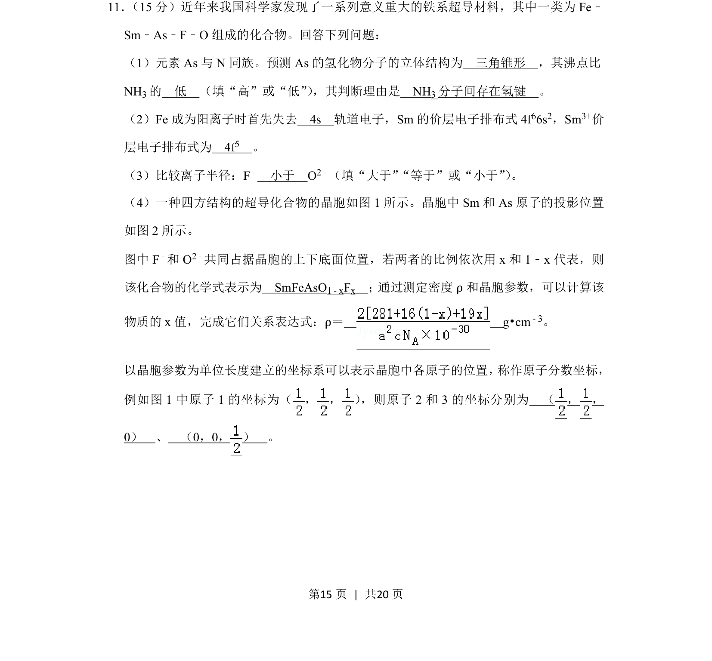
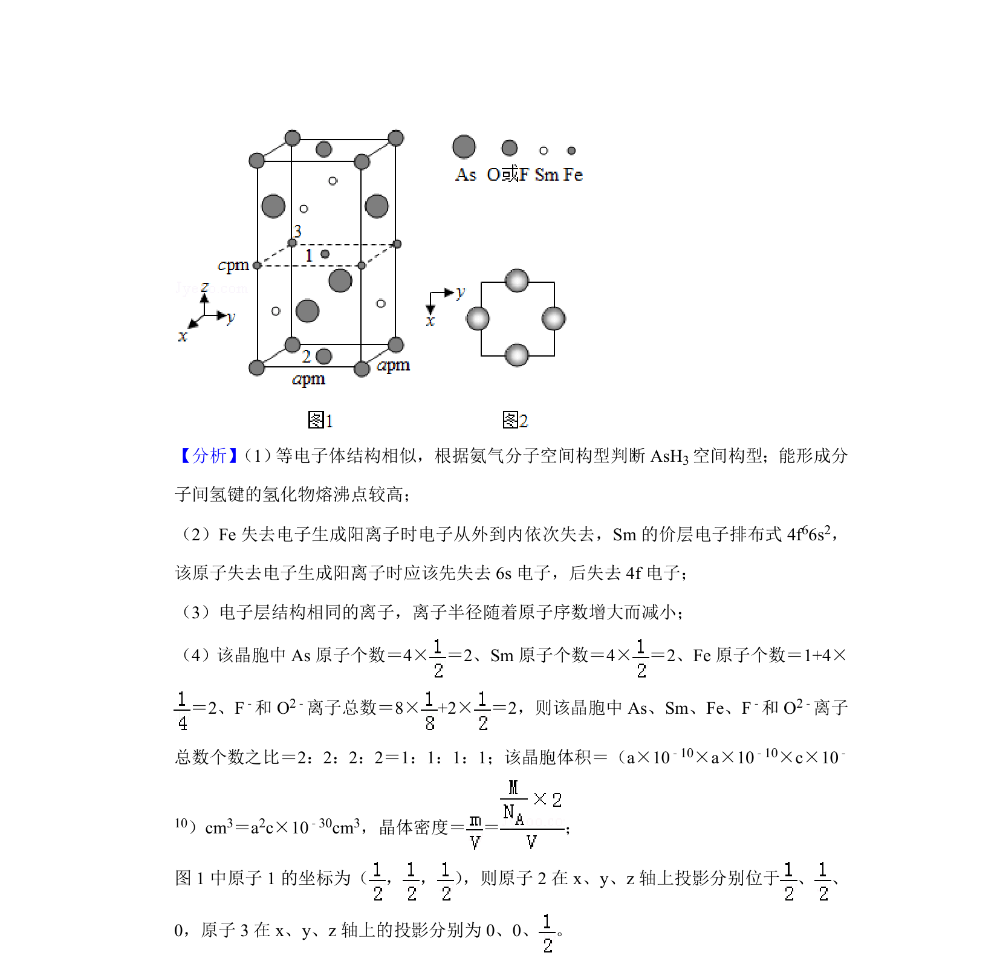
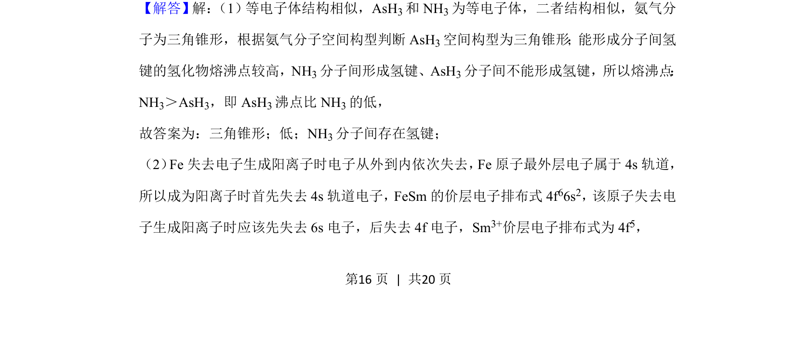
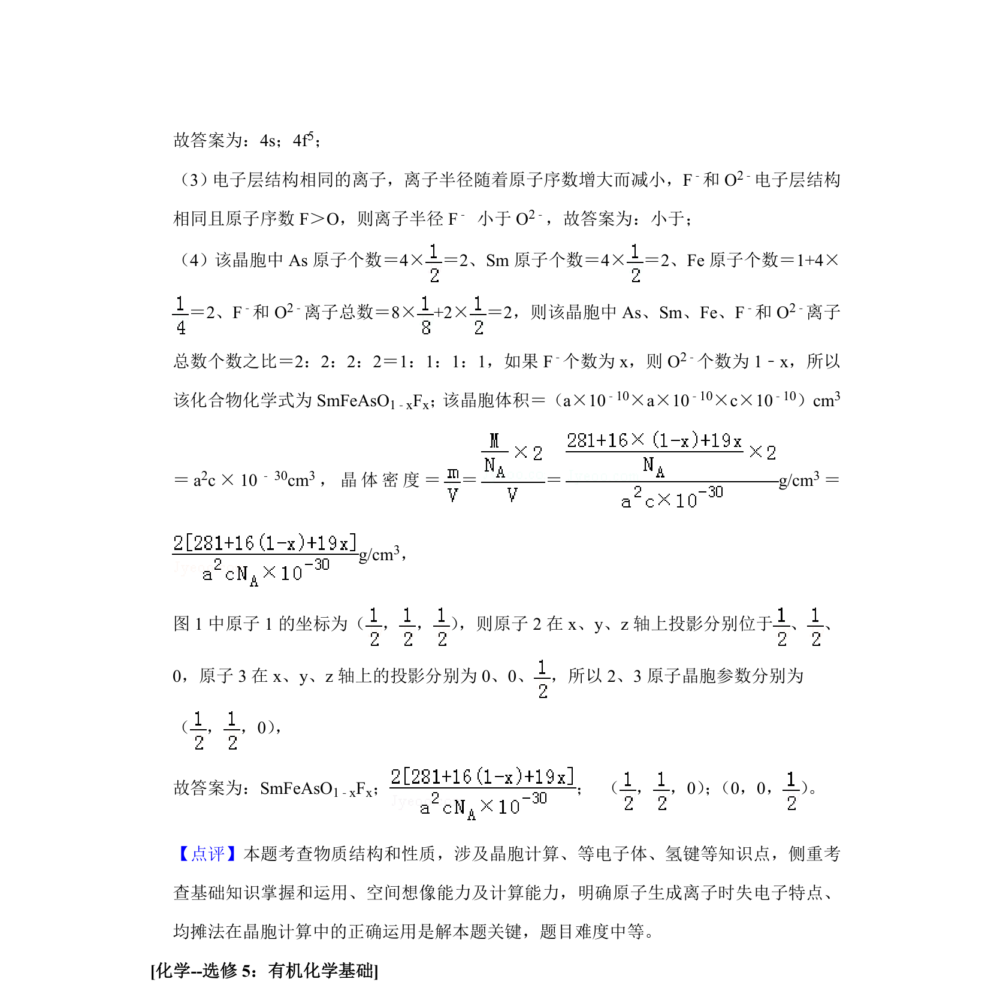

## 题面

## 摘要

该题考查铁系超导材料的结构、电子排布、化学式推断及晶胞密度计算。

## 关联考点

- [[784-物质结构|物质结构]]
- [[701-晶胞参数|晶胞参数]]
- [[586-密度公式|密度公式]]
- [[537-坐标表达|坐标表达]]

## 答案与解析

> 📄 原 PDF 第 15 页：`素材/真题/吉林/2008-2024·（吉林）化学高考真题/2019年高考化学试卷（新课标Ⅱ）（解析卷）.pdf`

<!-- 题干文本-start -->
## 题干文本
11． （15分）近年来我国科学家发现了一系列意义重大的铁系超导材料，其中一类为Fe﹣
Sm﹣As﹣F﹣O组成的化合物。回答下列问题：
（1）元素As与N同族。预测As的氢化物分子的立体结构为　三角锥形　，其沸点比
NH3的　低　（填“高”或“低”） ，其判断理由是　NH3分子间存在氢键　。
（2）Fe成为阳离子时首先失去　4s　轨道电子，Sm的价层电子排布式4f 66s2，Sm3+价
层电子排布式为　4f5　。
（3）比较离子半径：F﹣　小于　O2﹣（填“大于” “等于”或“小于”） 。
（4）一种四方结构的超导化合物的晶胞如图1所示。晶胞中Sm和As原子的投影位置
如图2所示。
图中F ﹣和O 2﹣共同占据晶胞的上下底面位置，若两者的比例依次用x和1﹣x代表，则
该化合物的化学式表示为　SmFeAsO1﹣xFx　；通过测定密度ρ和晶胞参数，可以计算该
物质的x值，完成它们关系表达式：ρ＝　 　g•cm﹣3。
以晶胞参数为单位长度建立的坐标系可以表示晶胞中各原子的位置， 称作原子分数坐标，
例如图1中原子1的坐标为（ ， ， ） ，则原子2和3的坐标分别为　（ ， ，
0）　、　（0，0， ）　。
<!-- 题干文本-end -->

<!-- 解析文本-start -->
## 解析文本

<!-- 解析文本-end -->
