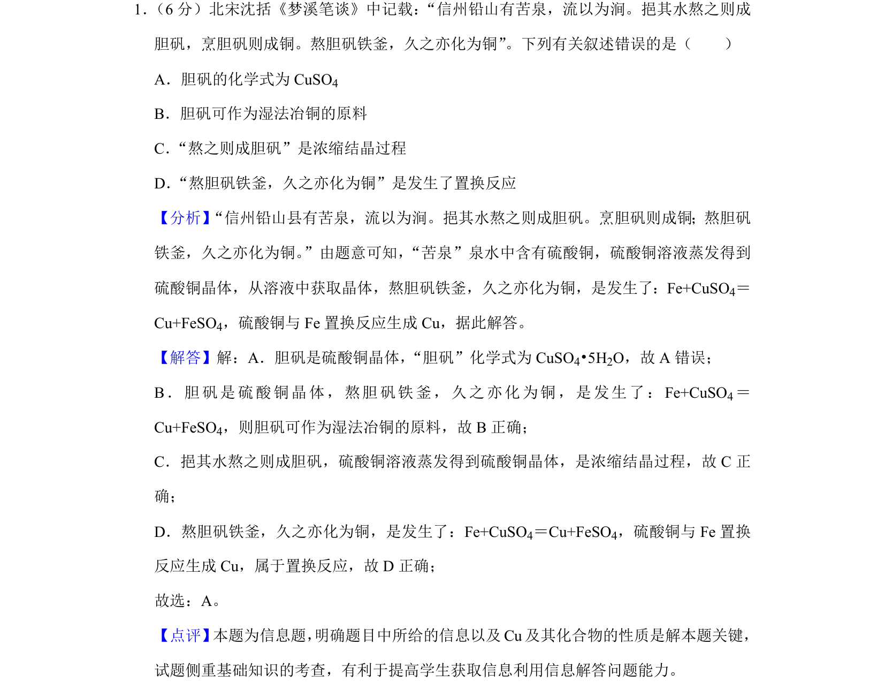
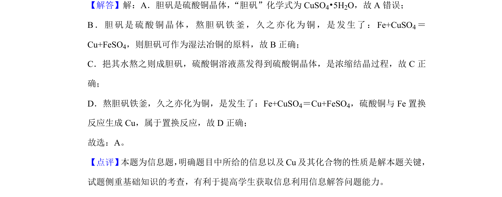

## 题面

## 摘要

本题考查沈括《梦溪笔谈》中胆矾相关化学知识的判断。

## 关联考点

- [[826-胆矾化学式|胆矾化学式]]
- [[761-湿法冶铜|湿法冶铜]]
- [[089-结晶|结晶]]
- [[095-置换反应|置换反应]]

## 答案与解析

> 📄 原 PDF 第 1 页：`素材/真题/吉林/2008-2024·（吉林）化学高考真题/2020年高考化学试卷（新课标Ⅱ）（解析卷）.pdf`

<!-- 题干文本-start -->
## 题干文本
1． （6分）北宋沈括《梦溪笔谈》中记载：“信州铅山有苦泉，流以为涧。挹其水熬之则成
胆矾，烹胆矾则成铜。熬胆矾铁釜，久之亦化为铜”。下列有关叙述错误的是（　　）
A．胆矾的化学式为CuSO 4
B．胆矾可作为湿法冶铜的原料
C．“熬之则成胆矾”是浓缩结晶过程
D．“熬胆矾铁釜，久之亦化为铜”是发生了置换反应
<!-- 题干文本-end -->

<!-- 解析文本-start -->
## 解析文本
【分析】“信州铅山县有苦泉，流以为涧。挹其水熬之则成胆矾。烹胆矾则成铜；熬胆矾
铁釜，久之亦化为铜。”由题意可知，“苦泉”泉水中含有硫酸铜，硫酸铜溶液蒸发得到
硫酸铜晶体，从溶液中获取晶体，熬胆矾铁釜，久之亦化为铜，是发生了：Fe+CuSO4＝
Cu+FeSO4，硫酸铜与Fe置换反应生成Cu，据此解答。
【解答】解：A．胆矾是硫酸铜晶体，“胆矾”化学式为CuSO4•5H2O，故A错误；
B．胆矾是硫酸铜晶体，熬胆矾铁釜，久之亦化为铜，是发生了：Fe+CuSO 4＝
Cu+FeSO4，则胆矾可作为湿法冶铜的原料，故B正确；
C．挹其水熬之则成胆矾，硫酸铜溶液蒸发得到硫酸铜晶体，是浓缩结晶过程，故C正
确；
D．熬胆矾铁釜，久之亦化为铜，是发生了：Fe+CuSO 4＝Cu+FeSO4，硫酸铜与Fe置换
反应生成Cu，属于置换反应，故D正确；
故选：A。
【点评】 本题为信息题， 明确题目中所给的信息以及Cu及其化合物的性质是解本题关键，
试题侧重基础知识的考查，有利于提高学生获取信息利用信息解答问题能力。
<!-- 解析文本-end -->
