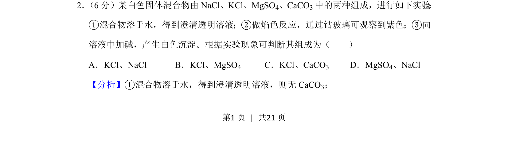
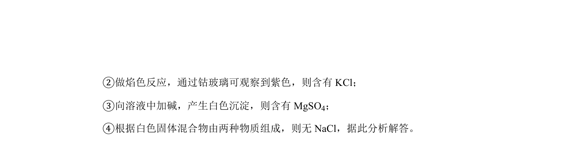
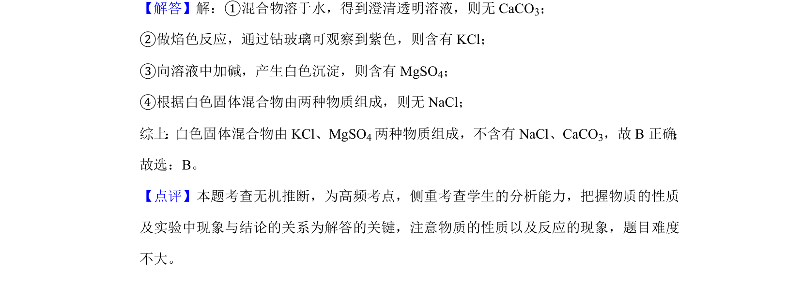

## 题面

## 摘要

该题通过溶解性、焰色反应和加碱沉淀实验推断混合物组成。

## 关联考点

- [[557-物质检验|物质检验]]
- [[169-离子反应|离子反应]]
- [[328-沉淀溶解平衡|沉淀溶解平衡]]

## 答案与解析

> 📄 原 PDF 第 1 页：`素材/真题/吉林/2008-2024·（吉林）化学高考真题/2020年高考化学试卷（新课标Ⅱ）（解析卷）.pdf`

<!-- 题干文本-start -->
## 题干文本
2． （6分）某白色固体混合物由NaCl、KCl、MgSO4、CaCO3中的两种组成，进行如下实验 ：
①混合物溶于水，得到澄清透明溶液；②做焰色反应，通过钴玻璃可观察到紫色；③向
溶液中加碱，产生白色沉淀。根据实验现象可判断其组成为（　　）
A．KCl、NaCl B．KCl、MgSO 4 C．KCl、CaCO3 D．MgSO4、NaCl
<!-- 题干文本-end -->

<!-- 解析文本-start -->
## 解析文本
【分析】①混合物溶于水，得到澄清透明溶液，则无CaCO 3；
<!-- 解析文本-end -->
