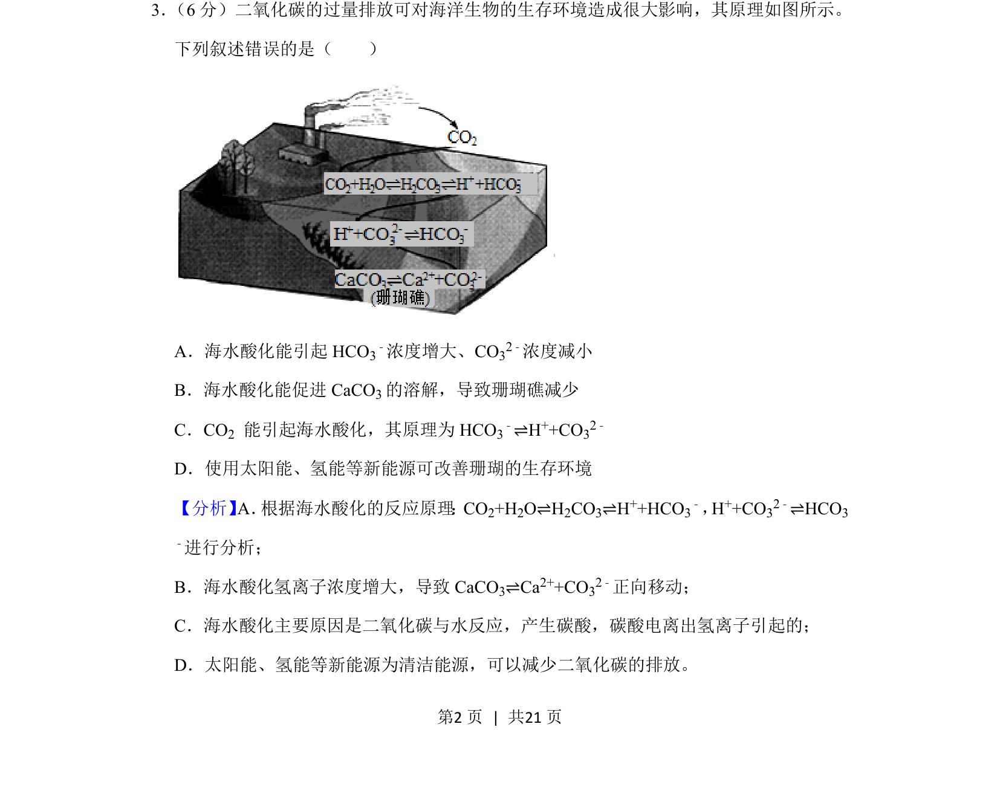
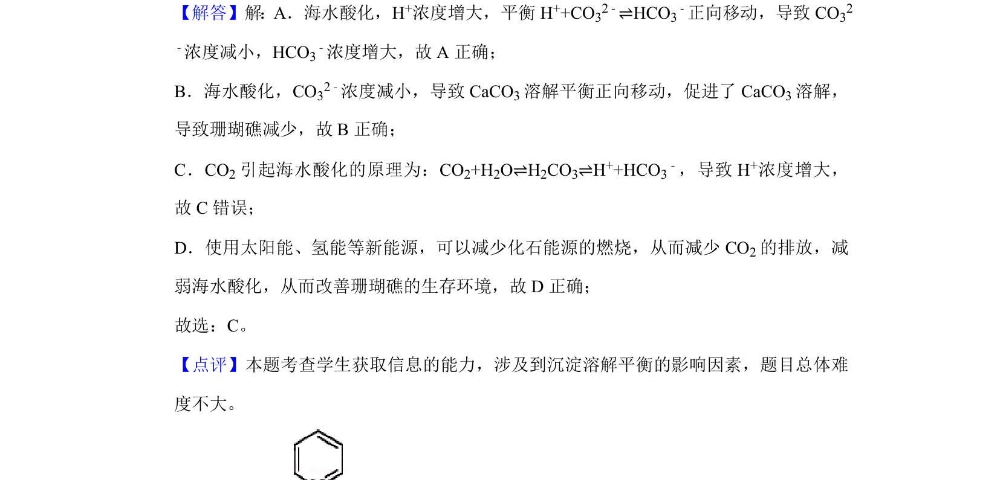

## 题面

## 摘要

该题考查二氧化碳过量排放对海洋环境的影响及相关化学平衡分析。

## 关联考点

- [[284-化学平衡|化学平衡]]
- [[334-电离平衡|电离平衡]]
- [[787-环境化学|环境化学]]

## 答案与解析

> 📄 原 PDF 第 2 页：`素材/真题/吉林/2008-2024·（吉林）化学高考真题/2020年高考化学试卷（新课标Ⅱ）（解析卷）.pdf`
