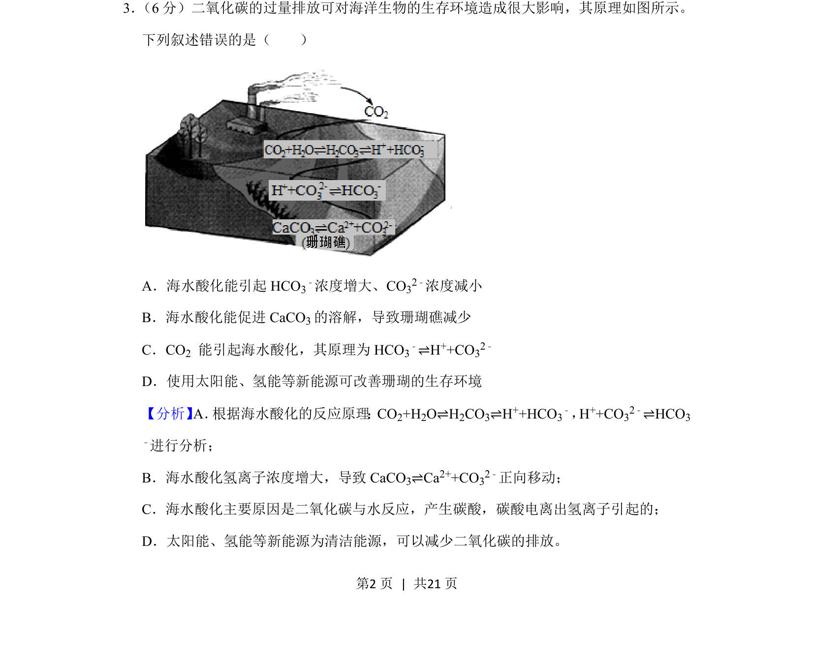
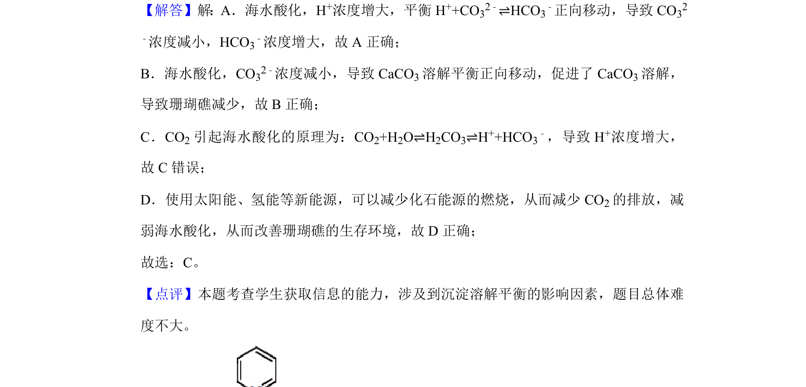

## 题面

## 摘要

该题考查二氧化碳过量排放对海洋环境的影响及相关化学平衡分析。

## 关联考点

- [[284-化学平衡|化学平衡]]
- [[334-电离平衡|电离平衡]]
- [[786-环境化学|环境化学]]

## 答案与解析

> 📄 原 PDF 第 2 页：`素材/真题/吉林/2008-2024·（吉林）化学高考真题/2020年高考化学试卷（新课标Ⅱ）（解析卷）.pdf`

<!-- 题干文本-start -->
## 题干文本
3． （6分）二氧化碳的过量排放可对海洋生物的生存环境造成很大影响，其原理如图所示。
下列叙述错误的是（　　）
A．海水酸化能引起HCO 3
﹣浓度增大、CO32﹣浓度减小
B．海水酸化能促进CaCO 3的溶解，导致珊瑚礁减少
C．CO2 能引起海水酸化，其原理为HCO 3
﹣⇌H++CO32﹣
D．使用太阳能、氢能等新能源可改善珊瑚的生存环境
<!-- 题干文本-end -->

<!-- 解析文本-start -->
## 解析文本
【分析】A． 根据海水酸化的反应原理 ：CO2+H2O⇌H2CO3⇌H++HCO3
﹣，H++CO32﹣⇌HCO3
﹣进行分析；
B．海水酸化氢离子浓度增大，导致CaCO 3⇌Ca2++CO32﹣正向移动；
C．海水酸化主要原因是二氧化碳与水反应，产生碳酸，碳酸电离出氢离子引起的；
D．太阳能、氢能等新能源为清洁能源，可以减少二氧化碳的排放。
<!-- 解析文本-end -->
