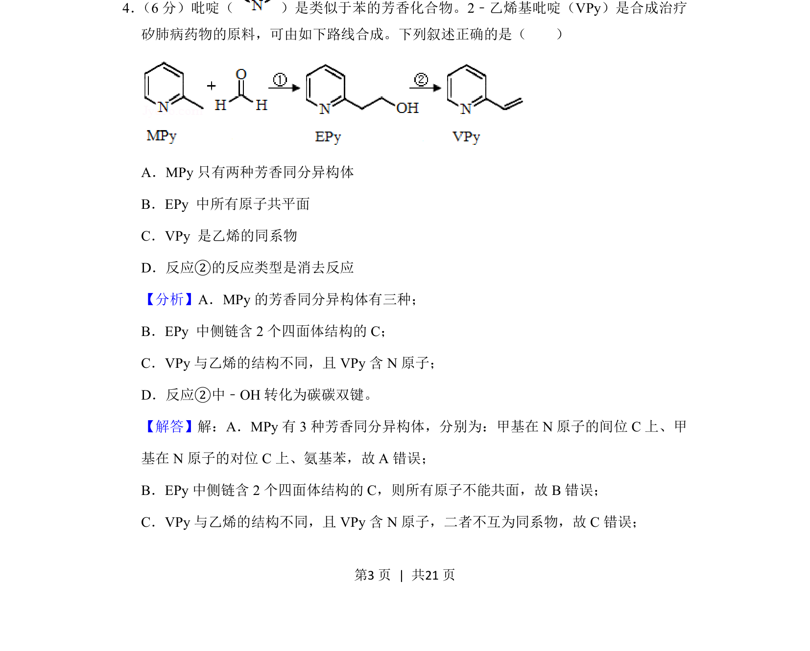
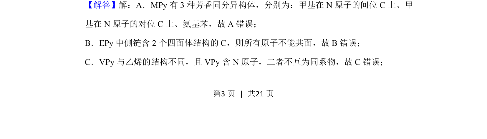
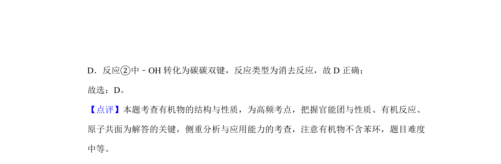

## 题面

## 摘要

该题考查有机化学中芳香同分异构体、原子共面、同系物及反应类型的判断。

## 关联考点

- [[446-同分异构体|同分异构体]]
- [[529-原子共面|原子共面]]
- [[658-同系物|同系物]]
- [[756-消去反应|消去反应]]

## 答案与解析

> 📄 原 PDF 第 3 页：`素材/真题/吉林/2008-2024·（吉林）化学高考真题/2020年高考化学试卷（新课标Ⅱ）（解析卷）.pdf`

<!-- 题干文本-start -->
## 题干文本
4． （6分）吡啶（ ）是类似于苯的芳香化合物。2﹣乙烯基吡啶（VPy）是合成治疗
矽肺病药物的原料，可由如下路线合成。下列叙述正确的是（　　）
A．MPy只有两种芳香同分异构体
B．EPy 中所有原子共平面
C．VPy 是乙烯的同系物
D．反应②的反应类型是消去反应
<!-- 题干文本-end -->

<!-- 解析文本-start -->
## 解析文本
【分析】A．MPy的芳香同分异构体有三种；
B．EPy 中侧链含2个四面体结构的C；
C．VPy与乙烯的结构不同，且VPy含N原子；
D．反应②中﹣OH转化为碳碳双键。
【解答】解：A．MPy有3种芳香同分异构体，分别为：甲基在N原子的间位C上、甲
基在N原子的对位C上、氨基苯，故A错误；
B．EPy中侧链含2个四面体结构的C，则所有原子不能共面，故B错误；
C．VPy与乙烯的结构不同，且VPy含N原子，二者不互为同系物，故C错误；
<!-- 解析文本-end -->
