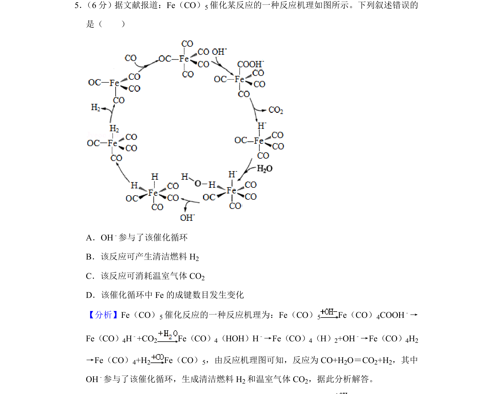
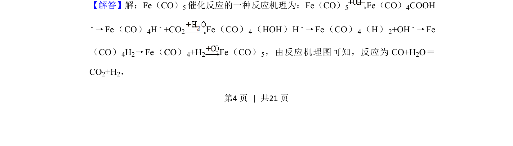
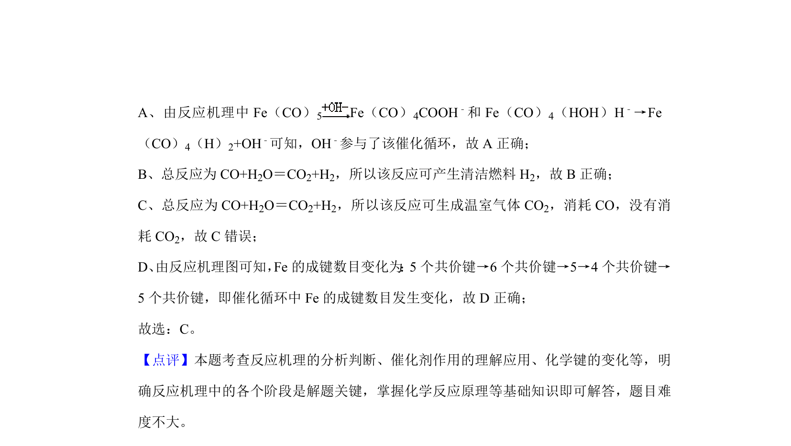

## 题面

## 摘要

本题考查催化反应机理的分析与判断，涉及催化剂循环和化学键变化。

## 关联考点

- [[595-催化循环|催化循环]]
- [[644-反应机理|反应机理]]
- [[258-化学键|化学键]]
- [[694-方程式分析|方程式分析]]

## 答案与解析

> 📄 原 PDF 第 4 页：`素材/真题/吉林/2008-2024·（吉林）化学高考真题/2020年高考化学试卷（新课标Ⅱ）（解析卷）.pdf`

<!-- 题干文本-start -->
## 题干文本
5． （6分）据文献报道：Fe（CO）5催化某反应的一种反应机理如图所示。下列叙述错误的
是（　　）
A．OH﹣参与了该催化循环
B．该反应可产生清洁燃料H 2
C．该反应可消耗温室气体CO 2
D．该催化循环中Fe的成键数目发生变化
<!-- 题干文本-end -->

<!-- 解析文本-start -->
## 解析文本
【分析】Fe（CO）5催化反应的一种反应机理为：Fe（CO） 5 Fe（CO）4COOH﹣→
Fe（CO）4H﹣+CO2 Fe（CO）4（HOH）H﹣→Fe（CO）4（H）2+OH﹣→Fe（CO）4H2
→Fe（CO）4+H2 Fe（CO）5，由反应机理图可知，反应为CO+H 2O＝CO2+H2，其中
OH﹣参与了该催化循环，生成清洁燃料H 2和温室气体CO 2，据此分析解答。
【解答】解：Fe（CO）5催化反应的一种反应机理为：Fe（CO）5 Fe（CO）4COOH
﹣→Fe（CO） 4H﹣+CO2 Fe（CO） 4（HOH）H ﹣→Fe（CO） 4（H） 2+OH﹣→Fe
（CO） 4H2→Fe（CO） 4+H2 Fe（CO） 5，由反应机理图可知，反应为CO+H 2O＝
CO2+H2，
<!-- 解析文本-end -->
