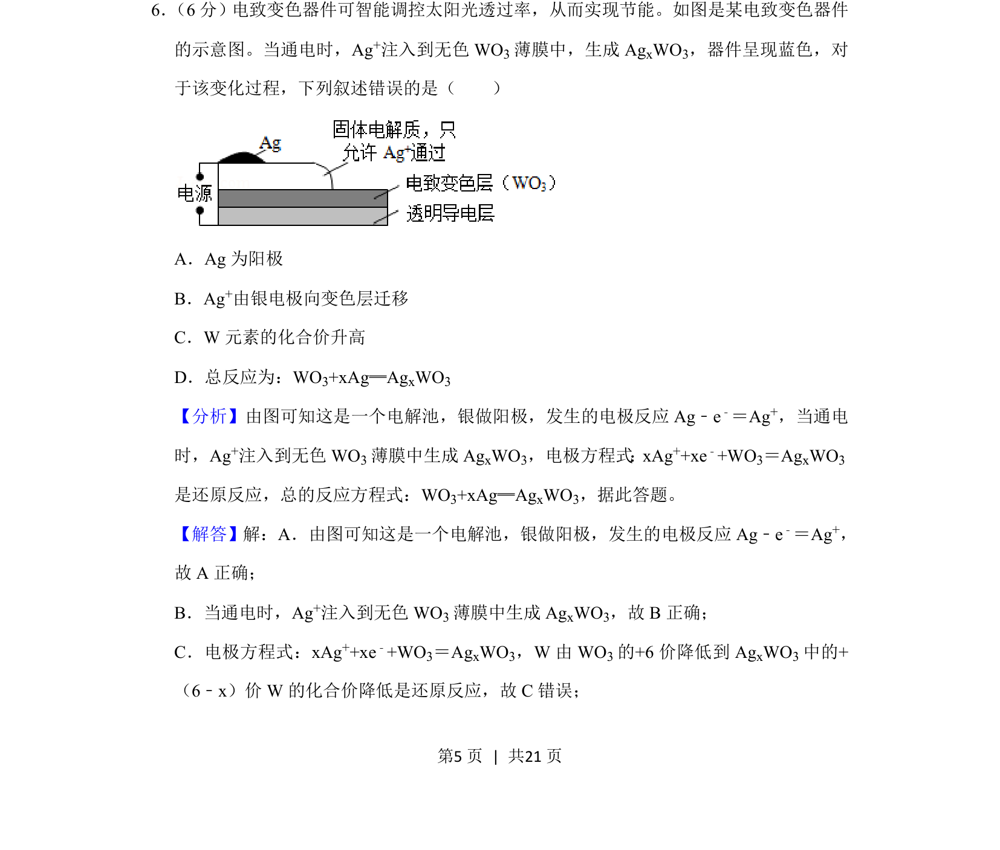
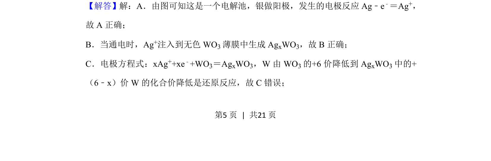
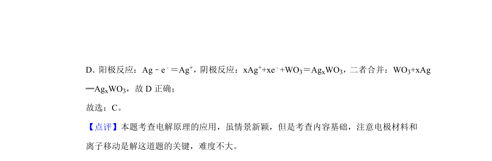

## 题面

## 摘要

该题以电致变色器件为背景，考查电解池工作原理、电极判断及化合价变化。

## 关联考点

- [[368-电解池|电解池]]
- [[300-负极反应|阳极反应]]
- [[564-离子迁移|离子迁移]]
- [[028-化合价|化合价]]

## 答案与解析

> 📄 原 PDF 第 5 页：`素材/真题/吉林/2008-2024·（吉林）化学高考真题/2020年高考化学试卷（新课标Ⅱ）（解析卷）.pdf`
