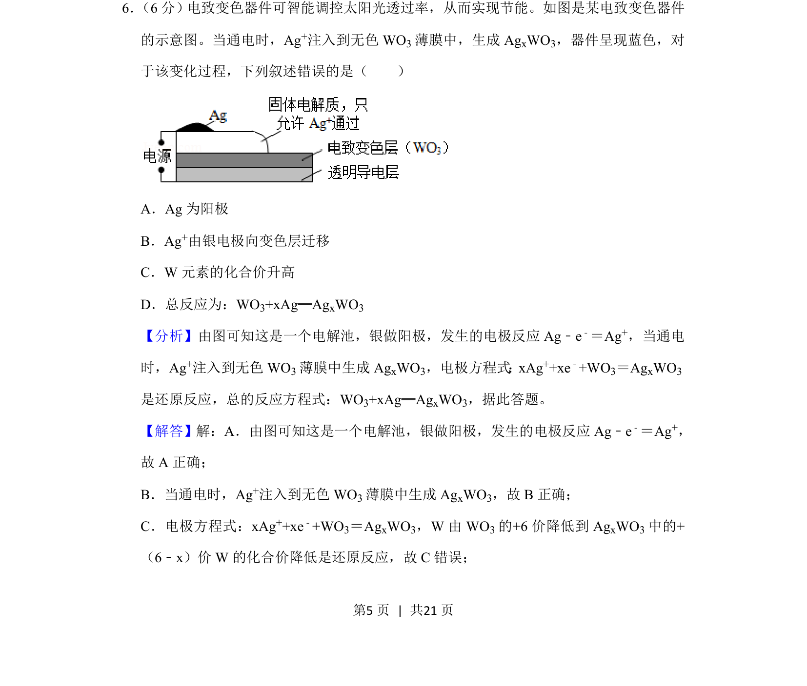
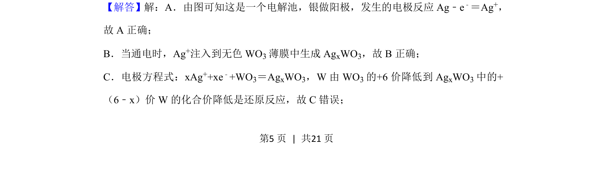
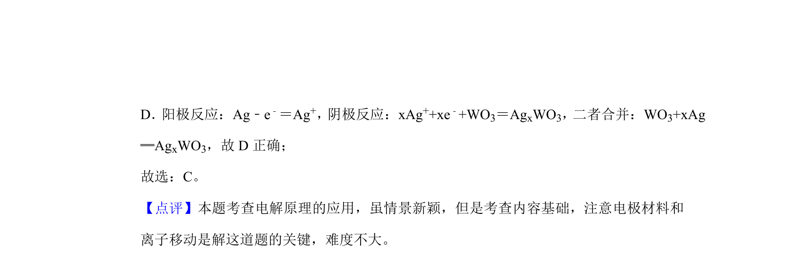

## 题面

## 摘要

该题以电致变色器件为背景，考查电解池工作原理、电极判断及化合价变化。

## 关联考点

- [[368-电解池|电解池]]
- [[300-负极反应|阳极反应]]
- [[564-离子迁移|离子迁移]]
- [[028-化合价|化合价]]

## 答案与解析

> 📄 原 PDF 第 5 页：`素材/真题/吉林/2008-2024·（吉林）化学高考真题/2020年高考化学试卷（新课标Ⅱ）（解析卷）.pdf`

<!-- 题干文本-start -->
## 题干文本
6． （6分）电致变色器件可智能调控太阳光透过率，从而实现节能。如图是某电致变色器件
的示意图。当通电时，Ag+注入到无色WO 3薄膜中，生成Ag xWO3，器件呈现蓝色，对
于该变化过程，下列叙述错误的是（　　）
A．Ag为阳极
B．Ag+由银电极向变色层迁移
C．W元素的化合价升高
D．总反应为：WO3+xAg═AgxWO3
<!-- 题干文本-end -->

<!-- 解析文本-start -->
## 解析文本
【分析】由图可知这是一个电解池，银做阳极，发生的电极反应Ag﹣e ﹣＝Ag+，当通电
时，Ag+注入到无色WO 3薄膜中生成Ag xWO3，电极方程式：xAg++xe﹣+WO3＝AgxWO3
是还原反应，总的反应方程式：WO3+xAg═AgxWO3，据此答题。
【解答】解：A．由图可知这是一个电解池，银做阳极，发生的电极反应Ag﹣e﹣＝Ag+，
故A正确；
B．当通电时，Ag+注入到无色WO 3薄膜中生成Ag xWO3，故B正确；
C．电极方程式：xAg ++xe﹣+WO3＝AgxWO3，W由WO 3的+6价降低到Ag xWO3中的+
（6﹣x）价W的化合价降低是还原反应，故C错误；
<!-- 解析文本-end -->
