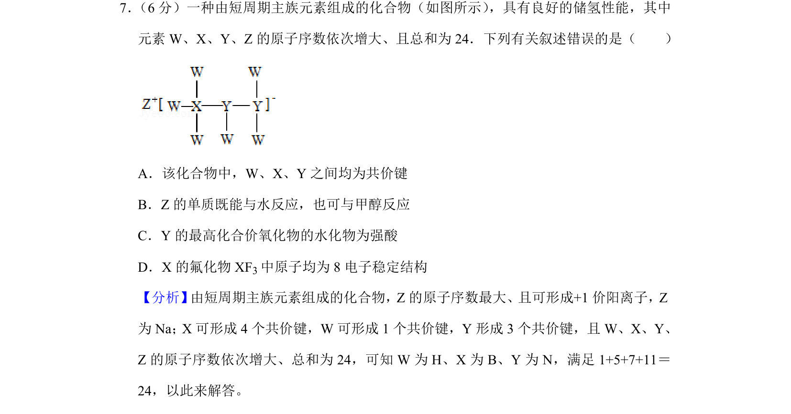
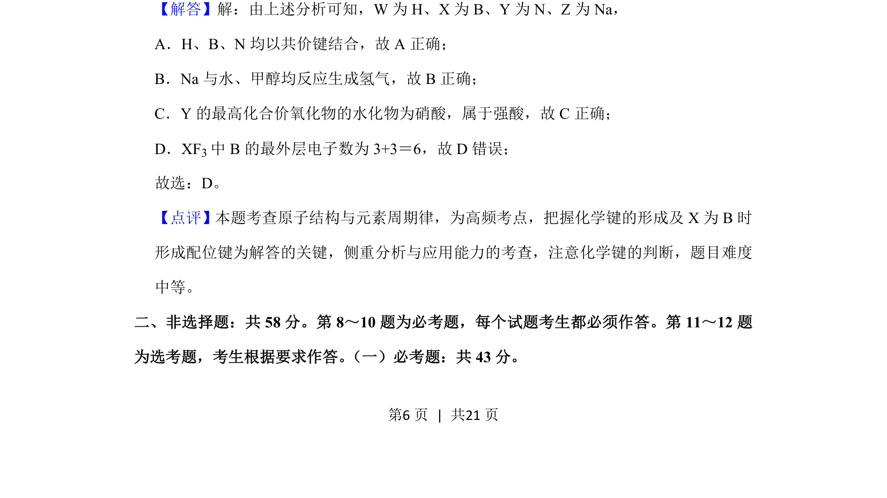

## 题面

## 摘要

一种由短周期主族元素组成的化合物的结构与性质推断，涉及化学键类型和元素化合物性质分析

## 关联考点

- [[252-元素周期律|元素周期律]]
- [[258-化学键|化学键]]
- [[426-原子结构|原子结构]]
- [[525-化合物性质|化合物性质]]

## 答案与解析

> 📄 原 PDF 第 6 页：`素材/真题/吉林/2008-2024·（吉林）化学高考真题/2020年高考化学试卷（新课标Ⅱ）（解析卷）.pdf`
