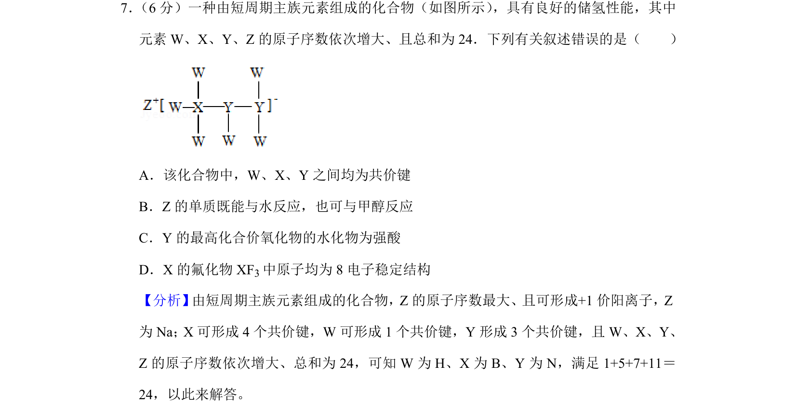
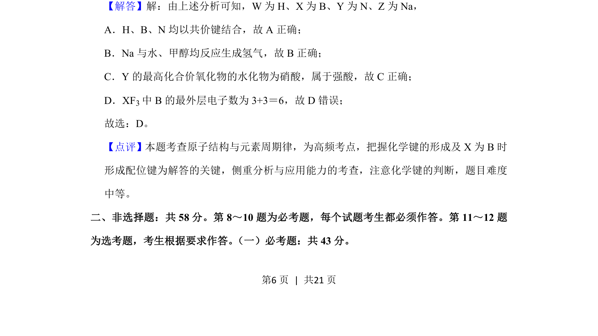

## 题面

## 摘要

一种由短周期主族元素组成的化合物的结构与性质推断，涉及化学键类型和元素化合物性质分析

## 关联考点

- [[252-元素周期律|元素周期律]]
- [[258-化学键|化学键]]
- [[426-原子结构|原子结构]]
- [[525-化合物性质|化合物性质]]

## 答案与解析

> 📄 原 PDF 第 6 页：`素材/真题/吉林/2008-2024·（吉林）化学高考真题/2020年高考化学试卷（新课标Ⅱ）（解析卷）.pdf`

<!-- 题干文本-start -->
## 题干文本
7． （6分）一种由短周期主族元素组成的化合物（如图所示） ，具有良好的储氢性能，其中
元素W、X、Y、Z的原子序数依次增大、且总和为24．下列有关叙述错误的是（　　）
A．该化合物中，W、X、Y之间均为共价键
B．Z的单质既能与水反应，也可与甲醇反应
C．Y的最高化合价氧化物的水化物为强酸
D．X的氟化物XF 3中原子均为8电子稳定结构
<!-- 题干文本-end -->

<!-- 解析文本-start -->
## 解析文本
【分析】 由短周期主族元素组成的化合物，Z的原子序数最大、且可形成+1价阳离子，Z
为Na；X可形成4个共价键，W可形成1个共价键，Y形成3个共价键，且W、X、Y、
Z的原子序数依次增大、总和为24，可知W为H、X为B、Y为N，满足1+5+7+11＝
24，以此来解答。
【解答】解：由上述分析可知，W为H、X为B、Y为N、Z为Na，
A．H、B、N均以共价键结合，故A正确；
B．Na与水、甲醇均反应生成氢气，故B正确；
C．Y的最高化合价氧化物的水化物为硝酸，属于强酸，故C正确；
D．XF3中B的最外层电子数为3+3＝6，故D错误；
故选：D。
【点评】本题考查原子结构与元素周期律，为高频考点，把握化学键的形成及X为B时
形成配位键为解答的关键，侧重分析与应用能力的考查，注意化学键的判断，题目难度
中等。
二、非选择题：共58分。第8～10题为必考题，每个试题考生都必须作答。第11～12题
为选考题，考生根据要求作答。 （一）必考题：共43分。
<!-- 解析文本-end -->
