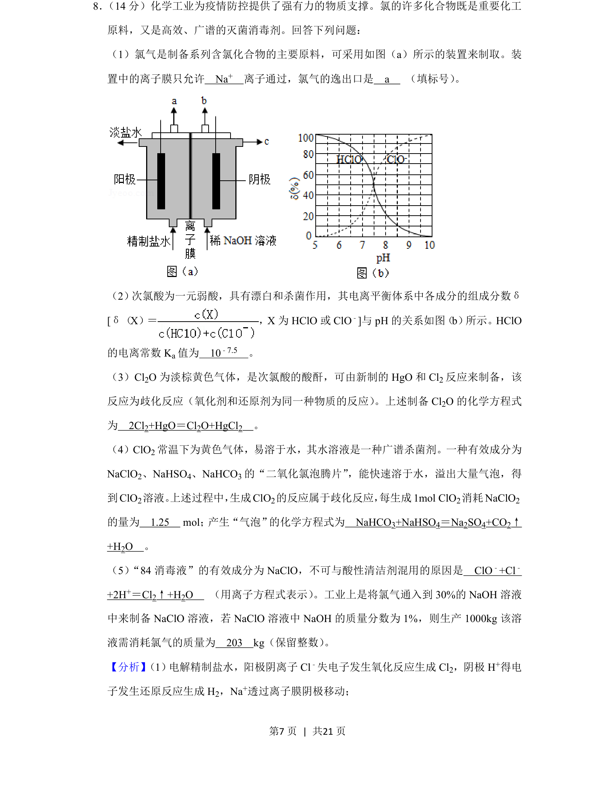
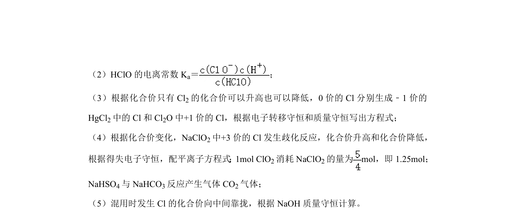
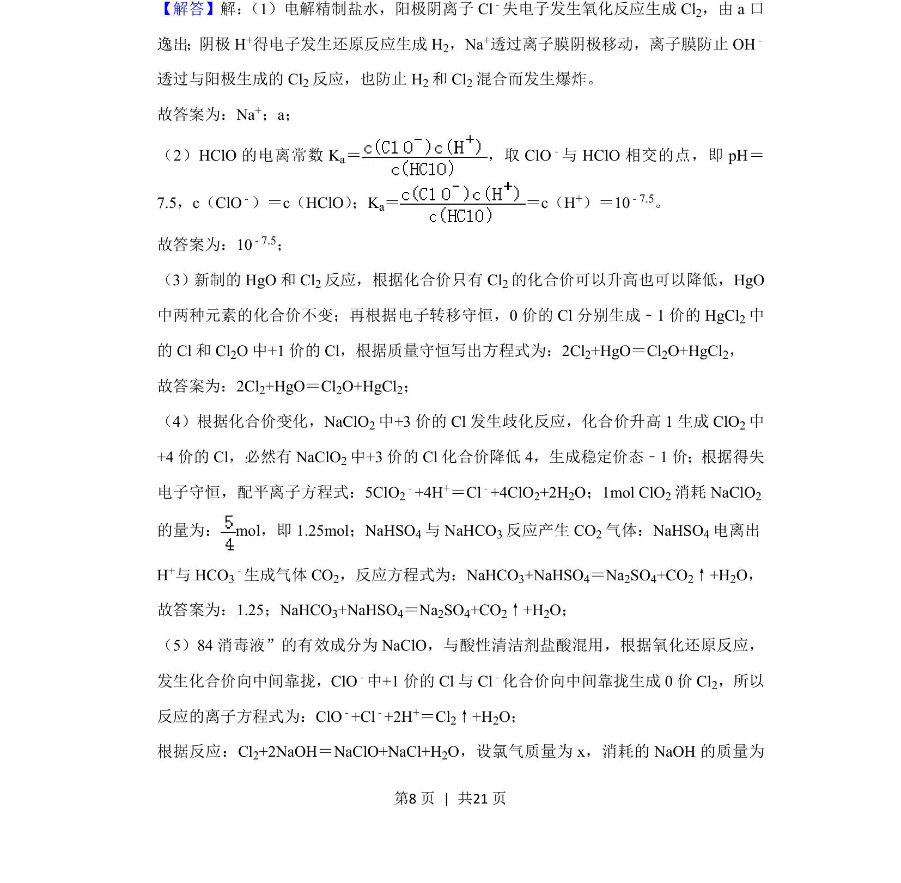
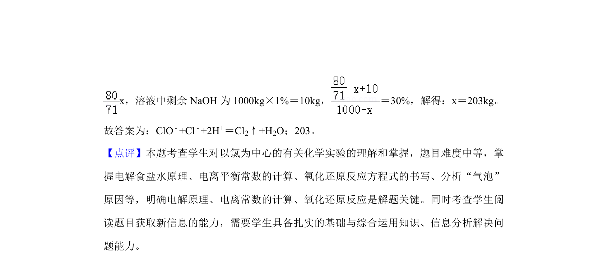

## 题面

## 摘要

本题以氯的化合物为背景，考查电解原理、电离常数、歧化反应及化学计算。

## 关联考点

- [[796-电解|电解]]
- [[333-电离常数|电离常数]]
- [[725-歧化反应|歧化反应]]
- [[626-化学计算|化学计算]]

## 答案与解析

> 📄 原 PDF 第 7 页：`素材/真题/吉林/2008-2024·（吉林）化学高考真题/2020年高考化学试卷（新课标Ⅱ）（解析卷）.pdf`

<!-- 题干文本-start -->
## 题干文本
8． （14分）化学工业为疫情防控提供了强有力的物质支撑。氯的许多化合物既是重要化工
原料，又是高效、广谱的灭菌消毒剂。回答下列问题：
（1）氯气是制备系列含氯化合物的主要原料，可采用如图（a）所示的装置来制取。装
置中的离子膜只允许　Na+　离子通过，氯气的逸出口是　a　 （填标号） 。
（2） 次氯酸为一元弱酸，具有漂白和杀菌作用，其电离平衡体系中各成分的组成分数δ
[δ（X）＝ ，X为HClO或ClO ﹣]与pH的关系如图（b） 所示。HClO
的电离常数K a值为　10﹣7.5　。
（3）Cl2O为淡棕黄色气体，是次氯酸的酸酐，可由新制的HgO和Cl 2反应来制备，该
反应为歧化反应（氧化剂和还原剂为同一种物质的反应） 。上述制备Cl2O的化学方程式
为　2Cl2+HgO＝Cl2O+HgCl2　。
（4）ClO2常温下为黄色气体，易溶于水，其水溶液是一种广谱杀菌剂。一种有效成分为
NaClO2、NaHSO4、NaHCO3的“二氧化氯泡腾片”，能快速溶于水，溢出大量气泡，得
到ClO 2溶液。 上述过程中， 生成ClO2的反应属于歧化反应， 每生成1mol ClO2消耗NaClO 2
的量为　1.25　 mol； 产生“气泡”的化学方程式为　NaHCO3+NaHSO4＝Na2SO4+CO2↑
+H2O　。
（5）“84消毒液”的有效成分为NaClO，不可与酸性清洁剂混用的原因是　ClO ﹣+Cl﹣
+2H+＝Cl2↑+H2O　 （用离子方程式表示） 。工业上是将氯气通入到30%的NaOH溶液
中来制备NaClO溶液，若NaClO溶液中NaOH的质量分数为1%，则生产1000kg该溶
液需消耗氯气的质量为　203　kg（保留整数） 。
<!-- 题干文本-end -->

<!-- 解析文本-start -->
## 解析文本
【分析】 （1） 电解精制盐水，阳极阴离子Cl﹣失电子发生氧化反应生成Cl 2，阴极H +得电
子发生还原反应生成H 2，Na+透过离子膜阴极移动；
<!-- 解析文本-end -->
