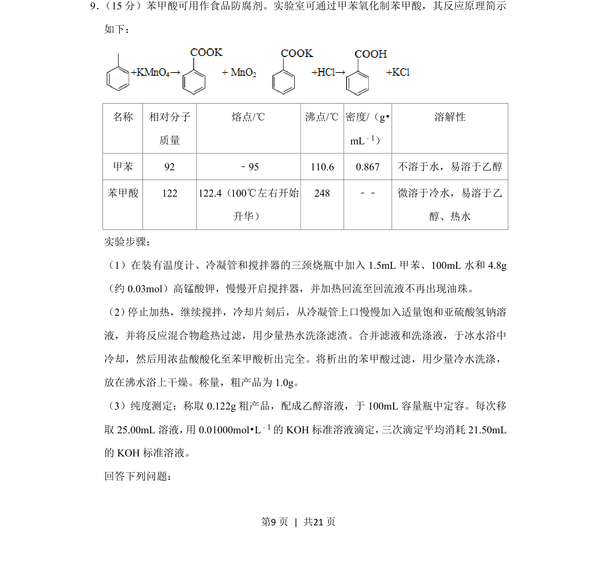
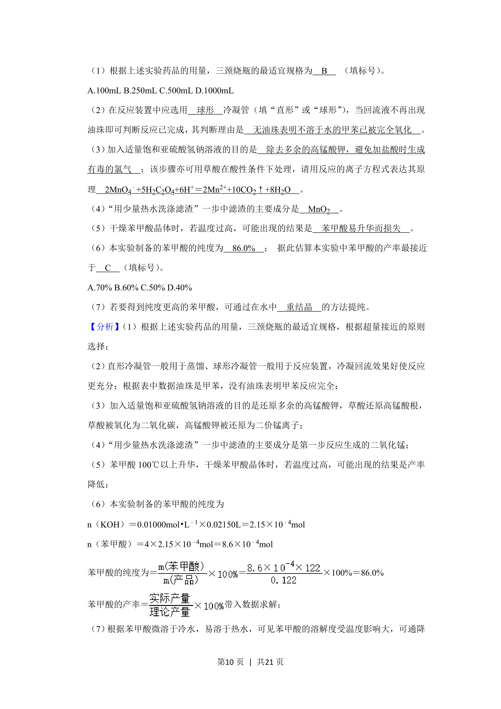
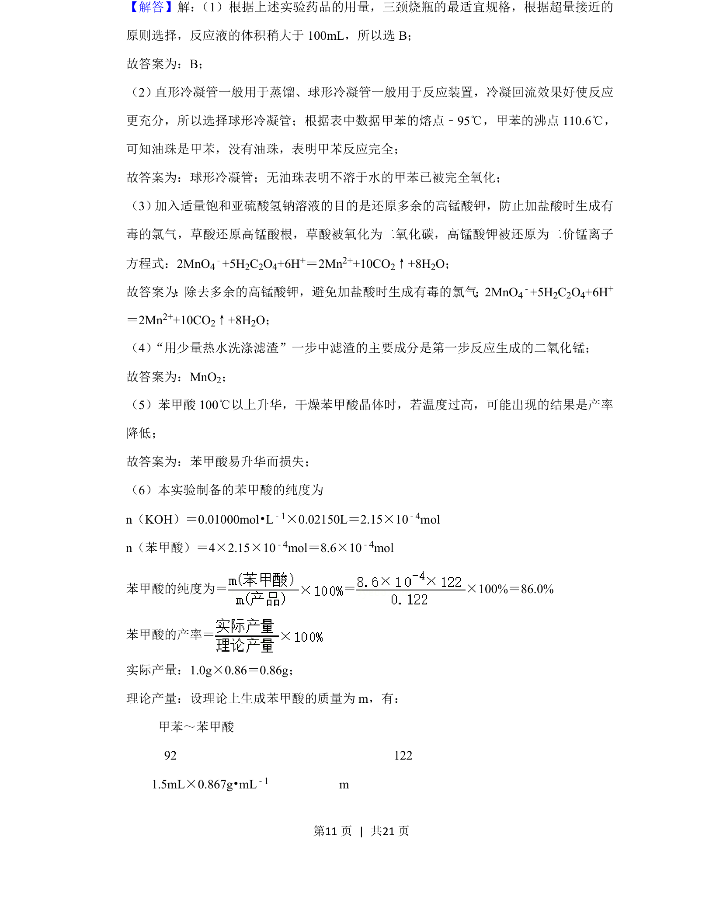
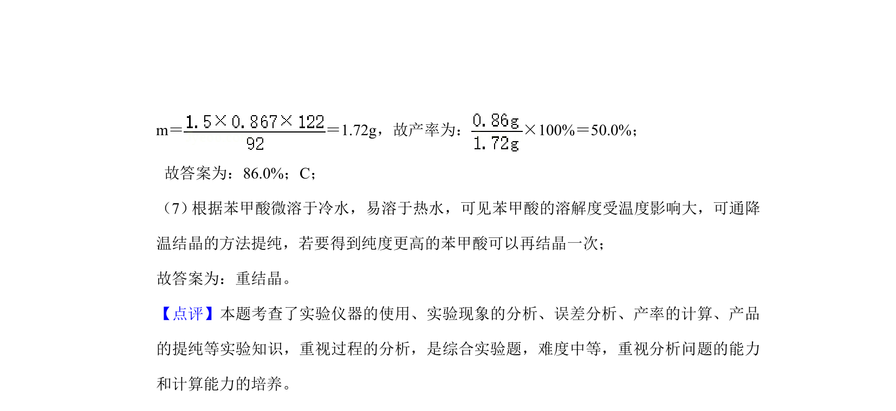

## 题面

## 摘要

实验室制备苯甲酸及纯度测定的综合实验题，涵盖氧化、分离提纯和滴定分析。

## 关联考点

- [[271-化学合成|有机合成]]
- [[物质分离提纯]]
- [[酸碱滴定]]
- [[产率计算]]

## 答案与解析

> 📄 原 PDF 第 9 页：`素材/真题/吉林/2008-2024·（吉林）化学高考真题/2020年高考化学试卷（新课标Ⅱ）（解析卷）.pdf`
