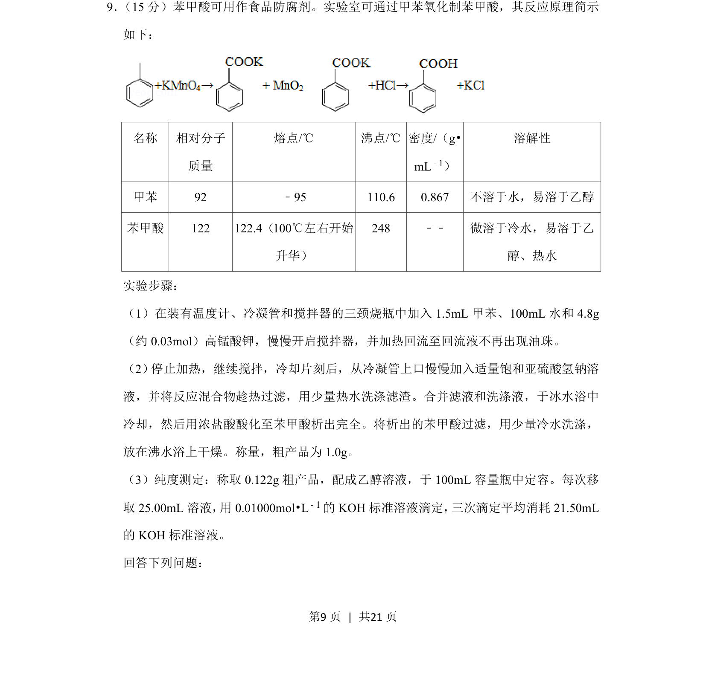
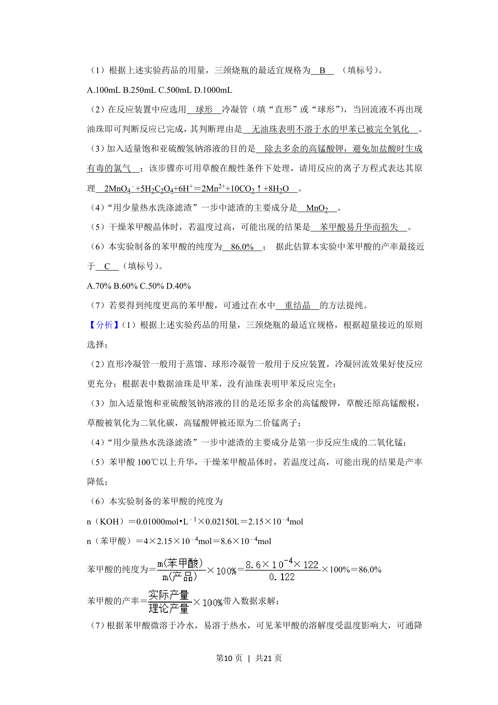
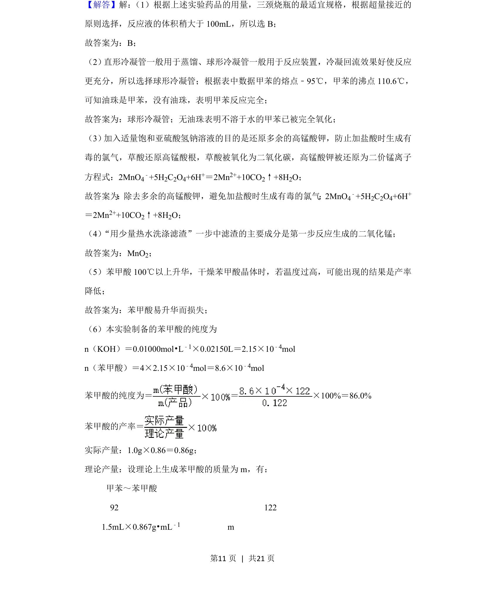
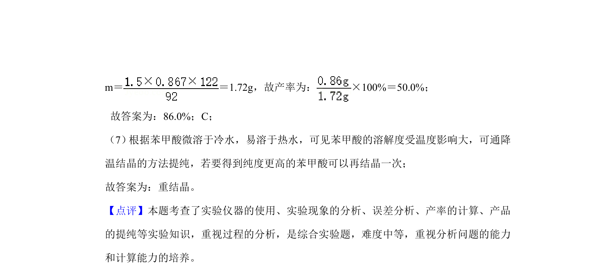

## 题面

## 摘要

实验室制备苯甲酸及纯度测定的综合实验题，涵盖氧化、分离提纯和滴定分析。

## 关联考点

- [[271-化学合成|有机合成]]
- [[773-物质分离提纯|物质分离提纯]]
- [[854-酸碱滴定|酸碱滴定]]
- [[591-产率计算|产率计算]]

## 答案与解析

> 📄 原 PDF 第 9 页：`素材/真题/吉林/2008-2024·（吉林）化学高考真题/2020年高考化学试卷（新课标Ⅱ）（解析卷）.pdf`

<!-- 题干文本-start -->
## 题干文本
9． （15分）苯甲酸可用作食品防腐剂。实验室可通过甲苯氧化制苯甲酸，其反应原理简示
如下：
名称 相对分子
质量
熔点/℃ 沸点/℃ 密度/（g•
mL﹣1）
溶解性
甲苯 92 ﹣95 110.6 0.867 不溶于水，易溶于乙醇
苯甲酸 122 122.4（100℃左右开始
升华）
248 ﹣﹣ 微溶于冷水，易溶于乙
醇、热水
实验步骤：
（1）在装有温度计、冷凝管和搅拌器的三颈烧瓶中加入1.5mL甲苯、100mL水和4.8g 
（约0.03mol）高锰酸钾，慢慢开启搅拌器，并加热回流至回流液不再出现油珠。
（2） 停止加热，继续搅拌，冷却片刻后，从冷凝管上口慢慢加入适量饱和亚硫酸氢钠溶
液，并将反应混合物趁热过滤，用少量热水洗涤滤渣。合并滤液和洗涤液，于冰水浴中
冷却，然后用浓盐酸酸化至苯甲酸析出完全。将析出的苯甲酸过滤，用少量冷水洗涤，
放在沸水浴上干燥。称量，粗产品为1.0g。
（3）纯度测定：称取0.122g粗产品，配成乙醇溶液，于100mL容量瓶中定容。每次移
取25.00mL溶液， 用0.01000mol•L﹣1的KOH标准溶液滴定， 三次滴定平均消耗21.50mL
的KOH标准溶液。
回答下列问题：
<!-- 题干文本-end -->

<!-- 解析文本-start -->
## 解析文本

<!-- 解析文本-end -->
