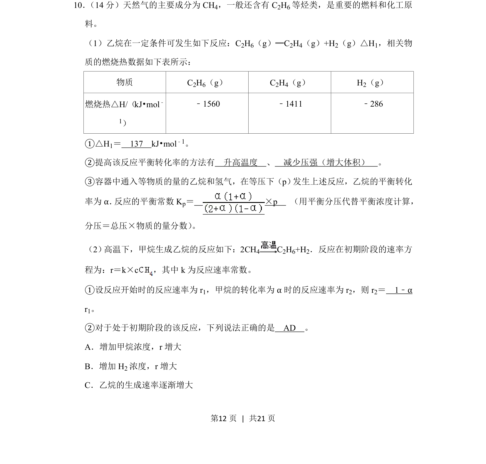
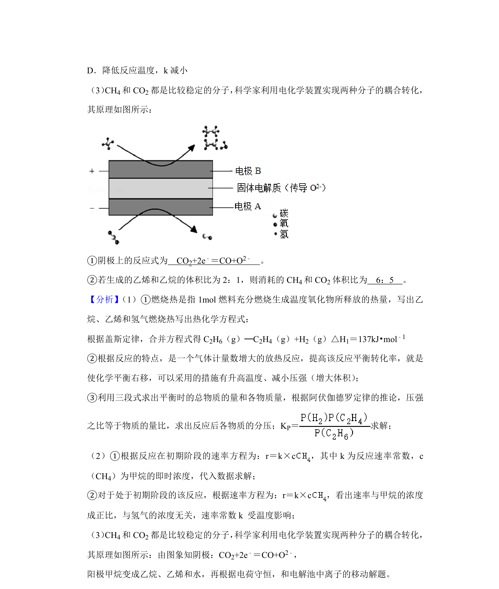
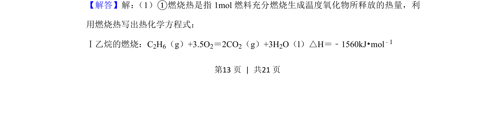
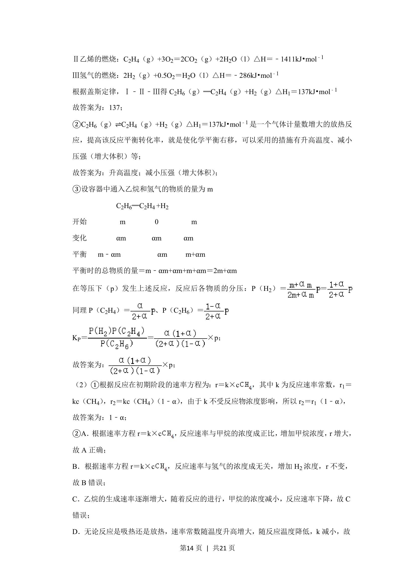
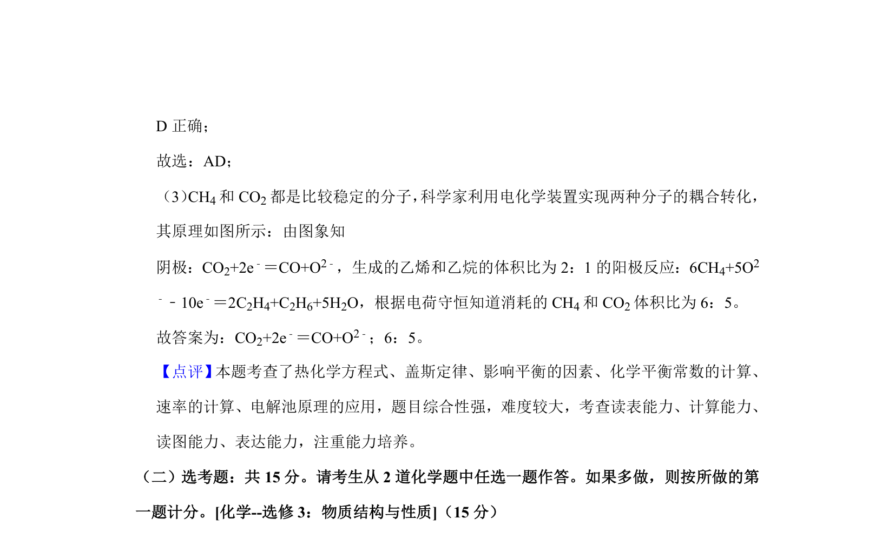

## 题面

## 摘要

利用燃烧热计算反应热，分析化学平衡转化率及平衡常数，结合速率方程进行转化率相关计算。

## 关联考点

- [[155-燃料热值|燃烧热]]
- [[288-反应热|反应热]]
- [[284-化学平衡|化学平衡]]
- [[342-化学平衡常数|平衡常数]]

## 答案与解析

> 📄 原 PDF 第 12 页：`素材/真题/吉林/2008-2024·（吉林）化学高考真题/2020年高考化学试卷（新课标Ⅱ）（解析卷）.pdf`
