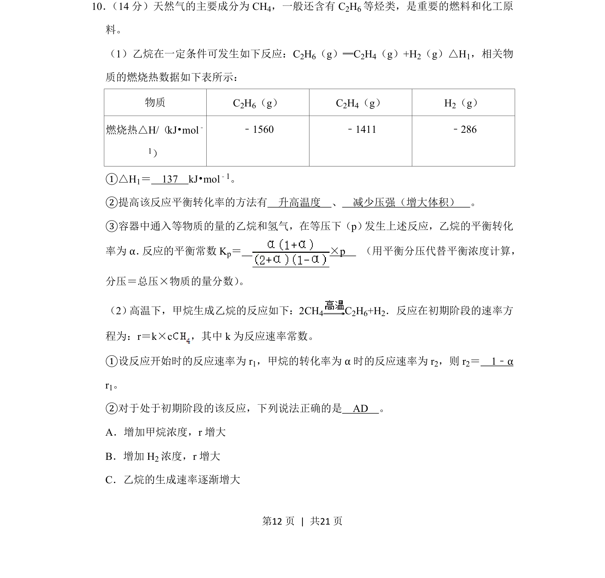
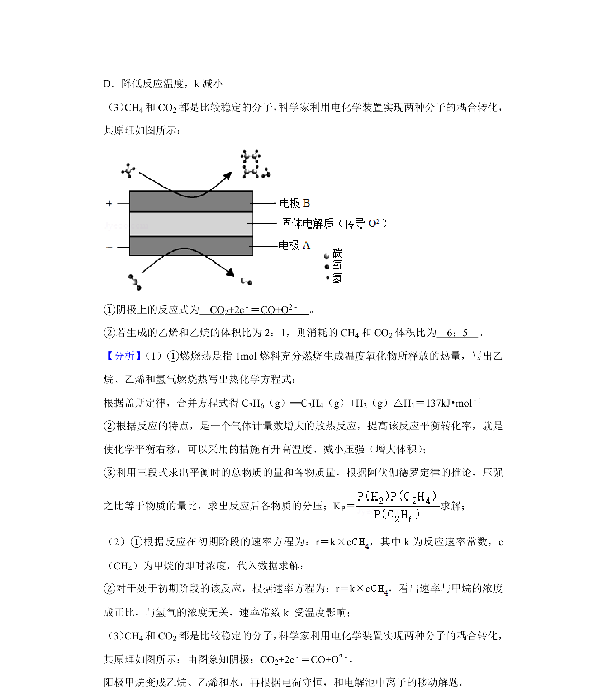
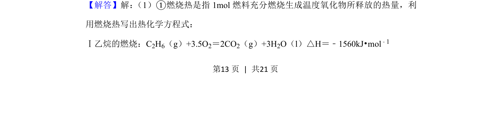
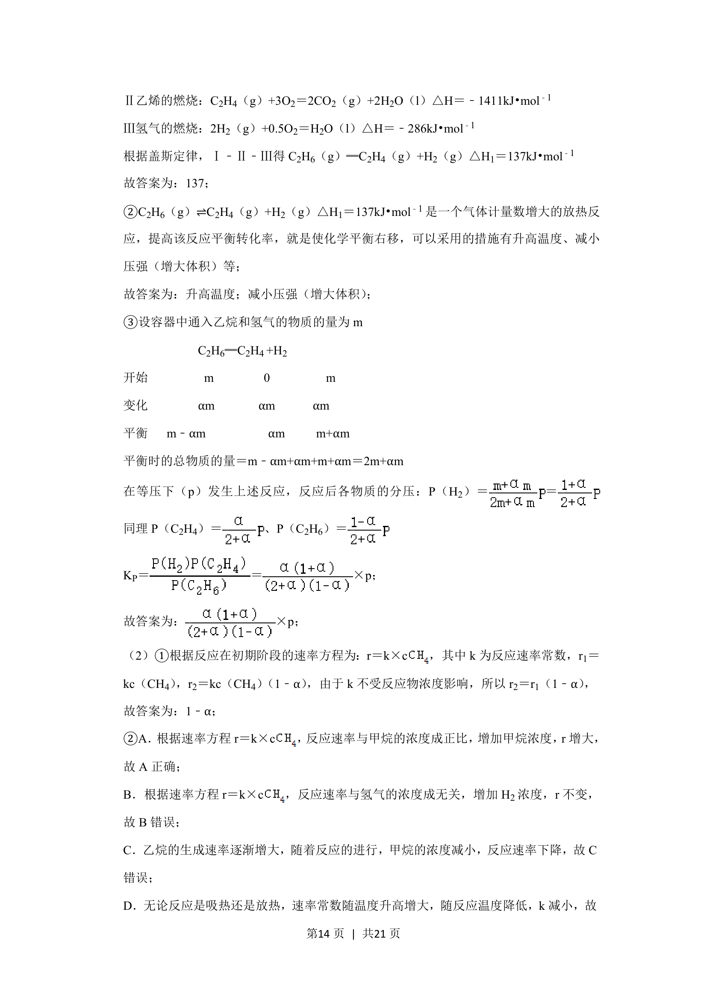
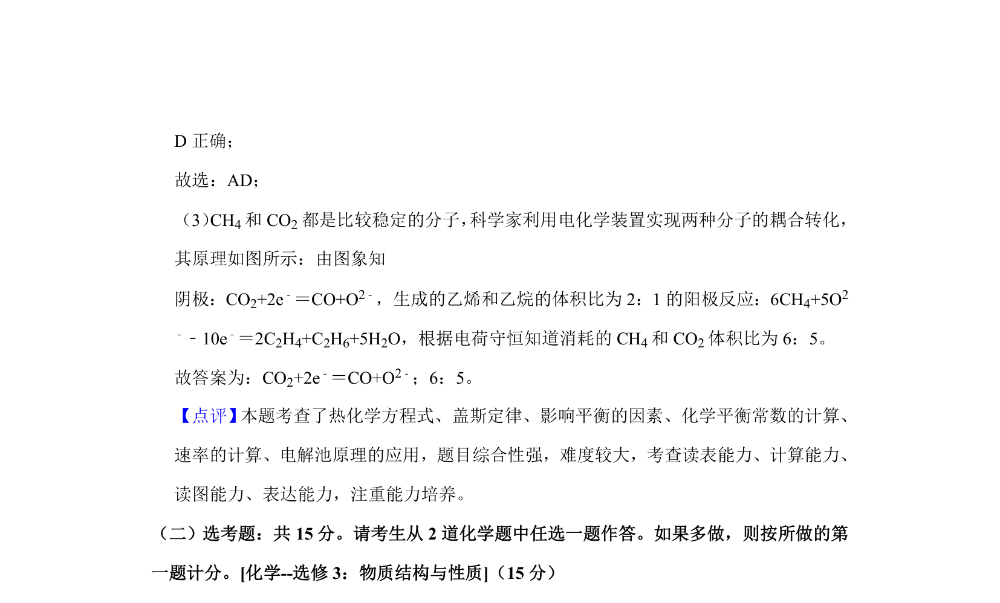

## 题面

## 摘要

利用燃烧热计算反应热，分析化学平衡转化率及平衡常数，结合速率方程进行转化率相关计算。

## 关联考点

- [[155-燃料热值|燃烧热]]
- [[288-反应热|反应热]]
- [[284-化学平衡|化学平衡]]
- [[342-化学平衡常数|平衡常数]]

## 答案与解析

> 📄 原 PDF 第 12 页：`素材/真题/吉林/2008-2024·（吉林）化学高考真题/2020年高考化学试卷（新课标Ⅱ）（解析卷）.pdf`

<!-- 题干文本-start -->
## 题干文本
10． （14分）天然气的主要成分为CH4，一般还含有C 2H6等烃类，是重要的燃料和化工原
料。
（1）乙烷在一定条件可发生如下反应：C2H6（g）═C2H4（g）+H2（g）△H1，相关物
质的燃烧热数据如下表所示：
物质 C2H6（g） C2H4（g） H2（g）
燃烧热△H/（kJ•mol﹣
1）
﹣1560 ﹣1411 ﹣286
①△H1＝　137　kJ•mol﹣1。
②提高该反应平衡转化率的方法有　升高温度　、　减少压强（增大体积）　。
③容器中通入等物质的量的乙烷和氢气，在等压下（p） 发生上述反应，乙烷的平衡转化
率为α． 反应的平衡常数Kp＝　 ×p　 （用平衡分压代替平衡浓度计算，
分压＝总压×物质的量分数） 。
（2） 高温下，甲烷生成乙烷的反应如下：2CH4 C2H6+H2．反应在初期阶段的速率方
程为：r＝k×c，其中k为反应速率常数。
①设反应开始时的反应速率为r 1，甲烷的转化率为α时的反应速率为r 2，则r 2＝　1﹣α　
r1。
②对于处于初期阶段的该反应，下列说法正确的是　AD　。
A．增加甲烷浓度，r增大
B．增加H 2浓度，r增大
C．乙烷的生成速率逐渐增大
<!-- 题干文本-end -->

<!-- 解析文本-start -->
## 解析文本

<!-- 解析文本-end -->
