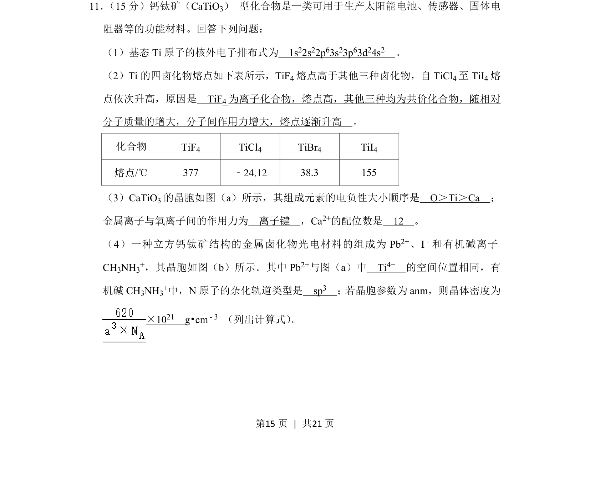
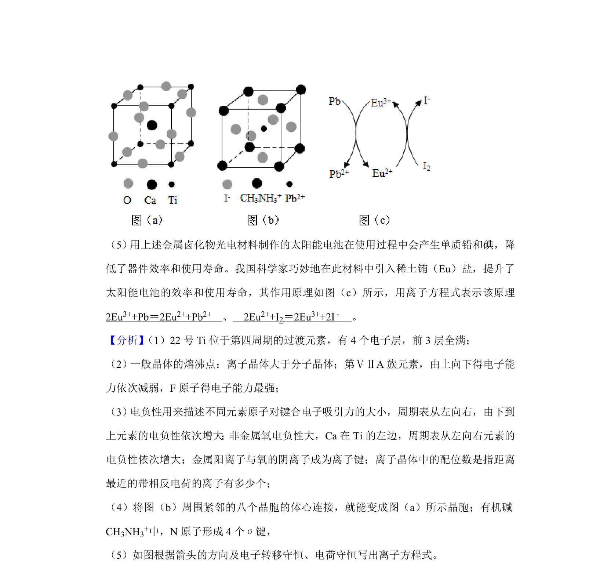
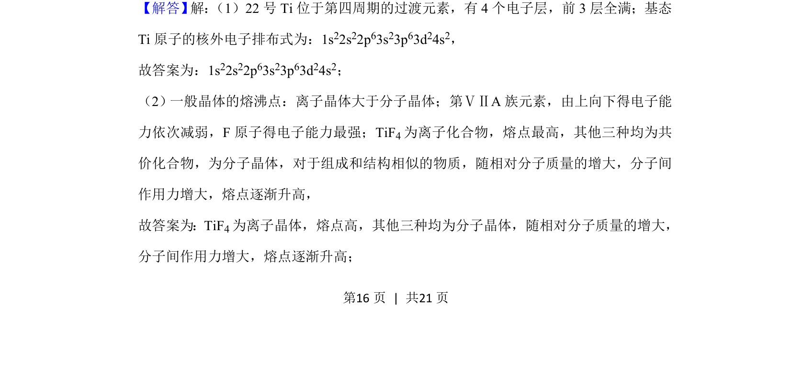
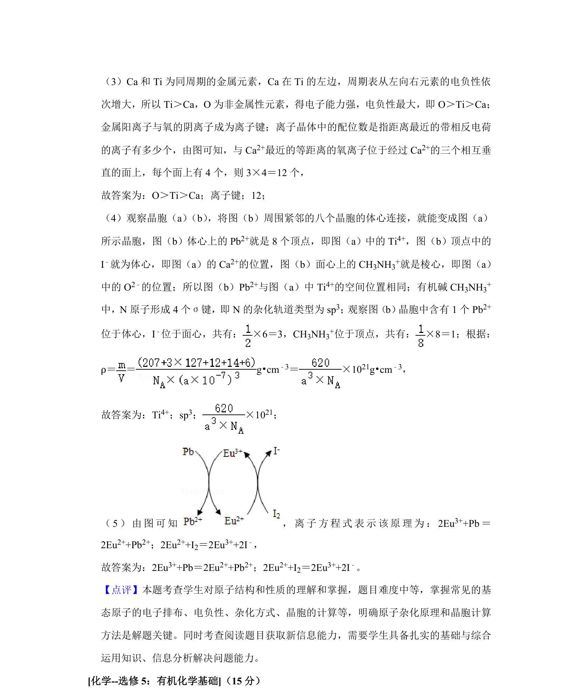

## 题面

## 摘要

考查基态原子电子排布、四卤化物熔点比较、钙钛矿晶胞结构及密度计算。

## 关联考点

- [[389-电子排布式|电子排布式]]
- [[606-分子间作用力与离子键|分子间作用力与离子键]]
- [[391-电负性|电负性]]
- [[896-晶体结构与密度计算|晶体结构与密度计算]]

## 答案与解析

> 📄 原 PDF 第 15 页：`素材/真题/吉林/2008-2024·（吉林）化学高考真题/2020年高考化学试卷（新课标Ⅱ）（解析卷）.pdf`
