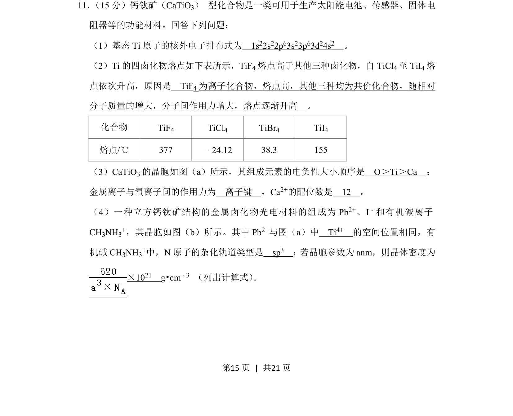
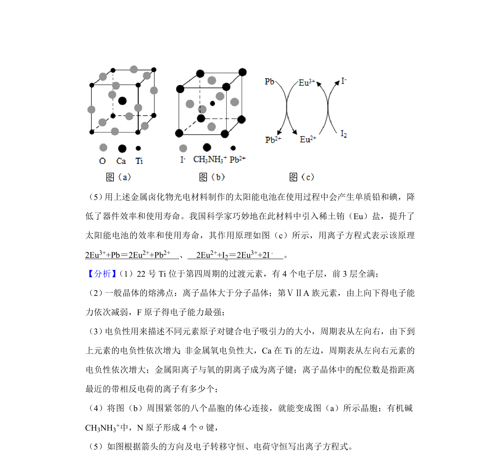
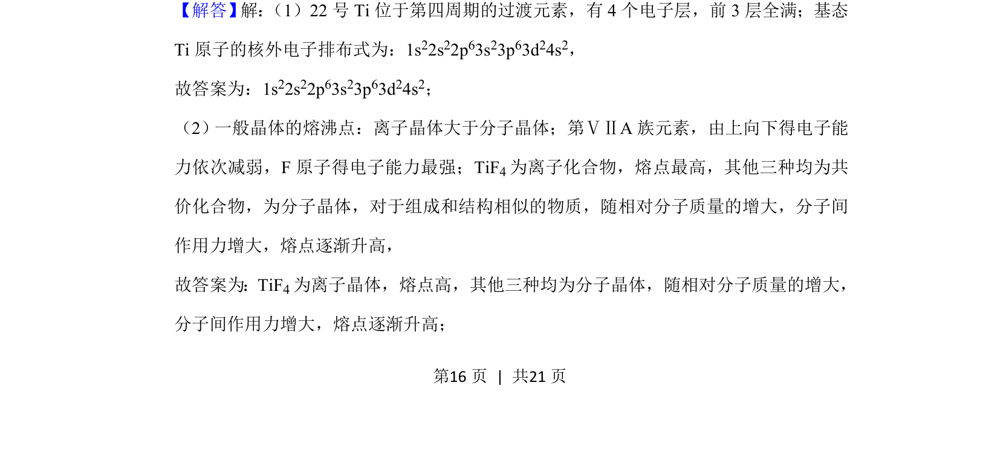
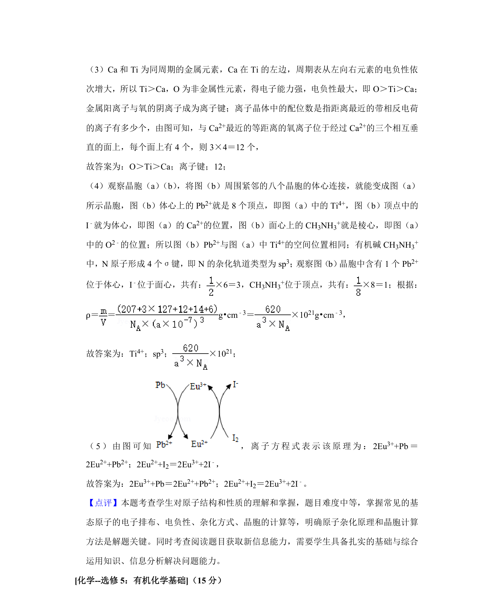

## 题面

## 摘要

考查基态原子电子排布、四卤化物熔点比较、钙钛矿晶胞结构及密度计算。

## 关联考点

- [[389-电子排布式|电子排布式]]
- [[605-分子间作用力与离子键|分子间作用力与离子键]]
- [[391-电负性|电负性]]
- [[895-晶体结构与密度计算|晶体结构与密度计算]]

## 答案与解析

> 📄 原 PDF 第 15 页：`素材/真题/吉林/2008-2024·（吉林）化学高考真题/2020年高考化学试卷（新课标Ⅱ）（解析卷）.pdf`

<!-- 题干文本-start -->
## 题干文本
11． （15分）钙钛矿（CaTiO3） 型化合物是一类可用于生产太阳能电池、传感器、固体电
阻器等的功能材料。回答下列问题：
（1）基态Ti原子的核外电子排布式为　1s 22s22p63s23p63d24s2　。
（2）Ti的四卤化物熔点如下表所示，TiF 4熔点高于其他三种卤化物，自TiCl 4至TiI 4熔
点依次升高，原因是　TiF4为离子化合物，熔点高，其他三种均为共价化合物，随相对
分子质量的增大，分子间作用力增大，熔点逐渐升高　。
化合物 TiF4 TiCl4 TiBr4 TiI4
熔点/℃ 377 ﹣24.12 38.3 155
（3）CaTiO3的晶胞如图（a）所示，其组成元素的电负性大小顺序是　O＞Ti＞Ca　；
金属离子与氧离子间的作用力为　离子键　，Ca2+的配位数是　12　。
（4）一种立方钙钛矿结构的金属卤化物光电材料的组成为Pb 2+、I﹣和有机碱离子
CH3NH3+，其晶胞如图（b）所示。其中Pb 2+与图（a）中　Ti 4+　的空间位置相同，有
机碱CH 3NH3+中，N原子的杂化轨道类型是　sp 3　；若晶胞参数为anm，则晶体密度为　
×1021　g•cm﹣3 （列出计算式） 。
<!-- 题干文本-end -->

<!-- 解析文本-start -->
## 解析文本

<!-- 解析文本-end -->
