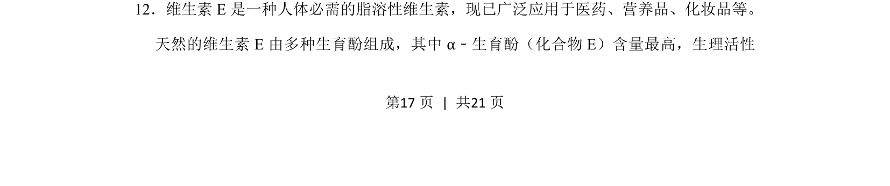
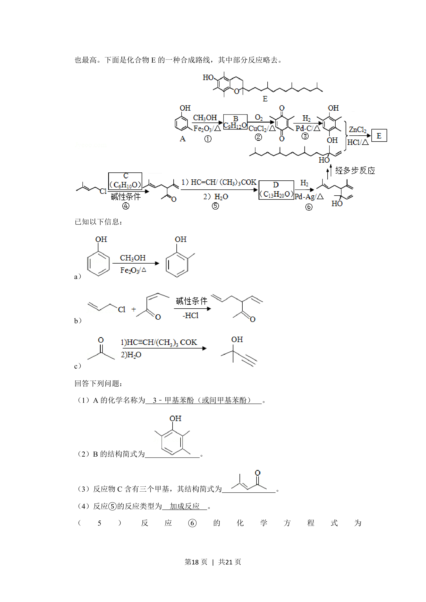
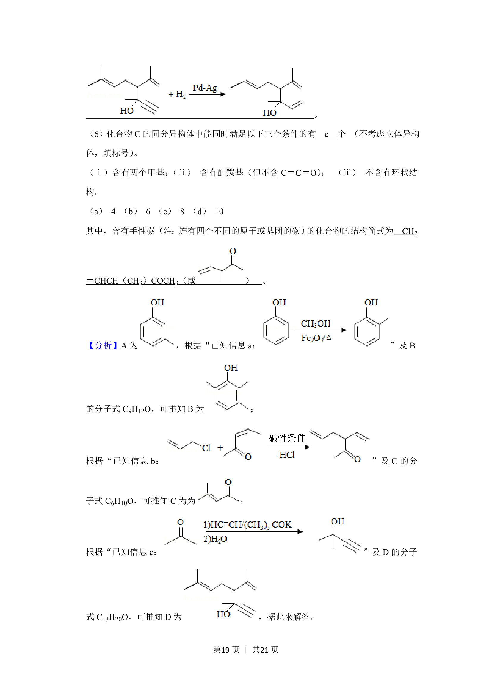
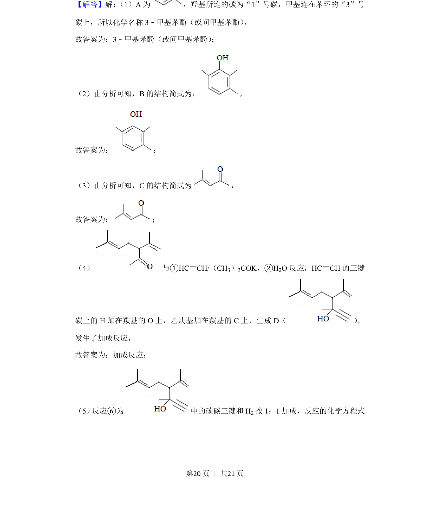
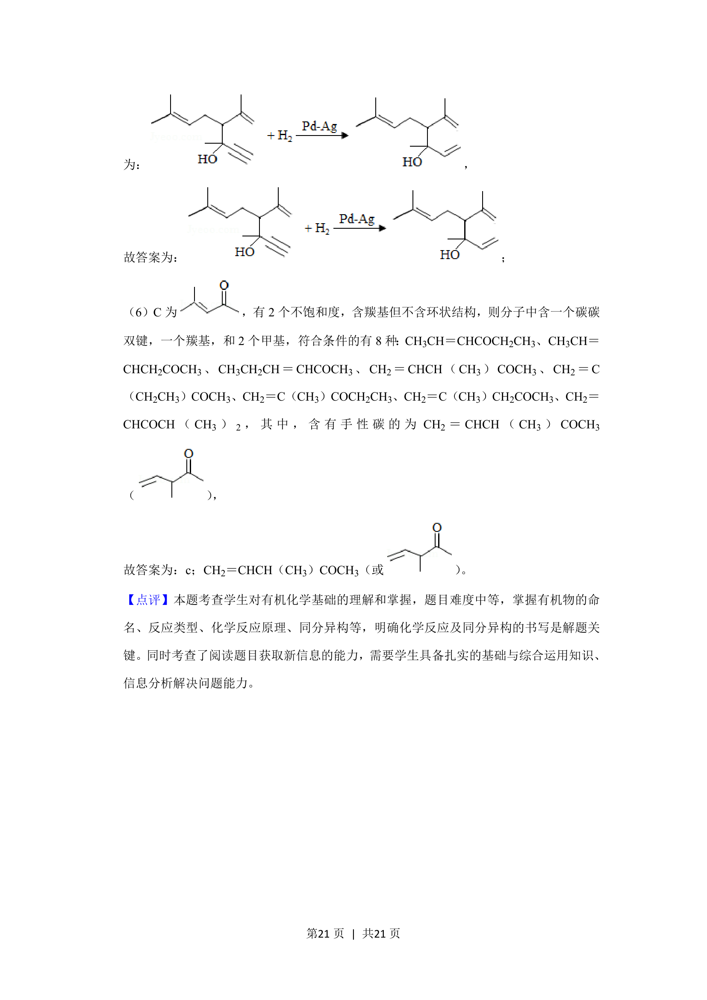

## 题面

## 摘要

有机推断与合成路线分析，涉及维生素E中α-生育酚的结构与性质。

## 关联考点

- [[450-有机化合物结构|有机化合物结构]]
- [[448-官能团|官能团]]
- [[446-同分异构体|同分异构体]]
- [[653-合成路线|合成路线]]

## 答案与解析

> 📄 原 PDF 第 17 页：`素材/真题/吉林/2008-2024·（吉林）化学高考真题/2020年高考化学试卷（新课标Ⅱ）（解析卷）.pdf`
