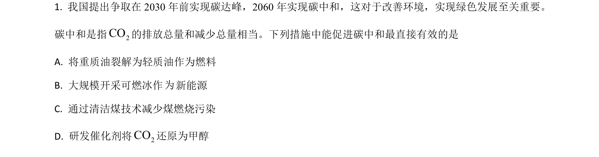
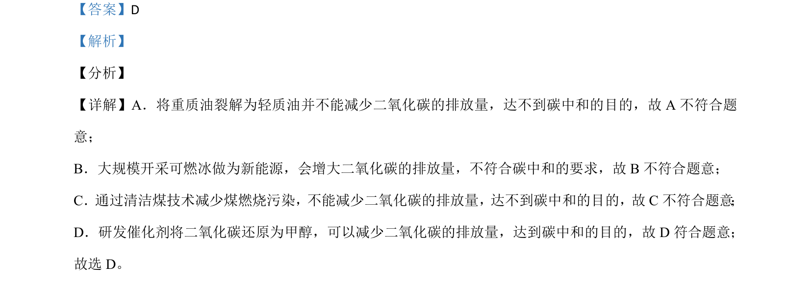

## 题面

## 摘要

考查化学与碳中和的关系，判断哪些措施可减少二氧化碳排放。

## 关联考点

- [[561-碳中和|碳中和]]
- [[590-二氧化碳减排|二氧化碳减排]]
- [[593-催化剂应用|催化剂应用]]

## 答案与解析

> 📄 原 PDF 第 1 页：`素材/真题/吉林/2008-2024·（吉林）化学高考真题/2021年高考化学试卷（全国乙卷）（解析卷）.pdf`

<!-- 题干文本-start -->
## 题干文本
1. 我国提出争取在 2030 年前实现碳达峰，2060年实现碳中和，这对于改善环境，实现绿色发展至关重要。
碳中和是指2CO的排放总量和减少总量相当。下列措施中能促进碳中和最直接有效的是
A. 将重质油裂解为轻质油作为燃料
B. 大规模开采可燃冰作 新能源
C. 通过清洁煤技术减少煤燃烧污染
D. 研发催化剂将2CO还原为甲醇
<!-- 题干文本-end -->

<!-- 解析文本-start -->
## 解析文本
【答案】D
【解析】
【分析】
【详解】A．将重质油裂解为轻质油并不能减少二氧化碳的排放量，达不到碳中和的目的，故 A 不符合题
意； 
B．大规模开采可燃冰做为新能源，会增大二氧化碳的排放量，不符合碳中和的要求，故 B不符合题意；
C．通过清洁煤技术减少煤燃烧污染，不能减少二氧化碳的排放量，达不到碳中和的目的，故C不符合题意 ；
D．研发催化剂将二氧化碳还原为甲醇，可以减少二氧化碳的排放量，达到碳中和的目的，故 D 符合题意；
故选 D。
<!-- 解析文本-end -->
