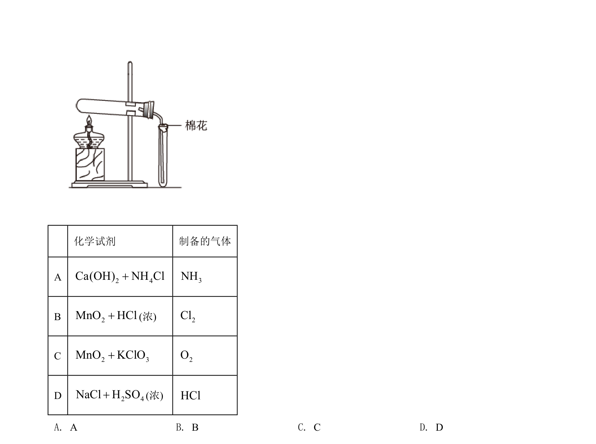
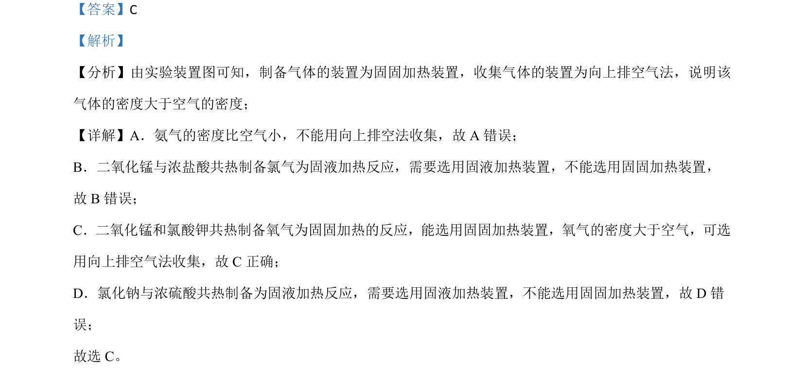

## 题面

## 摘要

本实验题通过装置选择考查常见气体的制备原理与收集方法

## 关联考点

- [[726-气体制备装置|气体制备装置]]
- [[728-气体收集方法|气体收集方法]]
- [[549-氨气性质|氨气性质]]
- [[200-氯气制备|氯气制备]]
- [[736-氧气制备|氧气制备]]

## 答案与解析

> 📄 原 PDF 第 1 页：`素材/真题/吉林/2008-2024·（吉林）化学高考真题/2021年高考化学试卷（全国乙卷）（解析卷）.pdf`
