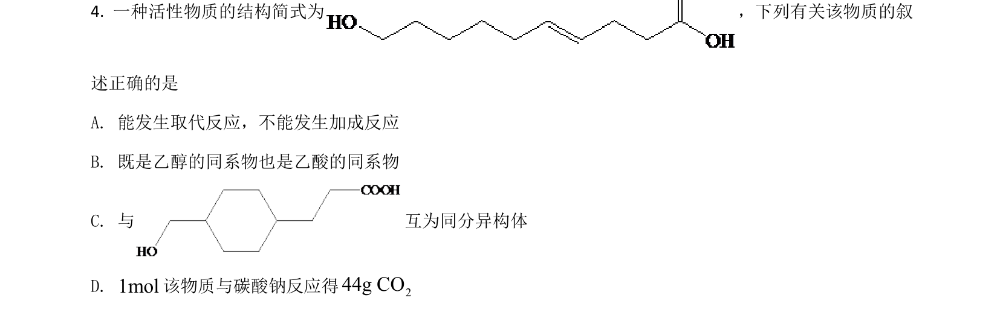
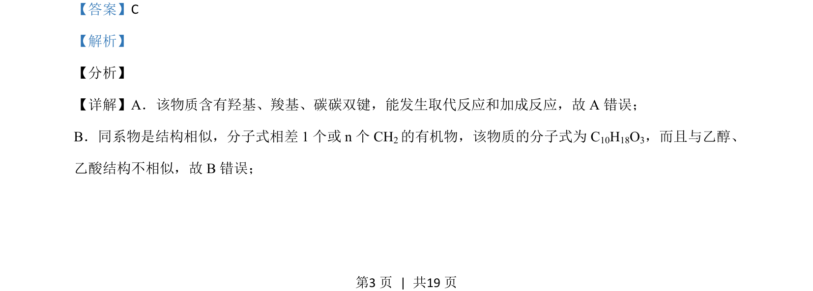
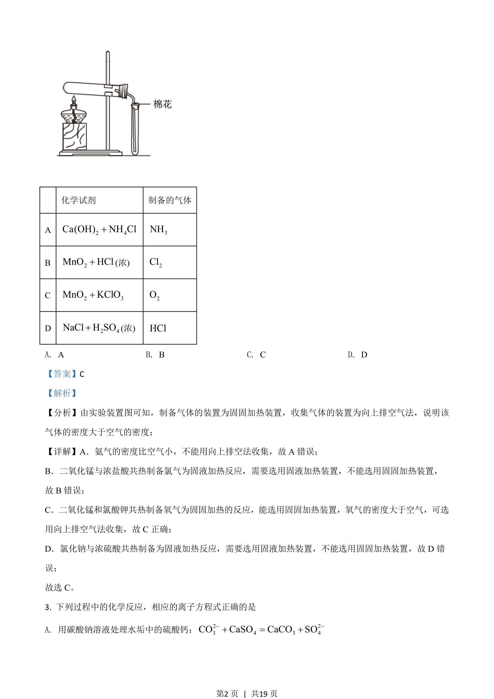

## 题面

## 摘要

本题通过有机物结构辨析官能团性质、同系物与同分异构体等概念。

## 关联考点

- [[707-有机化学|有机化学]]
- [[448-官能团|官能团]]
- [[446-同分异构体|同分异构体]]
- [[647-反应类型|反应类型]]

## 答案与解析

> 📄 原 PDF 第 3 页：`素材/真题/吉林/2008-2024·（吉林）化学高考真题/2021年高考化学试卷（全国乙卷）（解析卷）.pdf`
