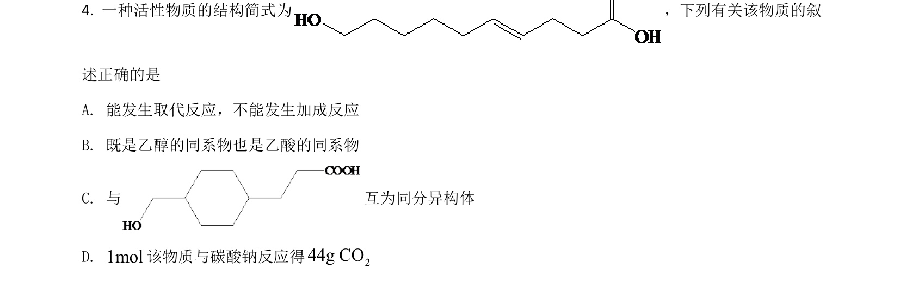
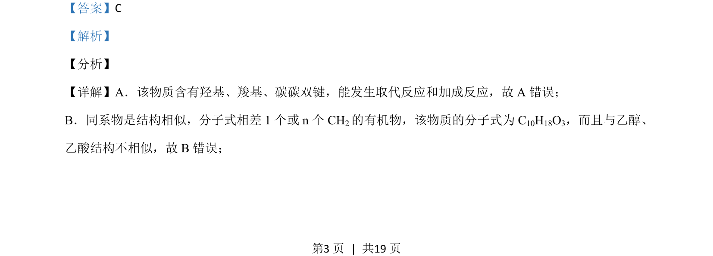
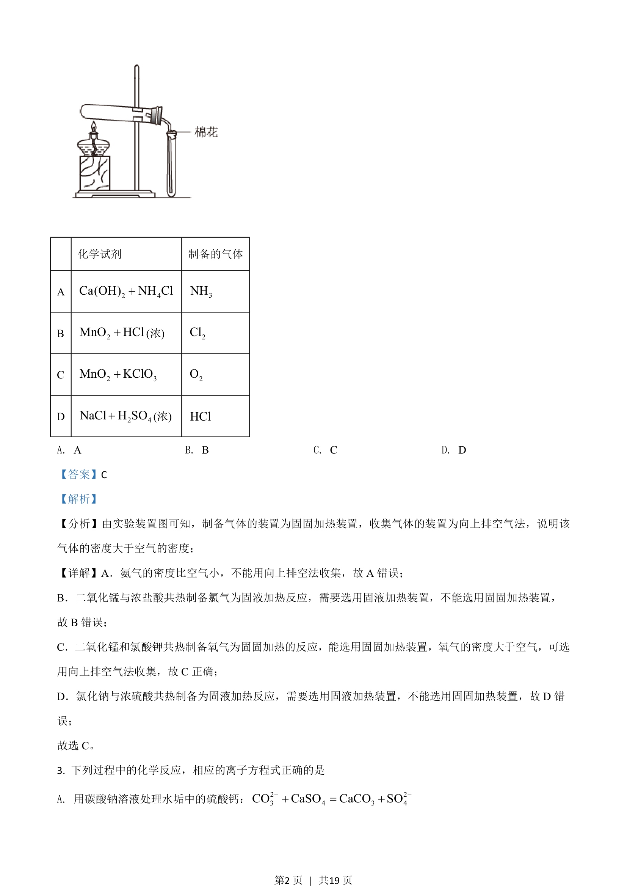

## 题面

## 摘要

本题通过有机物结构辨析官能团性质、同系物与同分异构体等概念。

## 关联考点

- [[706-有机化学|有机化学]]
- [[448-官能团|官能团]]
- [[446-同分异构体|同分异构体]]
- [[646-反应类型|反应类型]]

## 答案与解析

> 📄 原 PDF 第 3 页：`素材/真题/吉林/2008-2024·（吉林）化学高考真题/2021年高考化学试卷（全国乙卷）（解析卷）.pdf`

<!-- 题干文本-start -->
## 题干文本
4. 一种活性物质的结构简式为 ，下列有关该物质的叙
述正确的是
A. 能发生取代反应，不能发生加成反应
B. 既是乙醇的同系物也是乙酸的同系物
C. 与 互为同分异构体
D. 1mol该物质与碳酸钠反应得 244g CO
<!-- 题干文本-end -->

<!-- 解析文本-start -->
## 解析文本
【答案】C
【解析】
【分析】
【详解】A．该物质含有羟基、羧基、碳碳双键，能发生取代反应和加成反应，故 A 错误；
B．同系物是结构相似，分子式相差 1 个或 n 个 CH2的有机物，该物质的分子式为 C10H18O3，而且与乙醇、
乙酸结构不相似，故 B错误；
<!-- 解析文本-end -->
