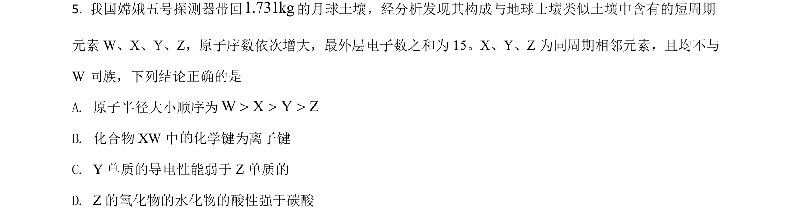
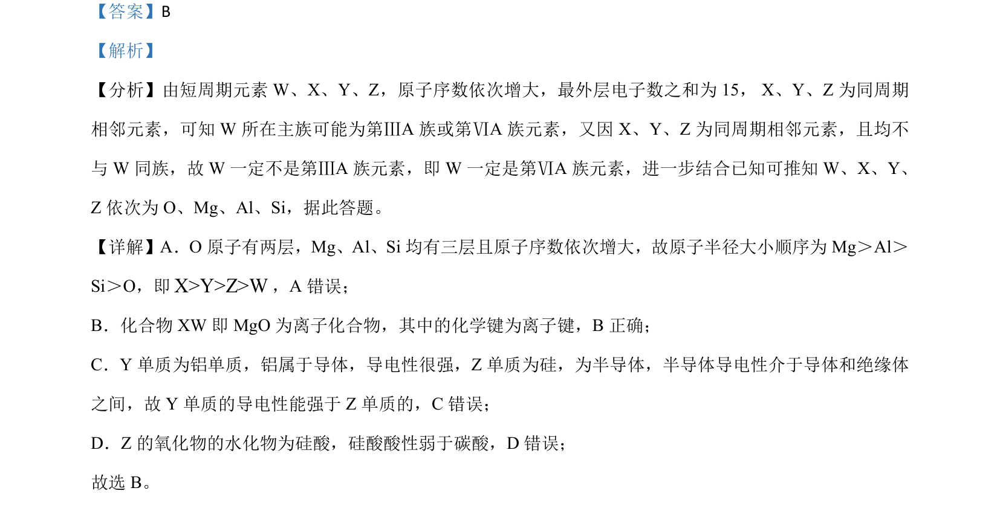

## 题面

## 摘要

推断短周期元素种类并比较原子半径、化学键类型、导电性及酸碱性。

## 关联考点

- [[元素推断]]
- [[原子半径比较]]
- [[离子键与共价键]]
- [[099-金属导电性|导电性]]
- [[酸性比较]]

## 答案与解析

> 📄 原 PDF 第 4 页：`素材/真题/吉林/2008-2024·（吉林）化学高考真题/2021年高考化学试卷（全国乙卷）（解析卷）.pdf`
