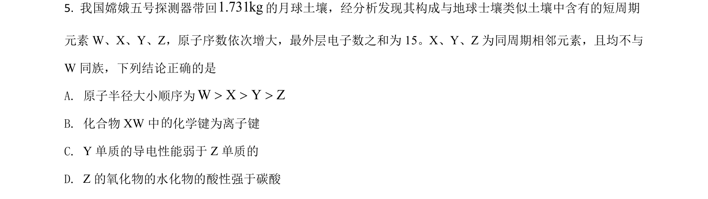
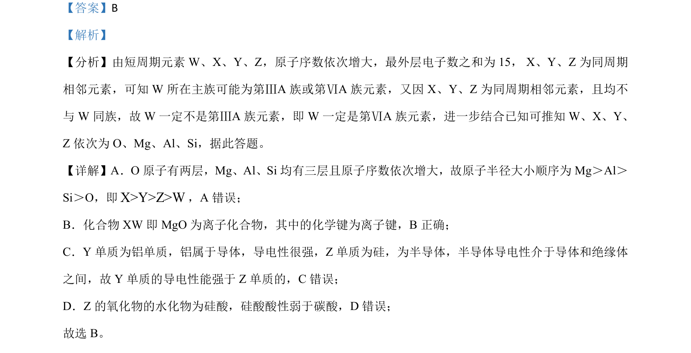

## 题面

## 摘要

推断短周期元素种类并比较原子半径、化学键类型、导电性及酸碱性。

## 关联考点

- [[597-元素推断|元素推断]]
- [[635-原子半径比较|原子半径比较]]
- [[811-离子键与共价键|离子键与共价键]]
- [[099-金属导电性|导电性]]
- [[852-酸性比较|酸性比较]]

## 答案与解析

> 📄 原 PDF 第 4 页：`素材/真题/吉林/2008-2024·（吉林）化学高考真题/2021年高考化学试卷（全国乙卷）（解析卷）.pdf`

<!-- 题干文本-start -->
## 题干文本
5. 我国嫦娥五号探测器带回1.731kg的月球土壤，经分析发现其构成与地球士壤类似土壤中含有的短周期
元素 W、X、Y、Z，原子序数依次增大，最外层电子数之和为 15。X、Y、Z为同周期相邻元素，且均不与
W同族，下列结论正确的是
A. 原子半径大小顺序为W X Y Z> > >
B. 化合物 XW中 化学键为离子键
C. Y 单质的导电性能弱于 Z单质的
D. Z的氧化物的水化物的酸性强于碳酸
<!-- 题干文本-end -->

<!-- 解析文本-start -->
## 解析文本
【答案】B
【解析】
【分析】由短周期元素 W、X、Y、Z，原子序数依次增大，最外层电子数之和为 15， X、Y、Z 为同周期
相邻元素，可知 W 所在主族可能为第ⅢA 族或第ⅥA 族元素，又因 X、Y、Z 为同周期相邻元素，且均不
与 W同族，故 W一定不是第ⅢA 族元素，即 W一定是第ⅥA 族元素，进一步结合已知可推知 W、X、Y、
Z依次为 O、Mg、Al、Si，据此答题。
【详解】A．O 原子有两层，Mg、Al、Si 均有三层且原子序数依次增大，故原子半径大小顺序为 Mg＞Al＞
Si＞O，即X>Y>Z>W，A 错误；
B．化合物 XW 即 MgO 为离子化合物，其中的化学键为离子键，B正确；
C．Y 单质为铝单质，铝属于导体，导电性很强，Z单质为硅，为半导体，半导体导电性介于导体和绝缘体
之间，故 Y 单质的导电性能强于 Z单质的，C错误；
D．Z的氧化物的水化物为硅酸，硅酸酸性弱于碳酸，D 错误；
故选 B。
<!-- 解析文本-end -->
