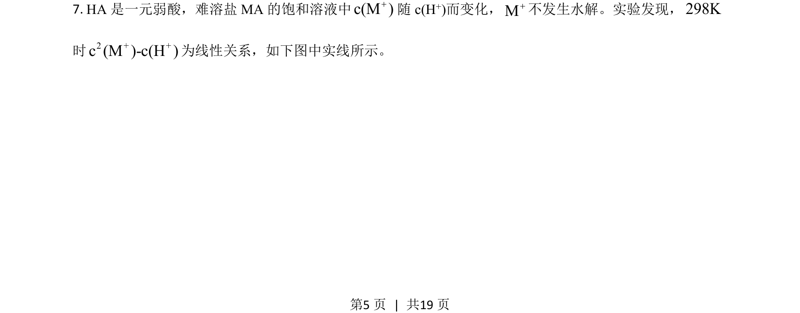
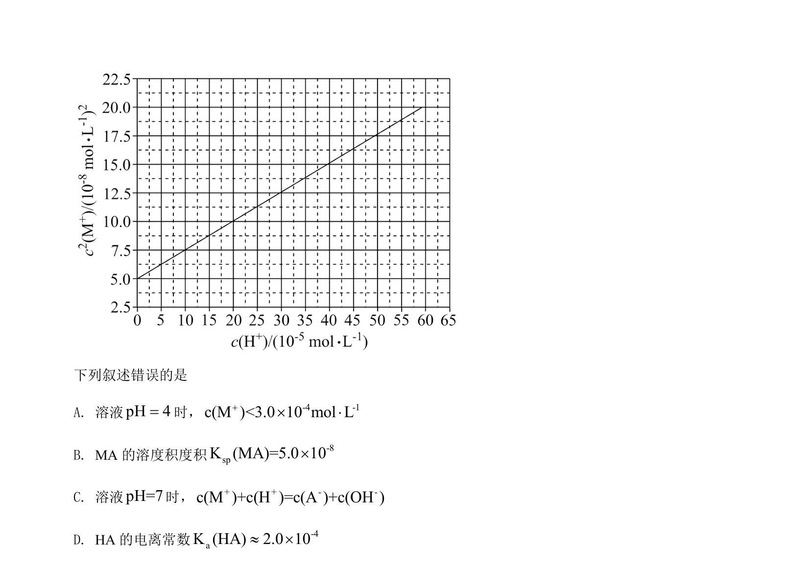
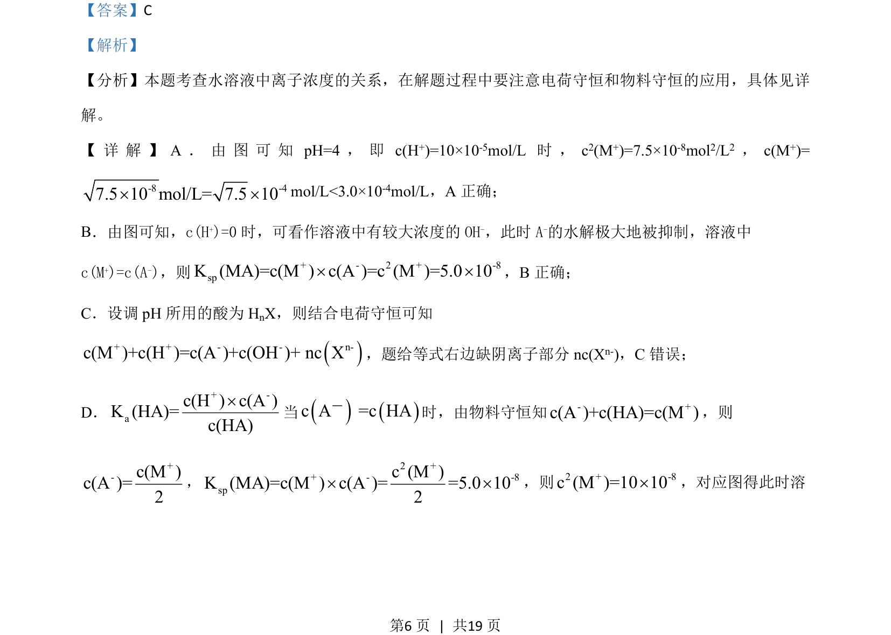
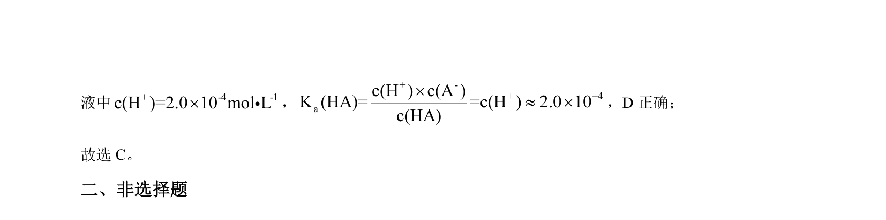

## 题面

## 摘要

本题考查水溶液中离子浓度关系的判断，综合应用电荷守恒、物料守恒及平衡常数计算。

## 关联考点

- [[690-电荷数守恒|电荷守恒]]
- [[物料守恒]]
- [[溶度积常数]]
- [[334-电离平衡|电离平衡]]

## 答案与解析

> 📄 原 PDF 第 5 页：`素材/真题/吉林/2008-2024·（吉林）化学高考真题/2021年高考化学试卷（全国乙卷）（解析卷）.pdf`
