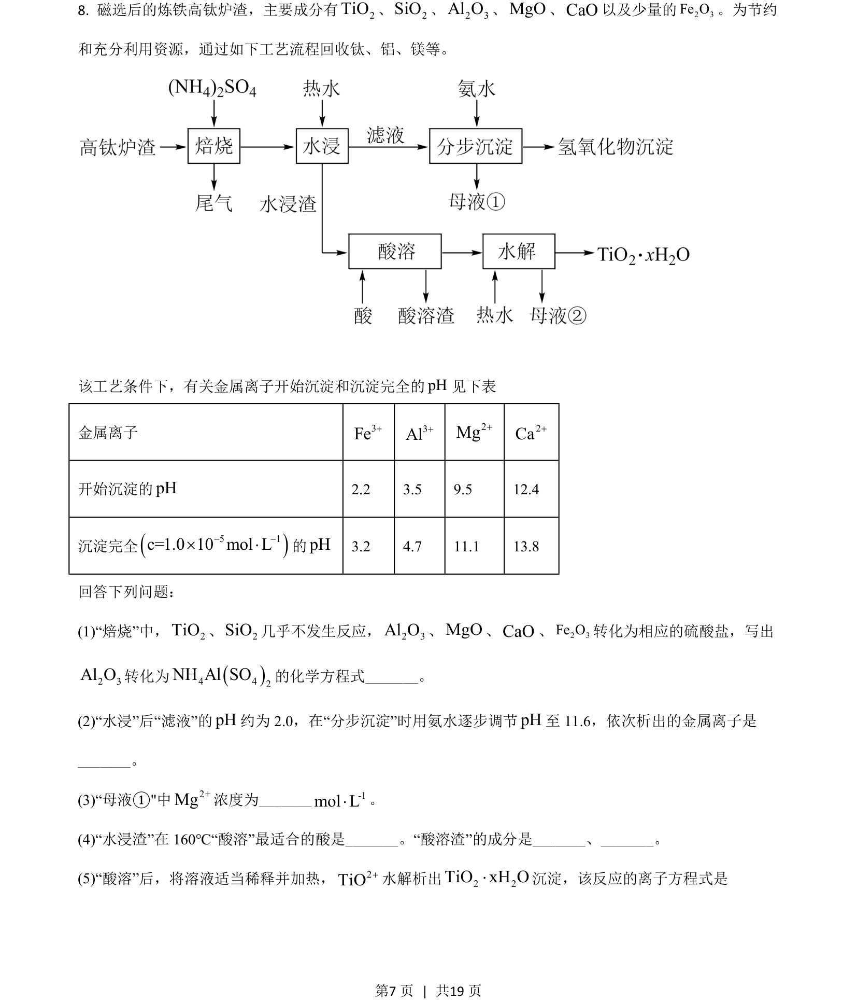
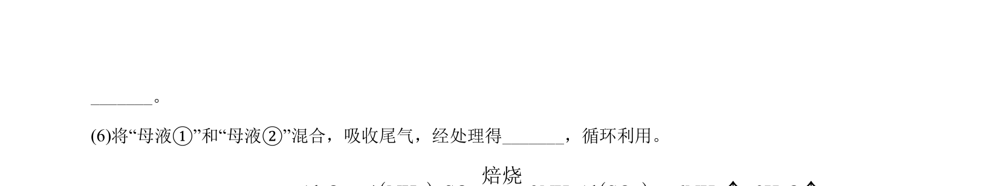
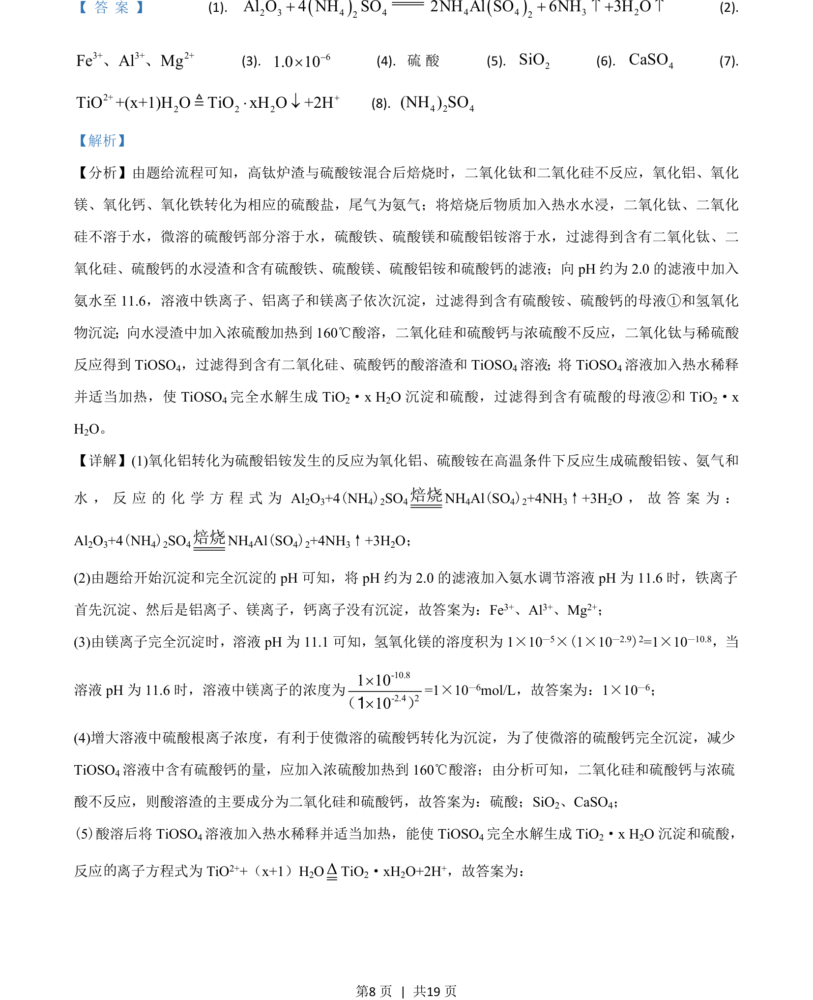
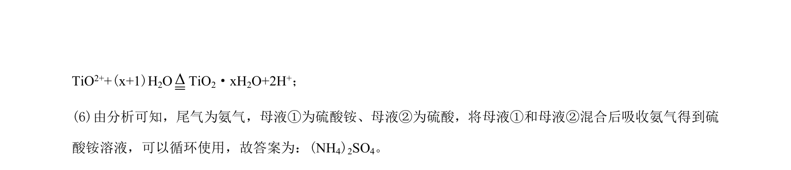

## 题面

## 摘要

考查高钛炉渣回收钛铝镁的工艺流程，涉及方程书写、沉淀顺序、离子浓度等。

## 关联考点

- [[622-化学方程式书写|化学方程式书写]]
- [[747-沉淀顺序判断|沉淀顺序判断]]
- [[811-离子浓度计算|离子浓度计算]]
- [[878-条件选择|条件选择]]

## 答案与解析

> 📄 原 PDF 第 7 页：`素材/真题/吉林/2008-2024·（吉林）化学高考真题/2021年高考化学试卷（全国乙卷）（解析卷）.pdf`
