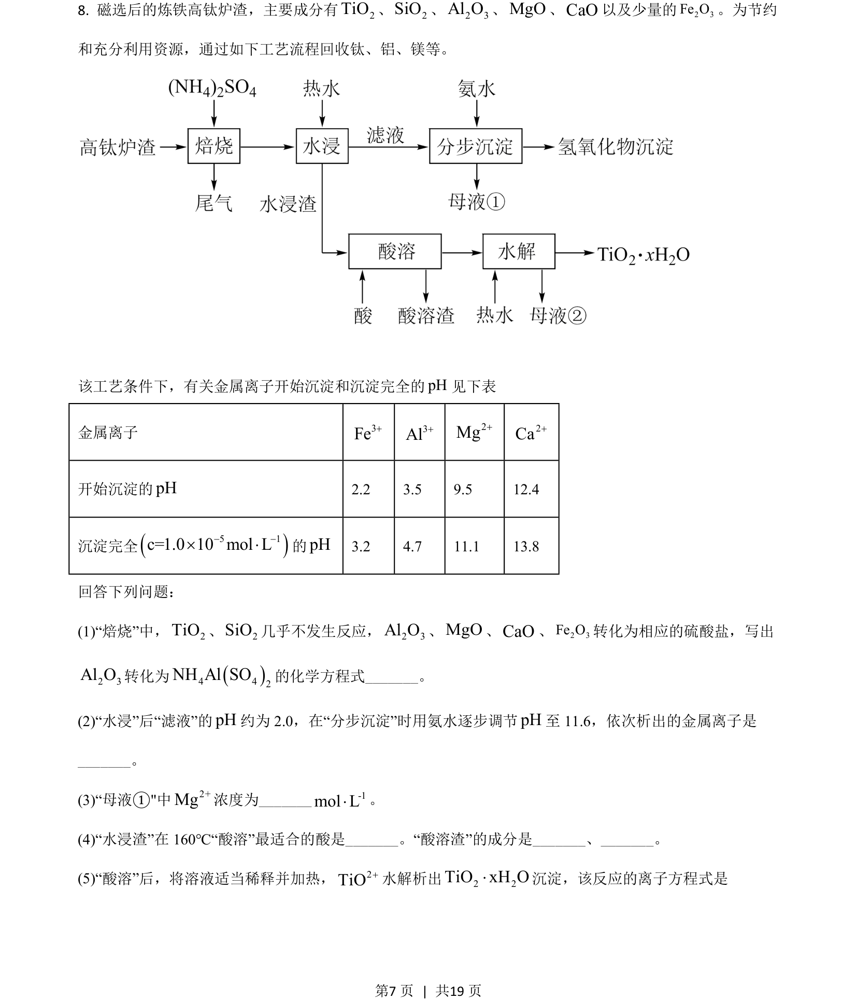
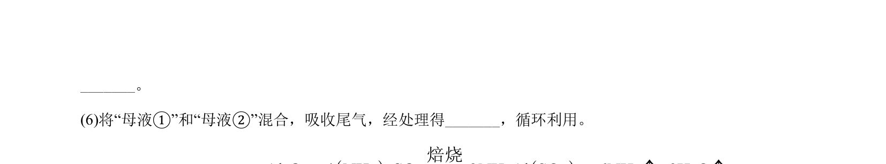
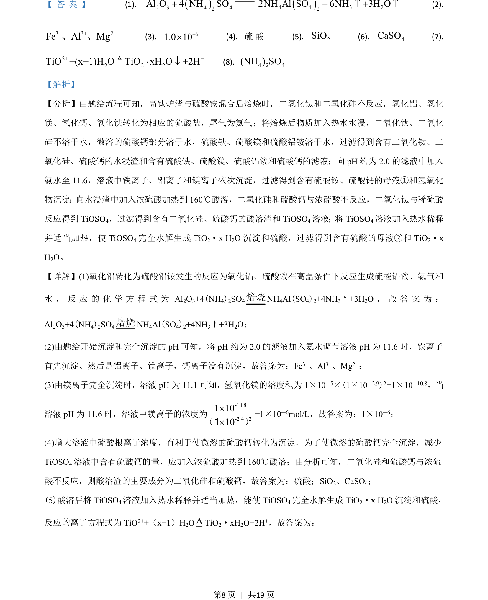
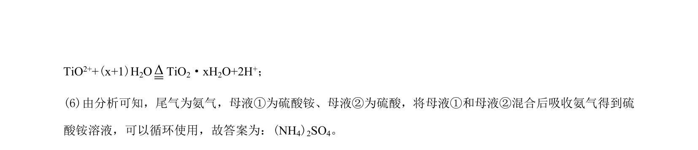

## 题面

## 摘要

考查高钛炉渣回收钛铝镁的工艺流程，涉及方程书写、沉淀顺序、离子浓度等。

## 关联考点

- [[976-化学方程式的书写|化学方程式书写]]
- [[746-沉淀顺序判断|沉淀顺序判断]]
- [[810-离子浓度计算|离子浓度计算]]
- [[877-条件选择|条件选择]]

## 答案与解析

> 📄 原 PDF 第 7 页：`素材/真题/吉林/2008-2024·（吉林）化学高考真题/2021年高考化学试卷（全国乙卷）（解析卷）.pdf`

<!-- 题干文本-start -->
## 题干文本
8. 磁选后的炼铁高钛炉渣，主要成分有2TiO、2SiO、2 3Al O、MgO、CaO以及少量的2 3Fe O。为节约
和充分利用资源，通过如下工艺流程回收钛、铝、镁等。
该工艺条件下，有关金属离子开始沉淀和沉淀完全的pH见下表
金属离子 3Fe+3Al+2Mg+2Ca+
开始沉淀的pH2.2 3.5 9.5 12.4
沉淀完全()5 1c=1.0 10 mol L- -´ ×的pH3.2 4.7 11.1 13.8
回答下列问题：
(1)“焙烧”中，2TiO、2SiO几乎不发生反应，2 3Al O、MgO、CaO、2 3Fe O转化为相应的硫酸盐，写出
2 3Al O转化为()4 42NH Al SO的化学方程式_______。
(2)“水浸”后“滤液”的pH约为 2.0，在“分步沉淀”时用氨水逐步调节pH至 11.6，依次析出的金属离子是
_______。
(3)“母液①"中2+Mg浓度为_______ -1mol L×。
(4)“水浸渣”在 160℃“酸溶”最适合的酸是_______。“酸溶渣”的成分是_______、_______。
(5)“酸溶”后，将溶液适当稀释并加热，2TiO+水解析出2 2TiO xH O×沉淀，该反应的离子方程式是
<!-- 题干文本-end -->

<!-- 解析文本-start -->
## 解析文本

<!-- 解析文本-end -->
