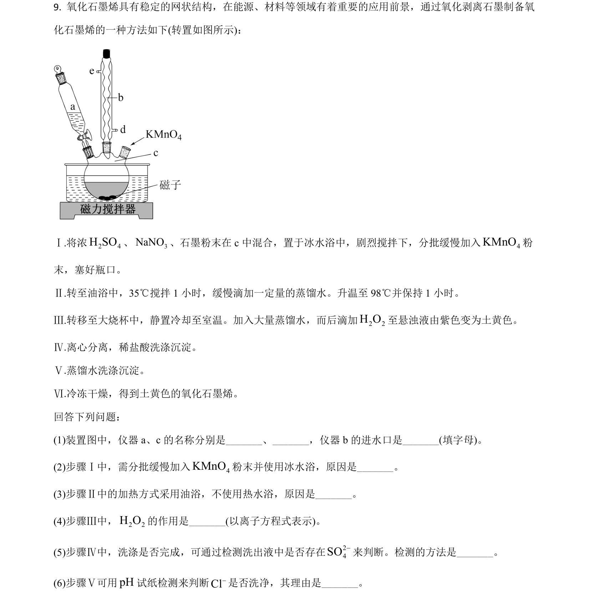
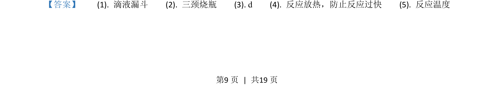
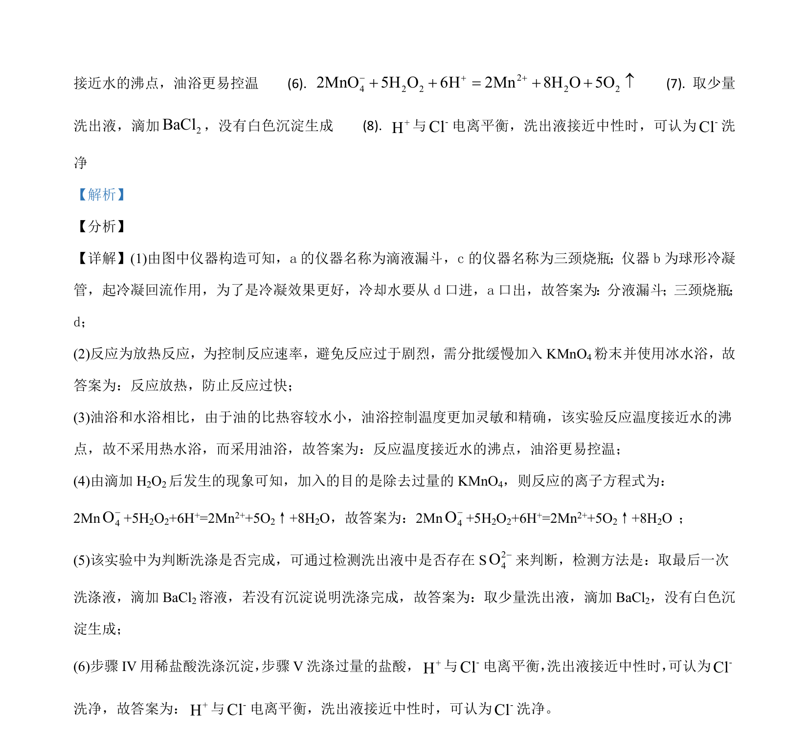

## 题面

## 摘要

考查化学实验仪器与操作、反应条件控制及平衡常数计算

## 关联考点

- [[527-化学实验|化学实验]]
- [[284-化学平衡|化学平衡]]
- [[169-离子反应|离子反应]]

## 答案与解析

> 📄 原 PDF 第 9 页：`素材/真题/吉林/2008-2024·（吉林）化学高考真题/2021年高考化学试卷（全国乙卷）（解析卷）.pdf`
