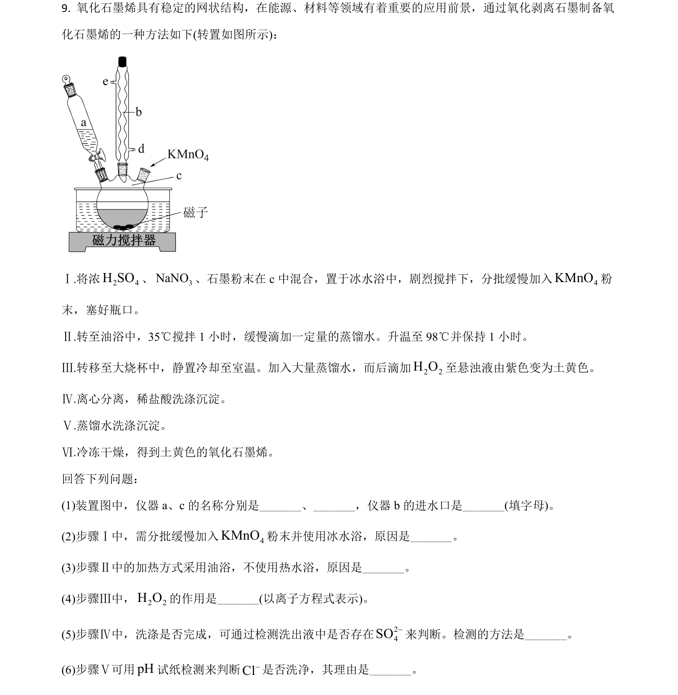
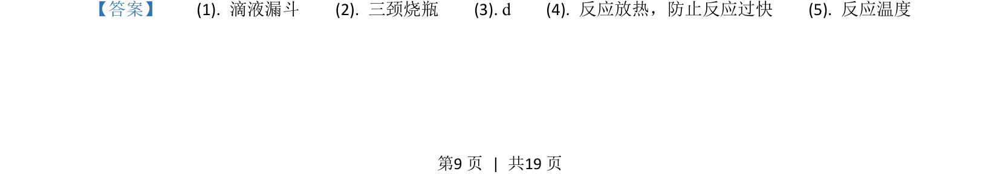
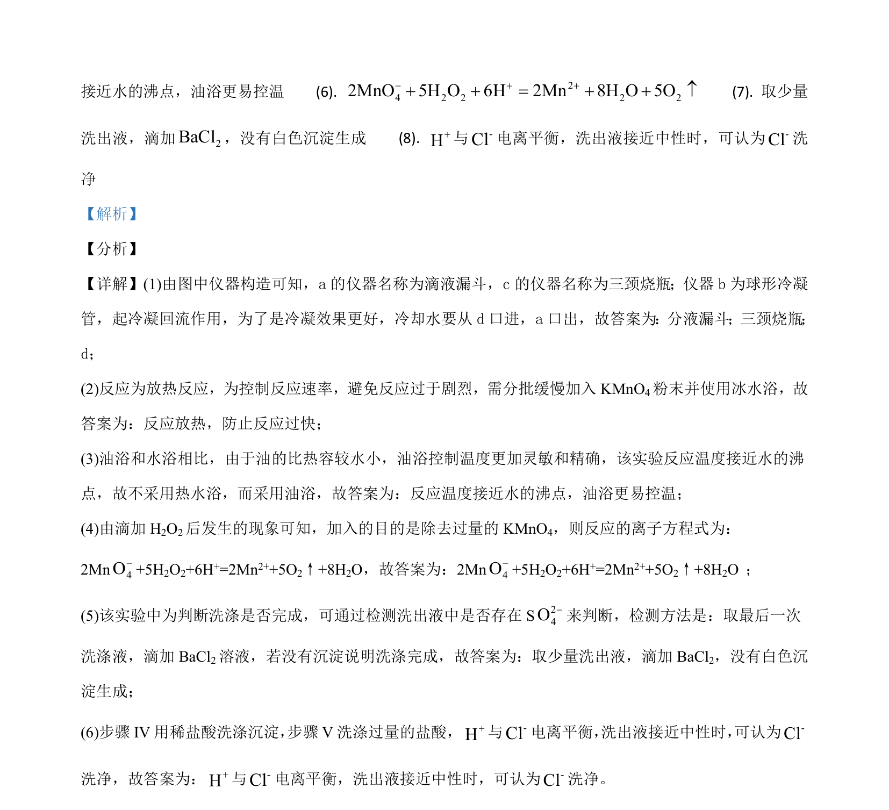

## 题面

## 摘要

考查化学实验仪器与操作、反应条件控制及平衡常数计算

## 关联考点

- [[527-化学实验|化学实验]]
- [[284-化学平衡|化学平衡]]
- [[169-离子反应|离子反应]]

## 答案与解析

> 📄 原 PDF 第 9 页：`素材/真题/吉林/2008-2024·（吉林）化学高考真题/2021年高考化学试卷（全国乙卷）（解析卷）.pdf`

<!-- 题干文本-start -->
## 题干文本
9. 氧化石墨烯具有稳定的网状结构，在能源、材料等领域有着重要的应用前景，通过氧化剥离石墨制备氧
化石墨烯的一种方法如下(转置如图所示)：
Ⅰ.将浓2 4H SO、 3NaNO、石墨粉末在 c中混合，置于冰水浴中，剧烈搅拌下，分批缓慢加入 4KMnO粉
末，塞好瓶口。
Ⅱ.转至油浴中，35℃搅拌 1 小时，缓慢滴加一定量的蒸馏水。升温至 98℃并保持 1 小时。
Ⅲ.转移至大烧杯中，静置冷却至室温。加入大量蒸馏水，而后滴加2 2H O至悬浊液由紫色变为土黄色。
Ⅳ.离心分离，稀盐酸洗涤沉淀。
Ⅴ.蒸馏水洗涤沉淀。
Ⅵ.冷冻干燥，得到土黄色的氧化石墨烯。
回答下列问题：
(1)装置图中，仪器 a、c的名称分别是_______、_______，仪器 b 的进水口是_______(填字母)。
(2)步骤Ⅰ中，需分批缓慢加入 4KMnO粉末并使用冰水浴，原因是_______。
(3)步骤Ⅱ中的加热方式采用油浴，不使用热水浴，原因是_______。
(4)步骤Ⅲ中，2 2H O的作用是_______(以离子方程式表示)。
(5)步骤Ⅳ中，洗涤是否完成，可通过检测洗出液中是否存在24SO-来判断。检测的方法是_______。
(6)步骤Ⅴ可用pH试纸检测来判断Cl-是否洗净，其理由是_______。
<!-- 题干文本-end -->

<!-- 解析文本-start -->
## 解析文本
【答案】    (1). 滴液漏斗    (2). 三颈烧瓶    (3). d    (4). 反应放热，防止反应过快    (5). 反应温度
<!-- 解析文本-end -->
