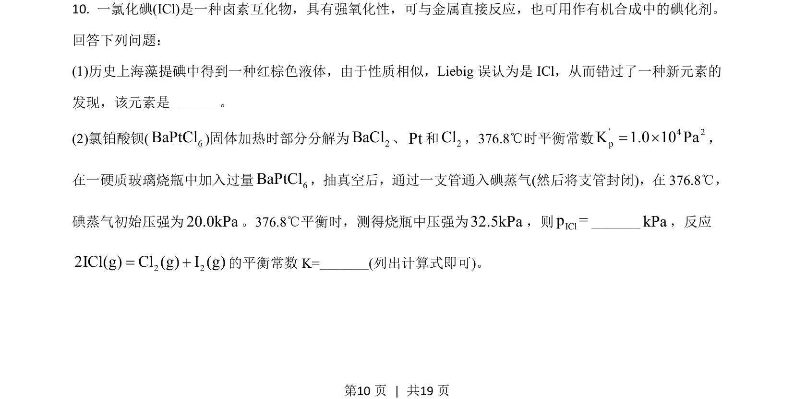
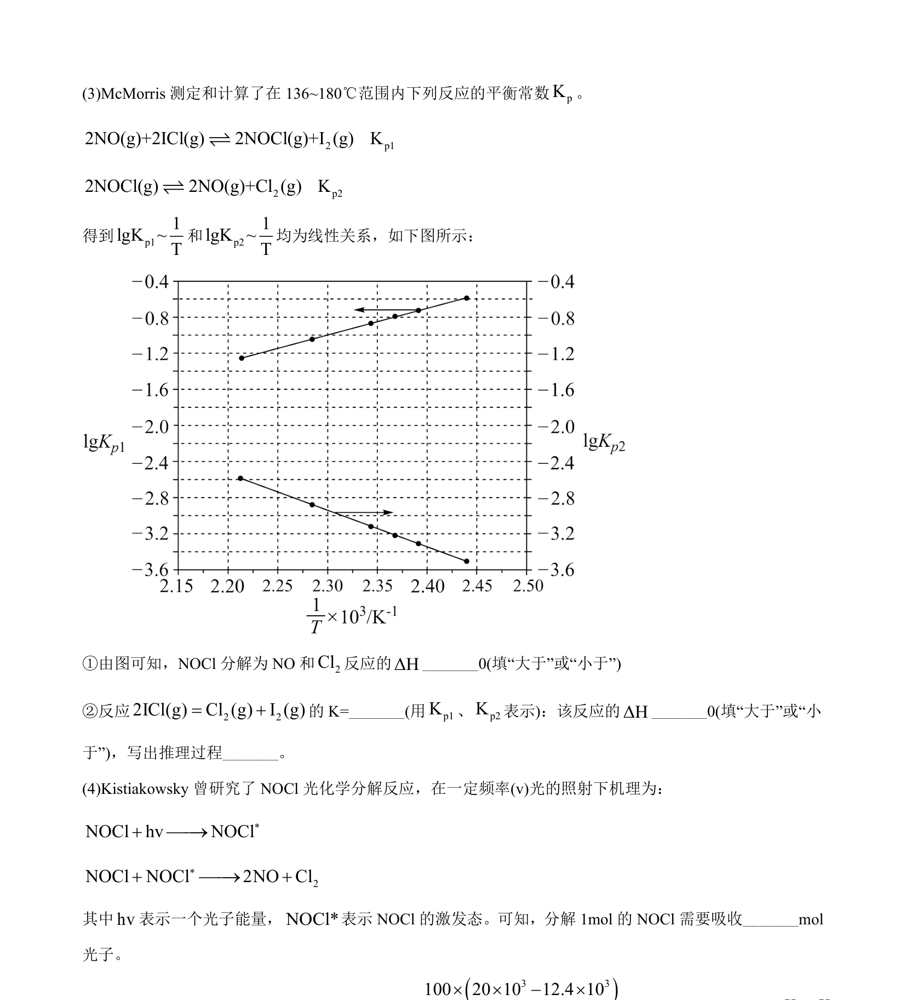
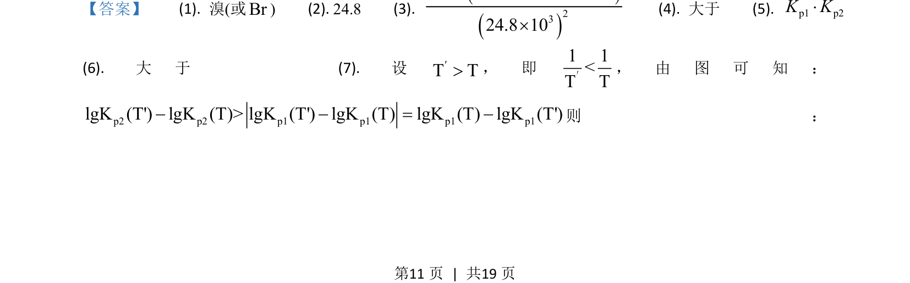
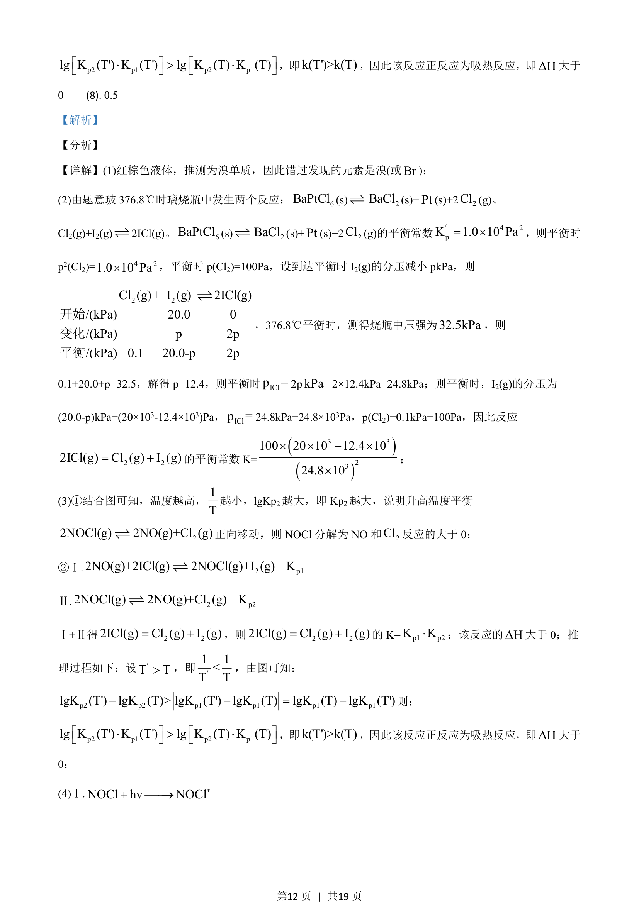
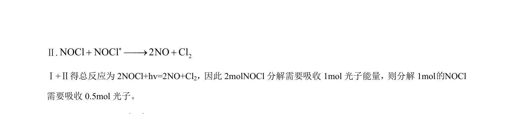

## 题面

## 摘要

考查卤素互化物ICl的性质及化学平衡常数计算。

## 关联考点

- [[633-卤素知识|卤素知识]]
- [[284-化学平衡|化学平衡]]
- [[683-平衡常数计算|平衡常数计算]]

## 答案与解析

> 📄 原 PDF 第 10 页：`素材/真题/吉林/2008-2024·（吉林）化学高考真题/2021年高考化学试卷（全国乙卷）（解析卷）.pdf`

<!-- 题干文本-start -->
## 题干文本
10. 一氯化碘(ICl)是一种卤素互化物，具有强氧化性，可与金属直接反应，也可用作有机合成中的碘化剂。
回答下列问题：
(1)历史上海藻提碘中得到一种红棕色液体，由于性质相似，Liebig误认为是 ICl，从而错过了一种新元素的
发现，该元素是_______。
(2)氯铂酸钡( 6BaPtCl)固体加热时部分分解为2BaCl、Pt和2Cl，376.8℃时平衡常数 4 2pK 1.0 10 Pa= ´′，
在一硬质玻璃烧瓶中加入过量 6BaPtCl，抽真空后，通过一支管通入碘蒸气(然后将支管封闭)，在 376.8℃，
碘蒸气初始压强为20.0kPa。376.8℃平衡时，测得烧瓶中压强为32.5kPa，则IClp =_______kPa，反应
2 22ICl(g) Cl (g) I (g)= +的平衡常数 K=_______(列出计算式即可)。
<!-- 题干文本-end -->

<!-- 解析文本-start -->
## 解析文本

<!-- 解析文本-end -->
